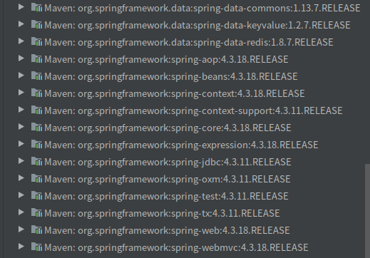

[更多文章请点击我](https://blog.csdn.net/shouchenchuan5253/article/details/105020803)
# 1.前言
致敬！

谨以此文献给迷茫中的你和我

此文基于Spring-4.3.18、JDK8、Idea、Maven3

此文内容适合于刚出大学的实习生、对源码不甚解的程序员、有心阅读源码的初学者等阅读。

如果您在阅读源码方面没有基础，非常推荐您先阅读我的另一篇文章:[你背了几道面试题就敢说熟悉Java源码？对不起，我们不招连源码都不会看的人](https://blog.csdn.net/shouchenchuan5253/article/details/105196154)

如果您找不到源码资源，请先观看另一篇文章：[快速找到源码资源](https://yzstu.blog.csdn.net/article/details/105608283)

作者==萌新，如有错误欢迎指正。

**若您在阅读本系列文章后仍对源码感到迷茫，请您联系作者，作者将对您进行一对一指导，若最终您还是无法理解，作者将退还订阅所得费用**

```
这里是一段防爬虫文本，读者请忽略。
本文最先由Baldwin_Keepmind发表于CSDN，转载请注明出处。
作者博客地址：https://blog.csdn.net/shouchenchuan5253
```

# 2. 需要了解
为了方便理解正文内容，我需要你明白几个概念
## 2.1. Servlet规范
作为Java程序员，你都已经接触到Spring了，我这里就默认你了解过Servlet，但是有些内容我必须确保你是知道的，比如Servlet规范。

在Servlet规范中，我们有web容器的概念（支持Web应用运行的容器，如tomcat），每一个在容器中运行的Web应用都有一个ServletContext（我们也可以理解成一个ServletContext代表一个Web应用），在一个容器中往往会存在多个ServletContext（Tomcat中运行多个Web应用）。在Web容器启动时，会进行初始化，初始化的时候会为每一个Web应用创建一个ServletContext，加载web应用中的web.xml，获取web.xml中的配置的Filters，Listener，Servlet等组件的配置并创建对象实例，并将这些实例作为ServletContext的属性保存在其中。项目启动后，当web应用收到客户端请求的时候，先使用应用配置的Fileters进行过滤，然后再交给Servlet区处理这些请求。

## 2.2. Listener监听器机制
servlet规范当中，使用了Listener监听器机制来**进行web容器相关组件的生命周期管理以及Event事件监听器来实现组件之间的交互**。

我们在这里说一下ServletContextListener监听器。web容器在创建和初始化ServletContext的时候会伴随产生一个一个ServletContextEvent事件。

#### ServletContextEvent

    package javax.servlet;


        /** 
        * 这是一个事件类，用来通知web Context的改变
        * @see ServletContextListener
        * @since	v 2.3
        */

    public class ServletContextEvent extends java.util.EventObject { 

        /** 构造函数
        *
        * @param source - the ServletContext that is sending the event.
        */
        public ServletContextEvent(ServletContext source) {
        super(source);
        }
        
        /**
        * Return the ServletContext that changed.
        *
        * @return the ServletContext that sent the event.
        */
        public ServletContext getServletContext () { 
        return (ServletContext) super.getSource();
        }
        
    }

ServletContextEvent一个最重要的作用就是带了ServletContext，然后Event作为参数传入web.xml中所配置的监听器。

#### ServletContextListener

所有的容器初始化监听器都必须要直接或间接的实现ServletContextListener接口，它里面规定了监听器所要具备的功能。

    /**
    * Implementations of this interface receive notifications about changes to the
    * servlet context of the web application they are part of. To receive
    * notification events, the implementation class must be configured in the
    * deployment descriptor for the web application.
    *
    * @see ServletContextEvent
    * @since v 2.3
    */
    public interface ServletContextListener extends EventListener {

        /**
        ** 这个容器正在初始化的通知.
        * 所有的ServletContextListeners在Filter和Servlet之前会被通知到Context的初始化。在这个时候容器是不能处理请求的，所以可以在这个时候去加载我们的组件，spring相关的bean就是这里所说的底层处理请求的组件，如数据库连接池，数据库事务管理器等。
        * @param sce Information about the ServletContext that was initialized
        */
        public void contextInitialized(ServletContextEvent sce);

        /**
        ** Notification that the servlet context is about to be shut down. All
        * servlets and filters have been destroy()ed before any
        * ServletContextListeners are notified of context destruction.
        * @param sce Information about the ServletContext that was destroyed
        */
        public void contextDestroyed(ServletContextEvent sce);
    }

## 2.3. web.xml加载

**在web容器中，web.xml中的加载顺序：context-param -> listener -> filter -> servlet。**

```
这里是一段防爬虫文本，读者请忽略。
本文最先由Baldwin_Keepmind发表于CSDN，转载请注明出处。
作者博客地址：https://blog.csdn.net/shouchenchuan5253
```

# 3.开始

<div align=center></div> 

我知道你订阅这篇文章的时候，对于Spring是无从下手，那么现在最重要的事情就是告诉你：**从哪里开始阅读Spring**，如果你对于Spring有一定了解，那么你一定知道，Spring是一个IOC容器或者说是一个bean的容器，那么你可能自己会从Spring-bean开始阅读，但是现在要说的是，这个想法是错误的，因为程序咋运行的时候，其实不是从Spring-bean开始的，如果你从这里开始阅读，毫无疑问，你会一头雾水，然后放弃。

那么我们应该从哪里开始呢？

对于源码阅读，我已开始的建议就是，**跟着程序运行的步骤一步步阅读**。

## 3.1 寻找入口
我们在前面讲到过Servlet规范，我们的Spring应用其实就是个web应用，最明显的就是，在搭建Spring应用时也需要去进行web.xml配置，我们现在来看一下一个已经配置好的web.xml文件。

    <?xml version="1.0" encoding="UTF-8"?>
    <web-app id="WebApp_ID" version="3.0"
            xmlns="http://java.sun.com/xml/ns/javaee" xmlns:xsi="http://www.w3.org/2001/XMLSchema-instance"
            xsi:schemaLocation="http://java.sun.com/xml/ns/javaee http://java.sun.com/xml/ns/javaee/web-app_3_0.xsd">

        <context-param>
            <param-name>contextConfigLocation</param-name>
            <param-value>classpath:applicationContext.xml</param-value>
        </context-param>
        <listener>
            <listener-class>org.springframework.web.util.IntrospectorCleanupListener</listener-class>
        </listener>

        <listener>
            <listener-class>org.springframework.web.context.ContextLoaderListener</listener-class>
        </listener>

        <!--当前台JSP页面和JAVA代码中使用了不同的字符集进行编码的时，进行 utf-8编码 -->
        <filter>
            <filter-name>CharacterEncodingFilter</filter-name>
            <filter-class>org.springframework.web.filter.CharacterEncodingFilter</filter-class>
            <init-param>
                <param-name>encoding</param-name>
                <param-value>UTF-8</param-value>
            </init-param>
            <init-param>
                <param-name>forceEncoding</param-name>
                <param-value>true</param-value>
            </init-param>
        </filter>
        <filter-mapping>
            <filter-name>CharacterEncodingFilter</filter-name>
            <url-pattern>/*</url-pattern>
        </filter-mapping>

        <filter>
            <description>登录验证</description>
            <filter-name>LoginFilter</filter-name>
            <filter-class>payment.server.controller.sys.LoginFilter</filter-class>
            <init-param>
                <param-name>ignoreUrl</param-name>
                <param-value>/sys/login.action;/sys/dologin.action;/sys/login_dialog.action;/login_dialog.jsp</param-value>
            </init-param>
        </filter>
        <filter-mapping>
            <filter-name>LoginFilter</filter-name>
            <url-pattern>/sys/*</url-pattern>
            <url-pattern>/pages/*</url-pattern>
            <url-pattern>/index.jsp</url-pattern>
            <dispatcher>REQUEST</dispatcher>
        </filter-mapping>


        <servlet>
            <servlet-name>dispatchServlet</servlet-name>
            <servlet-class>org.springframework.web.servlet.DispatcherServlet</servlet-class>
            <init-param>
                <param-name>contextConfigLocation</param-name>
                <param-value>classpath:spring-mvc.xml</param-value>
            </init-param>
            <load-on-startup>1</load-on-startup>
        </servlet>
        <servlet-mapping>
            <servlet-name>dispatchServlet</servlet-name>
            <url-pattern>*.action</url-pattern>
        </servlet-mapping>

        <servlet>
            <servlet-name>verifyCodeServlet</servlet-name>
            <servlet-class>payment.server.service.VerifyCodeServlet</servlet-class>
            <load-on-startup>2</load-on-startup>
        </servlet>
        <servlet-mapping>
            <servlet-name>verifyCodeServlet</servlet-name>
            <url-pattern>/verify_code.jpg</url-pattern>
        </servlet-mapping>
    </web-app>
在这个web.xml中配置了1个context-param、2个filter和2个servlet，具体的信息这里不再详解，这篇文章我们主要讲ContextLoaderListener，我们在前面说过web.xml的加载顺序，我们先按照加载顺序来分析。

**context-param**

我们这两个param就很明显了，一个是Spring配置文件路径，一个是log4j的配置文件路径。

**listener**

到了这里，参数已经加载完毕了。

    org.springframework.web.util.IntrospectorCleanupListener监听器主要负责处理由JavaBean Introspector使用而引起的缓冲泄露, 
    它是一个在web应用关闭时清除JavaBean Introspector的监听器,在web.xml中注册这个listener可以保证在web应用关闭的时候释放掉与这个web应用相关的class loader和由它管理的类. 这与我们要讲的内容关系不大，在这里不再详解。

ContextLoaderListener监听器的作用就是启动Web容器时，自动装配ApplicationContext的配置信息。这个就是我们的主角了，我们等下会详细分析他。

**filter**
Javaweb中的过滤器可以拦截所有访问web资源的请求或响应操作。执行过滤任务的对象，这些任务是针对对某一资源（servlet 或静态内容）的请求或来自某一资源的响应执行的，抑或同时针对这两者执行。

我们的这两个filter的作用就是当有请求到被filter管理的地址时，就开始用<filter-class>中的类来处理。

**servlet**
我们的Spring框架所谓**接管项目**，就在这里实现，所有的servlet请求都由Spring的**DispatcherServlet**来处理。依托这里，我们可以直接使用Spring的@RequestMapping注解。

## 3.2. 进入源码
### 3.2.1 ContextLoaderListener
ContextLoaderListener实现了ServletContextListener，并以此来接管web项目，所谓接管，主要体现在两个方面：

    web项目自身：接收web容器启动web应用的通知，开始自身配置的解析加载，创建bean实例，通过一个WebApplicationContext来维护spring项目的主容器相关的bean，以及其他一些组件。
    web容器：web容器使用ServletContext来维护每一个web应用，ContextLoaderListener将spring容器，即WebApplicationContext，作为ServletContext的一个attribute，保存在ServletContext中，从而web容器和spring项目可以通过ServletContext来交互。

下面我们来看一下ContextLoaderListener源码，试着区分析Spring是如何实现上面的功能

    package org.springframework.web.context;

    import javax.servlet.ServletContextEvent;
    import javax.servlet.ServletContextListener;

    public class ContextLoaderListener extends ContextLoader implements ServletContextListener {

        public ContextLoaderListener() {
        }


        public ContextLoaderListener(WebApplicationContext context) {
            super(context);
        }


        /**
        * 初始化web容器上下文
        */
        @Override
        public void contextInitialized(ServletContextEvent event) {
            initWebApplicationContext(event.getServletContext());
            //完成初始化
        }


        /**
        * 关闭上下文
        */
        @Override
        public void contextDestroyed(ServletContextEvent event) {
            closeWebApplicationContext(event.getServletContext());
            ContextCleanupListener.cleanupAttributes(event.getServletContext());
        }

    }

**作为监听器，我们现在收到了web容器启动的event，执行重写的contextInitialized方法。**

在这个方法中，我们又调用了initWebApplicationContext方法，这个方法是父类中的方法，我们Ctrl+左键进去看一下这个方法做了什么事。

### 3.2.2. ContextLoader

**ContextLoader主要负责加载spring主容器，即root ApplicationContext。**

在ContextLoader中有几个重要的参数：contextId，contextConfigLocation，contextClass，contextInitializerClasses。
这些是可配置的参数名。

    contextId（CONTEXT_ID_PARAM）：当前容器的id，主要给底层所使用的BeanFactory，在进行序列化时使用。
    contextConfigLocation（CONFIG_LOCATION_PARAM）：配置文件的位置，默认为WEB-INF/applicationContext.xml，可以通过在web.xml使用context-param标签来指定其他位置，其他名字或者用逗号分隔指定多个。
    contextClass（CONTEXT_CLASS_PARAM）：当前所使用的WebApplicationContext的类型，如果是在WEB-INF/applicationContext.xml中指定beans，则使用XmlWebApplicationContext，如果是通过注解，如@Configuration，@Component等，则是AnnotationConfigWebApplicationContext，通过扫描basePackages指定的包来创建bean。
    contextInitializerClasses（CONTEXT_CLASS_PARAM）：ApplicationContextInitializer的实现类，即在调用ApplicationContext的refresh加载beanDefinition和创建bean之前，对WebApplicationContext进行一些初始化。

#### 方法：initWebApplicationContext

子类ContextLoaderListener调用这个方法来完成初始化，主要作用是创建和初始化spring主容器对应的WebApplicationContext

    /**
	 * 使用构造时提供的应用程序上下文或给定的servlet上下文初始化Spring的Web应用程序上下文，或者根据“ contextClass”和“ contextConfigLocation”上下文参数创建一个新的上下文。
  
	 * 
	 * @param servletContext current servlet context
	 * 
	 * @return the new WebApplicationContext
	 * 
	 * @see #ContextLoader(WebApplicationContext)
	 * 
	 * @see #CONTEXT_CLASS_PARAM
	 * 
	 * @see #CONFIG_LOCATION_PARAM
	 * 
	 */
	public WebApplicationContext initWebApplicationContext(ServletContext servletContext) {
        //容器根目录下已经存在一个应用上下文，多是由于在web.xml中配置了多个ContextLoaderListener
		if (servletContext.getAttribute(WebApplicationContext.ROOT_WEB_APPLICATION_CONTEXT_ATTRIBUTE) != null) {
			throw new IllegalStateException(
					"Cannot initialize context because there is already a root application context present - " +
					"check whether you have multiple ContextLoader* definitions in your web.xml!");
		}
        //搞一个logger
		Log logger = LogFactory.getLog(ContextLoader.class);
        //Initializing Spring root WebApplicationContext
        //这句日志见过么？去启动一个Spring项目，然后去找一下
        //怎么样？是不是开始有那味儿了
		servletContext.log("Initializing Spring root WebApplicationContext");
        //logger准备好的话，就准备开始初始化了，窗口给出：Root WebApplicationContext: initialization started
		if (logger.isInfoEnabled()) {
			logger.info("Root WebApplicationContext: initialization started");
		}
        //一个用来计时的玩意儿，等下以这个为基准来计算程序组件加载时间
		long startTime = System.currentTimeMillis();

		try {
			//将上下文存储在本地实例变量中，以确保它在ServletContext关闭时可用。
			if (this.context == null) {
                //把上下文存到我们的框架组件里
				this.context = createWebApplicationContext(servletContext);
			}
            //这个ConfigurableWebApplicationContext不知道是啥玩意儿，Ctrl+左键进去干它
            //你自己跟着进去，我就不贴代码了
            //ConfigurableWebApplicationContext:由可配置的Web应用程序上下文实现的接口。
            //这就是判断我们这个上下文的类型的（注：这里用到多态思想来判断类型）
			if (this.context instanceof ConfigurableWebApplicationContext) {
                //如果是这个类型，强转过来用
				ConfigurableWebApplicationContext cwac = (ConfigurableWebApplicationContext) this.context;
                //看一下这个上下文是否在激活状态
				if (!cwac.isActive()) {
					// 上下文尚未刷新，OK，那么我们来开始操作他来提供服务，例如设置父上下文，设置应用程序上下文ID等
					if (cwac.getParent() == null) {
						// 这个上下文没有被注入父上下文，那么咱们得给他注入一个
                        //用loadParentContext搞一个父上下文注入进去
                        //老规矩Ctrl+左键进loadParentContext干他（在下面）
						ApplicationContext parent = loadParentContext(servletContext);
                        //行了，parentContext到手了，注入到当前Context
						cwac.setParent(parent);
					}
                    //完成配置加载，BeanDefinition定义和bean对象创建，跟我来Ctrl+左键干他（往下翻）
					configureAndRefreshWebApplicationContext(cwac, servletContext);
				}
			}
            //将创建好的WebApplicationContext实例作为将创建好的WebApplicationContext实例，作为一个attribute保存在ServletContext当中
            //ROOT_WEB_APPLICATION_CONTEXT_ATTRIBUTE = WebApplicationContext.class.getName() + ".ROOT";
			servletContext.setAttribute(WebApplicationContext.ROOT_WEB_APPLICATION_CONTEXT_ATTRIBUTE, this.context);

            //获取ContextClassLoader
			ClassLoader ccl = Thread.currentThread().getContextClassLoader();
			if (ccl == ContextLoader.class.getClassLoader()) {
				currentContext = this.context;
			}
			else if (ccl != null) {
				currentContextPerThread.put(ccl, this.context);
			}

			if (logger.isDebugEnabled()) {
				logger.debug("Published root WebApplicationContext as ServletContext attribute with name [" +
						WebApplicationContext.ROOT_WEB_APPLICATION_CONTEXT_ATTRIBUTE + "]");
			}
			if (logger.isInfoEnabled()) {
				long elapsedTime = System.currentTimeMillis() - startTime;
				logger.info("Root WebApplicationContext: initialization completed in " + elapsedTime + " ms");
			}

			return this.context;
		}
		catch (RuntimeException ex) {
			logger.error("Context initialization failed", ex);
			servletContext.setAttribute(WebApplicationContext.ROOT_WEB_APPLICATION_CONTEXT_ATTRIBUTE, ex);
			throw ex;
		}
		catch (Error err) {
			logger.error("Context initialization failed", err);
			servletContext.setAttribute(WebApplicationContext.ROOT_WEB_APPLICATION_CONTEXT_ATTRIBUTE, err);
			throw err;
		}
        //完成初始化，返回
	}

#### 方法：loadParentContext

    /**
        * 用以加载或获取ApplicationContext实例，该实例将用作根WebApplicationContext的父上下文。
        * 如果该方法的返回值为null，则不会设置父上下文。
        * 在这里加载父上下文的主要原因是允许多个根Web应用程序上下文都成为共享EAR上下文的子级，或者*交替共享* EJB可见的相同父上下文。对于纯Web应用程序，通常无需担心在根Web应用程序上下文中具有父上下文。
        * @param servletContext current servlet context
        * @return 父上下文或null
        */
        protected ApplicationContext loadParentContext(ServletContext servletContext) {
            ApplicationContext parentContext = null;
            String locatorFactorySelector = servletContext.getInitParameter(LOCATOR_FACTORY_SELECTOR_PARAM);
            String parentContextKey = servletContext.getInitParameter(LOCATOR_FACTORY_KEY_PARAM);

            if (parentContextKey != null) {
                // locatorFactorySelector可以为null，表示默认的“ classpath *：beanRefContext.xml”，一般都不是空的
                BeanFactoryLocator locator = ContextSingletonBeanFactoryLocator.getInstance(locatorFactorySelector);
                Log logger = LogFactory.getLog(ContextLoader.class);
                //自己去看日志，应该是没有这一句的
                if (logger.isDebugEnabled()) {
                    logger.debug("Getting parent context definition: using parent context key of '" +
                            parentContextKey + "' with BeanFactoryLocator");
                }
                this.parentContextRef = locator.useBeanFactory(parentContextKey);
                parentContext = (ApplicationContext) this.parentContextRef.getFactory();
            }
            //搞到了parentContext，返回
            return parentContext;
             //方法：loadParentContext结束返回到上面ContextLoader.initWebApplicationContext方法
        }

#### 方法：configureAndRefreshWebApplicationContext
configureAndRefreshWebApplicationContext方法主要完成对ApplicationContext配置文件地址contextConfigLocation的设值，调用ApplicationContextInitializers，最后调用ApplicationContext的refresh方法完成bean容器的创建。

        //源码没有方法注释，我们自己干他
        protected void configureAndRefreshWebApplicationContext(ConfigurableWebApplicationContext wac, ServletContext sc) {
            //ObjectUtil小玩意儿，你们自己干他
            //ObjectUtils是Spring自己的工具类
            //identityToString:返回对象整体身份的String表示形式（）。
            if (ObjectUtils.identityToString(wac).equals(wac.getId())) {
                // 应用程序上下文ID仍设置为其原始默认值->根据可用信息分配一个更有用的ID
                String idParam = sc.getInitParameter(CONTEXT_ID_PARAM);
                if (idParam != null) {
                    //id给他
                    wac.setId(idParam);
                }
                else {
                    //idParam不能用， 搞一个默认的id给他
                    wac.setId(ConfigurableWebApplicationContext.APPLICATION_CONTEXT_ID_PREFIX +
                            ObjectUtils.getDisplayString(sc.getContextPath()));
                }
            }

            wac.setServletContext(sc);
            //获取配置文件中的Spring配置文件地址
            String configLocationParam = sc.getInitParameter(CONFIG_LOCATION_PARAM);
            if (configLocationParam != null) {
                //如果配置了这个地址，那写进去，如果没有的话就采用默认地址：WEB-INF/applicationContext.xml
                wac.setConfigLocation(configLocationParam);
            }

            // 源码注释上说：在刷新上下文的任何情况下，都会调用wac环境的#initPropertySources。
            // 这么重要的东西，提前给他搞好，别等下用的时候出问题
            ConfigurableEnvironment env = wac.getEnvironment();
            if (env instanceof ConfigurableWebEnvironment) {
                ((ConfigurableWebEnvironment) env).initPropertySources(sc, null);
            }

            // 在将配置位置提供给上下文之后但刷新上下文之前，根据配置文件自定义此ContextLoader创建的ConfigurableWebApplicationContext
            customizeContext(sc, wac);

            //这个refresh()是SpringIoc的核心，完成ApplicationContext的启动
            //即spring容器的各个核心组件的创建，如beanDefinitions，enviromnet等
            wac.refresh();
            //方法：configureAndRefreshWebApplicationContext结束返回到上面ContextLoader.initWebApplicationContext方法
        }

#### 方法：refresh (注：非常重要，来看！！！)
**这里很重要，是Spring的核心代码，会在下一篇文章里做详细讲解，有兴趣的话，可以关注我的专栏来阅读**

    @Override
	public void refresh() throws BeansException, IllegalStateException {
		synchronized (this.startupShutdownMonitor) {
			// 为上下文刷新做准备
            //准备此上下文以进行刷新，设置其启动日期和active标志以及执行属性源的一切初始化。
			prepareRefresh();

			// 创建BeanFactory，在下一篇文章里会详细介绍
			ConfigurableListableBeanFactory beanFactory = obtainFreshBeanFactory();

			// 准备创建好的beanFactory（给beanFactory设置ClassLoader，设置SpEL表达式解析器，设置类型转化器【能将xml String类型转成相应对象】
            //增加内置ApplicationContextAwareProcessor对象，忽略各种Aware对象，注册各种内置的对账对象【BeanFactory，ApplicationContext】等
            //注册AOP相关的一些东西，注册环境相关的一些bean
			prepareBeanFactory(beanFactory);

			try {
				// 允许在上下文子类中对bean工厂进行后处理。
                //会在Spring-Bean模块中讲解
				postProcessBeanFactory(beanFactory);

				// 实例化并调用BeanFactory中扩展了BeanFactoryPostProcessor的Bean的postProcessBeanFactory方法。
				invokeBeanFactoryPostProcessors(beanFactory);

				// 实例化和注册beanFactory中扩展了BeanPostProcessor的bean
				registerBeanPostProcessors(beanFactory);

				// 实例化，注册和设置国际化工具类MessageSource
				initMessageSource();

				//实例化，注册和设置消息广播类（如果没有自己定义使用默认的SimpleApplicationEventMulticaster实现，此广播使用同步的通知方式）
				initApplicationEventMulticaster();

				// 设置样式工具ThemeSource
				onRefresh();

				// 添加用户定义的消息接收器到上面设置的消息广播ApplicationEventMulticaster
				registerListeners();

				// 设置自定义的类型转化器ConversionService，设置自定义AOP相关的类LoadTimeWeaverAware，清除临时的ClassLoader，冻结配置（没看明白干什么的），实例化所有的类（懒加载的类除外）
				finishBeanFactoryInitialization(beanFactory);

				// 注册和设置跟bean生命周期相关的类（默认使用DefaultLifecycleProcessor），调用扩展了SmartLifecycle接口的start方法，使用上注册的广播类消息广播类ApplicationEventMulticaster广播ContextRefreshedEvent事件 
				finishRefresh();
			}
			catch (BeansException ex) {
				if (logger.isWarnEnabled()) {
					logger.warn("Exception encountered during context initialization - " +
							"cancelling refresh attempt: " + ex);
				}

				// 发生异常的话，要释放资源
				destroyBeans();

				// 重置flag
				cancelRefresh(ex);

				// 抛出异常
				throw ex;
			}

			finally {
				// Reset common introspection caches in Spring's core, since we
				// might not ever need metadata for singleton beans anymore...
				resetCommonCaches();
			}
            //方法：refresh结束返回到上面ContextLoader.configureAndRefreshWebApplicationContext方法
		}
	}

```
这里是一段防爬虫文本，读者请忽略。
本文最先由Baldwin_Keepmind发表于CSDN，转载请注明出处。
作者博客地址：https://blog.csdn.net/shouchenchuan5253
```
# 4. 总结

1.想分析源码，先找好入口，我们这里以初始化过程为入口来分析源码。
2.Spring通过监听器ContextLoaderListener来对组件进行初始化。
3.ContextLoaderListener调用父类ContextLoader的initWebApplicationContext方法进行初始化。
4.在initWebApplicationContext中完成两个操作：
    *创建WebApplicationContext对象实例并调用refresh方法完成从contextConfigLocation指定的配置中，加载BeanDefinitions和创建bean实例.
    *将创建好的WebApplicationContext实例作为将创建好的WebApplicationContext实例，作为一个attribute保存在ServletContext当中.
5.refresh中完成spring容器的各个核心组件的创建，如beanDefinitions，enviromnet等，这个方法是Spring的核心方法，会放在本专栏的下一篇文章中去详细讲解，有兴趣的话可以订阅一下我的专栏。

这篇文章历时20个小时完成，目前发表于我的专栏:[
Baldwin带你读源码-Spring系列](https://blog.csdn.net/shouchenchuan5253/category_9907686.html?utm_source=ffzl_BWzd)

如果你对源码感兴趣，可以订阅一下我的专栏，订阅之后，您可以得到作者一对一指导，若您最终无法理解源码，可以退还作者所得费用

**未经作者许可，严禁转载本文**

我是Baldwin，一个25岁的程序员，致力于让学习变得更有趣，如果你也真正喜爱编程，真诚的希望与你交个朋友，一起在编程的海洋里徜徉！

往期好文：

[春风得意马蹄疾，一文看尽（JVM）虚拟机](https://yzstu.blog.csdn.net/article/details/105462458)

[造轮子的艺术](https://blog.csdn.net/shouchenchuan5253/article/details/105256723)

[源码阅读技巧](https://blog.csdn.net/shouchenchuan5253/article/details/105196154)

[Java注解详解](https://blog.csdn.net/shouchenchuan5253/article/details/105145725)

[教你自建SpringBoot服务器](https://blog.csdn.net/shouchenchuan5253/article/details/104773702)

[更多文章请点击](https://blog.csdn.net/shouchenchuan5253/article/details/105020803)