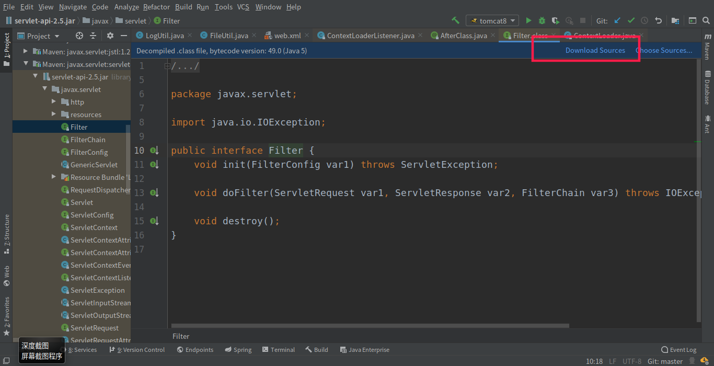

# 1.情景
最近在准备写关于源码阅读的文章，但是我下载的maven资源都是编译后的.class文件，在阅读的时候难度很大，比较走运的是，Idea是一个很优秀的编译器，在这里你打开.class文件后，他会询问你要不要下载源代码，大多时候都可以直接下载源代码来阅读，但是有时候可能仓库里也没有源代码，所以下载的时候就会提示：**Can`t download sources**

 
这就是一件很难受的事情了，我们想要看这些源码，需要自己去找资源，然后导入才行。

# 2.解决办法
自己去找资源肯定不是个好方法，不仅会浪费很多时间，有些资源可能我们根本找不到，这个时候就可以把maven下载资源的时候一同把源码也下载下来。

    1. setting->Build,Execution,Deployment->Build Tools ->maven->Impoting
    2. 找到Automatically download，勾选Source（我习惯将Annotations也勾选上）
    3. 等待下载完成

 

有的时候不会自动下载，那我们需要手动点击一下

 

# 3. 结果
下载完毕之后idea会自动导入，现在就可以愉快的阅读源码了。

 