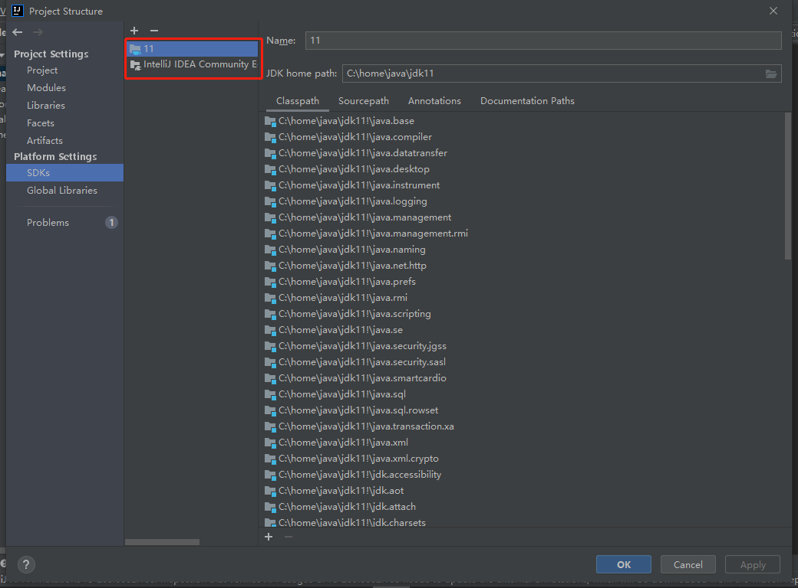

# 前言
之前的文章[自动化编程---JSR269](https://yzstu.blog.csdn.net/article/details/111658356)中，我们实现了使用Processor自动生成代码，但是不能在debug时使用自动生成的代码，要解决这个问题就需要依托IDEA的插件功能了，在这篇文章中，我们先搭建一下IDEA插件开发的环境。
# 软件选型
## IDEA
IDEA 分为两个版本：

- 社区版（Community）：完全免费，代码开源，但是缺少一些旗舰版中的高级特性，以下以IDEA-C代指
- 旗舰版（Ultimate）：30天免费，支持全部功能，代码不开源，以下以IDEA_U代指

我们这里选择的是社区版，因为需要在开发插件的时候获取源码进行调试。
## JDK
我下载的是最新版的IDEA-C 2020.3.1，其要求JDK版本是11

# 下载
## IDEA
IDEA的下载可以直接去官网下载社区版
## JDK
我的电脑上已经有了JDK 1.8，不想再大费周章的去部署JDK11了，所以我等下会直接在IDEA中下载JDK11

# 在IDEA-C中设置环境
## 设置JDK
在Project Structure中导向至SDKs，假如你电脑本身的Jdk不是11的话，需要先在SDKs中删除，也就是选中jdk，然后点击那个“-”符号。

然后点击“+”，我们的电脑上现在没有JDK11，所以先选择Download JDK，选择JDK11，然后选择一个合适的源，再然后选择你要下载的路径，等待下载完成即可。

## 设置IntelliJ Platform Plugin SDK
这里要求你记得你IDEA-C所安装的位置，在刚才设置JDK的界面那里，继续点击“+”，选择Add IntelliJ Platform Plugin SDK，然后选择你IDEA-C所安装的位置即可。

设置完成之后SDKs界面如下：

现在就可以开始进行IDEA插件开发了

