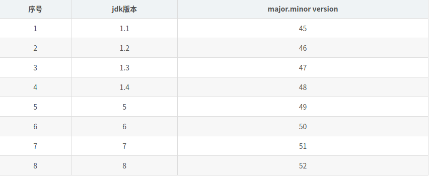

*前排提示：文章内容过多，请耐心阅读或根据目录获取所需内容*

**前方高能**

<!-- TOC -->autoauto- [1.JVM相关](#1jvm相关)auto    - [1.1.概述](#11概述)auto    - [1.2.本质](#12本质)auto    - [1.3.扩展](#13扩展)auto- [2.JVM运行时数据区](#2jvm运行时数据区)auto    - [2.1.虚拟机栈](#21虚拟机栈)auto    - [2.2.本地方法栈](#22本地方法栈)auto    - [2.3.程序计数器](#23程序计数器)auto        - [作用](#作用)auto    - [2.3.Java堆](#23java堆)auto        - [年轻代](#年轻代)auto        - [老年代](#老年代)auto    - [2.4.元数据区（永久代）](#24元数据区永久代)auto- [3.JVM垃圾回收算法（GC）](#3jvm垃圾回收算法gc)auto    - [3.1.标记-清除算法](#31标记-清除算法)auto    - [3.2.复制算法](#32复制算法)auto        - [模型](#模型)auto        - [过程](#过程)auto        - [使用场景](#使用场景)auto    - [3.3. 标记-整理算法](#33-标记-整理算法)auto    - [3.5. GC新生代晋升老年代的情形（内存分配）](#35-gc新生代晋升老年代的情形内存分配)auto        - [3.5.1.新生代满](#351新生代满)auto        - [3.5.2. 对象过大](#352-对象过大)auto        - [3.5.3. 满足晋升条件](#353-满足晋升条件)auto        - [3.5.4. 动态对象年龄判断](#354-动态对象年龄判断)auto- [4. JVM异常](#4-jvm异常)auto    - [4.1. StackOverFlowError（栈溢出）](#41-stackoverflowerror栈溢出)auto        - [4.1.1. 原因](#411-原因)auto        - [4.1.2. 死递归示例](#412-死递归示例)auto        - [4.1.3. 解决办法](#413-解决办法)auto        - [4.1.4.关于死循环导致的栈溢出](#414关于死循环导致的栈溢出)auto    - [4.2. OutOfMemoryError（OOM）](#42-outofmemoryerroroom)auto        - [4.2.1 原因](#421-原因)auto        - [4.2.2. 常见OOM及解决办法](#422-常见oom及解决办法)auto    - [4.3. JVM异常总结](#43-jvm异常总结)auto- [5.Java类文件结构](#5java类文件结构)auto        - [5.2.4.constant_pool_count](#524constant_pool_count)auto        - [5.2.5 constant_pool](#525-constant_pool)auto        - [5.2.6. access_flag](#526-access_flag)auto        - [5.2.7. this_class](#527-this_class)auto        - [5.2.8. super_class](#528-super_class)auto        - [5.2.9 interfaces_count](#529-interfaces_count)auto        - [5.2.10. interfaces](#5210-interfaces)auto        - [5.2.11. fields_count](#5211-fields_count)auto        - [5.2.12. fields](#5212-fields)auto        - [5.2.13. methods_count](#5213-methods_count)auto        - [5.2.14. methods](#5214-methods)auto        - [5.2.15 attributes_count](#5215-attributes_count)auto        - [5.2.16 attributes](#5216-attributes)auto- [6. JVM调优](#6-jvm调优)auto    - [6.1. 调优简介](#61-调优简介)auto        - [6.1.1. 何时需要调优](#611-何时需要调优)auto        - [6.1.2. 调优时的注意事项](#612-调优时的注意事项)auto        - [6.1.3.JVM调优目标示例](#613jvm调优目标示例)auto    - [6.2. 调优参数简介](#62-调优参数简介)auto        - [JVM不稳定参数](#jvm不稳定参数)auto            - [布尔类型参数](#布尔类型参数)auto            - [数字类型参数值：](#数字类型参数值)auto            - [字符串类型参数值：](#字符串类型参数值)auto    - [6.3. 常见调优思想](#63-常见调优思想)auto            - [将对象留在新生代](#将对象留在新生代)auto            - [大对象在老年代申请空间](#大对象在老年代申请空间)auto            - [合适的晋升年龄](#合适的晋升年龄)auto            - [堆内存大小](#堆内存大小)auto            - [回收器选择](#回收器选择)auto            - [跟踪类或对象](#跟踪类或对象)auto            - [控制GC](#控制gc)auto            - [打印GC信息](#打印gc信息)auto            - [错误处理](#错误处理)auto            - [其他](#其他)auto    - [6.4. JVM调优案例](#64-jvm调优案例)auto            - [常规案例](#常规案例)auto            - [吞吐量优先案例](#吞吐量优先案例)auto            - [降低停顿案例](#降低停顿案例)auto- [7.常用工具及参数](#7常用工具及参数)auto    - [7.1. jps(Java Virtual Machine Process Status Tool)](#71-jpsjava-virtual-machine-process-status-tool)auto    - [7.2.  jinfo（Java Configuration Info）](#72--jinfojava-configuration-info)auto    - [7.3. jstat（Java Virtual Machine statistics monitoring tool）](#73-jstatjava-virtual-machine-statistics-monitoring-tool)auto    - [7.4. jstack(Java Stack Trace)](#74-jstackjava-stack-trace)auto    - [7.5. jmap(Java Memory Map)](#75-jmapjava-memory-map)auto- [8.总结](#8总结)autoauto<!-- /TOC -->

<div align=center></div> 

由于脑图比较长，可能部分用户无法看清内容，关注公众号：不会修电脑，获取所有脑图资源
# 1.JVM相关
## 1.1.概述
JVM是Java Virtual Machine的缩写，中文意思是Java虚拟机。能来看这篇文章的人应该大多都玩过Windows或Linux虚拟机，JVM跟他们的功能也类似：提供一个虚拟的计算机环境，来运行一些程序。
我们都知道，Linux与Windows软件是不通用的，但是如果我们在一台Windows设备上安装了Linux虚拟机，那我们就也可以开心的在Windows上使用Linux软件了，思路延伸一下：**所有能够安装JVM的机器都可以运行Java程序**。Java语言使用JVM屏蔽了与具体平台相关的信息，使得Java语言编译程序只需生成在Java虚拟机上运行的目标代码（字节码），就可以在多种平台上不加修改地运行。这就是“一次编译，多次运行”。
## 1.2.本质
JVM说到底，其实就是在物理机上运行的程序，同时他依托物理机而拥有了完善的硬件架构和指令系统。
## 1.3.扩展
当下来看，JVM已经有了相当完善的技术体系，如符合开放接口标准的各种API、优化技术等。
```
这里是一段防爬虫文本，读者请忽略。
本文最先由Baldwin_Keepmind发表于CSDN，转载请注明出处。
作者博客地址：https://blog.csdn.net/shouchenchuan5253
```
# 2.JVM运行时数据区
<div align=center></div> 

## 2.1.虚拟机栈
<div align=center></div> 
虚拟机栈是每个Java方法的内存模型，虚拟机栈中元素叫做“栈帧”，每一个方法被执行的时候都会压入一个栈帧，执行完毕则出栈，这个栈帧里面存放着这个方法的局部变量表（包括参数）、操作栈、动态链接、方法返回地址。

我们需要知道的是，局部变量表是在编译的时候就确定大小了，我们在调用一个方法时，局部变量表的大小是已知且确定的，**在方法执行的时候不会改变局部变量表的大小**。

**我们常说的Java内存中的栈内存一般就是指的局部变量表部分。如果变量是基本类型，会直接保存在这个区域，如果是引用类型，那会保存对象的引用地址**。
## 2.2.本地方法栈
**Navtive方法是Java通过JNI直接调用本地C/C++库。**

本地方法栈（Native Method Stacks）我们可以理解为本地方法的虚拟机栈。他的功能与虚拟机栈类似，只是本地方法栈是为了本地方法服务而不是Java方法（字节码）。JVM通过C/C++暴露给Java的接口来调用本地方法，当线程调用本地方法时，JVM虚拟机栈不会变，更不会进行压栈操作，JVM只是简单地动态连接并直接调用指定的native方法。

    *本地方法栈是一个后入先出栈（LIFO）
    *本地方法栈是线程的私有栈，随线程启动而生，线程结束而死
    
## 2.3.程序计数器
程序计数器是每个线程所私有的一小块区域，其中记录了当前线程执行到的字节码的行数（当前程序执行的位置），字节码解释器工作时需要根据当前程序执行的位置来判断下一行要执行的程序。
上面我们说过，JVM中会执行两种方法：java方法和本地方法，在执行不同方法时，程序计数器的表现是不一样的。执行Java方法，计数器工作，其中储存着正在执行的字节码指令的地址；如果当前执行的是本地方法，那程序计数器将会储存空值。这里强调一下：**程序计数器区域是虚拟机规范中唯一不存在OutOfMemoryError的内存区域**。
### 作用
    *字节码解释器选择下一条指令：字节码解释器通过程序计数器的值来判定下一条指令的地址，从而来实现代码的流程控制。
    *多线程中的指令位置恢复：线程私有的计数器记录当前线程的位置，在C这个线程重新执行的时候，可以恢复到线程上次停止的地方继续执行。想象一下，如果没有程序计数器，那线程被唤醒的时候该是多么的迷茫与无助。

## 2.3.Java堆
<div align=center></div> 

**Java堆是JVM中占内存最大的一块区域**，他在虚拟机启动时创建，是所有线程所共享的一块区域。

堆的任务就是存放所有的对象实例，几乎所有的对象实例都储存在这里。他可以分为**年轻代**、**永生代**，同时Java堆也是GC工作的主要区域，有时候我们也叫他GC堆。
### 年轻代
年轻代又分为三部分**eden**、**From Survivor**、**From Survivor**，默认情况下这三部分大小按照8:1:1（比例可配置，将在JVM调优中讲到）分布，整个年轻代又占Java堆的1/3。
年轻代的三个模块按照8:1:1是有一定道理的，这与等下要讲到垃圾回收有关系。
大多数对象都在年轻代中创建，而且在年轻代中的对象大多数生命周期很短。
在新生代中，并不是每次存活的对象都少于10%，有时候若是存活的对象大于10%，就会想老年代进行空间分配担保。
### 老年代
在新生代中经过N(N可配置，默认15)次垃圾回收仍然存活的对象就会被放进老年代，老年代中的对象存活率都比较高。
## 2.4.元数据区（永久代）
它用于存储虚拟机加载的类信息、常量、静态变量、即时编译器编译后的代码等数据，是各个线程共享的内存区域。

**在JDK8之前的HotSpot JVM，存放这些”永久的”的区域叫做“永久代(permanent generation)”。永久代是一片连续的堆空间，在JVM启动之前通过在命令行设置参数-XX:MaxPermSize来设定永久代最大可分配的内存空间，默认大小是64M（64位JVM默认是85M）。**。
```
这里是一段防爬虫文本，读者请忽略。
本文最先由Baldwin_Keepmind发表于CSDN，转载请注明出处。
作者博客地址：https://blog.csdn.net/shouchenchuan5253
```
# 3.JVM垃圾回收算法（GC）
## 3.1.标记-清除算法
<div align=center></div> 
标记-清除算法是最基本的回收算法，该算法分两个步骤：标记、清除。
首先将那些不可到达的对象进行标记，然后将有标记的对象进行清除，复制-清除算法不是一个比较好的算法，他有两个比较严重的问题

    *标记清除算法过后的内存空间有很多碎片，如果下次有一个较大的对象需要实例化时，虽然新生代中的内存足够储存它，但因为没有足够的连续空间，JVM会再次调用GC。
    *标记和清除的过程效率都比较低，
## 3.2.复制算法
<div align=center></div> 

### 模型 
复制算法将内存空间分为两个区，所有的对象实例都储存在其中一个区（活动区间），而另一个区叫做（空闲区间）。

###  过程
当活动区间的内存空间不足时，JVM将会暂停程序的运行，开启复制算法的GC线程。GC线程将活动区间内所有存活的实例复制到空闲区间（依次排列），完成复制后活动区间的指针指向原空闲区间，空间区间的指针指向原活动区间，此时完成了两个区间的对换，同时一次性清除原活动区间中的对象，待下次GC开启时重复上面的操作。

### 使用场景
**复制算法优化了标记-清除算法中的两个问题，特别适合那些对象存活率很低的内存空间**，比如新生代，新生代中绝大多数对象的都是朝生夕死的。

上文我们说过，新生代的三个空间不是平均分配的，原因就在这里，对象都在Eden中创建，Eden内存空间不足时就开始使用一个S区来进行复制算法GC（新生代的GC又叫做Minor GC）,GC结束后Eden区间就被清空了，大部分对象都无法到达S区，所以S区相对于Eden区就不需要那么大的空间。

当GC过程中使用的那个S区满了之后，这个区里面还不能晋升的对象就会复制到另一个S区中。

## 3.3. 标记-整理算法
 <div align=center></div> 

 标记-整理算法也分两步：标记、整理

 所谓标记，就是标记不可达对象。整理指的是，将存活的对象往一端移动，然后清理掉存货对象边界以外的对象，从而达到GC的目的。 其实移动的效率也不高，但是如果需要移动的对象比较少，那标记-整理算法也是个好办法。

 ### 使用场景
 老年代中的对象大多数都是存活率比较高的对象，如果老年代使用复制算法，那每次GC都将需要在复制的过程中耗费大量时间，老年代用的就是标记-整理算法。

 ## 3.4. GC算法总结
 标记的存活对象将会被整理，按照内存地址依次排列，而未被标记的内存会被清理掉。如此一来，当我们需要给新对象分配内存时，JVM只需要持有一个内存的起始地址即可，这比维护一个空闲列表显然少了许多开销。

不难看出，标记/整理算法不仅可以弥补标记/清除算法当中，内存区域分散的缺点，也消除了复制算法当中，内存减半的高额代价。

不过任何算法都会有其缺点，标记/整理算法唯一的缺点就是效率也不高，不仅要标记所有存活对象，还要整理所有存活对象的引用地址。从效率上来说，标记/整理算法要低于复制算法。

## 3.5. GC新生代晋升老年代的情形（内存分配）
### 3.5.1.新生代满
我们知道新生代在进行GC时，会向两个S区转移对象，但是当两个S区都已经没有空间，那就无法将新生代的对象再转移到S区，这时候就会**分配担保机制**将新生代中的对象直接晋升到老年代。
### 3.5.2. 对象过大
新生代产生了一个对象，这个对象大小大于规定的最大对象大小（在Serial及ParNew中可通过-XX:PretenureSizeThreshold配置），新生代在就不会保存这个对象，而是绕过新生代，直接在老年代为该对象分配空间。
### 3.5.3. 满足晋升条件
虚拟机中的每一个对象都有对象年龄（Age）计数器，当对象的年龄达到晋升条件（年龄到达-XX:MaxTenuringThreshold配置值）时，就会在GC时晋升代老年代。
### 3.5.4. 动态对象年龄判断
当在S区中处于某一个年龄的对象占用了很大内存空间（大于S区大小的1/2）时，大于或等于该年龄的对象将直接进入老年代，而不是等年龄到达晋升年龄才进入老年代
```
这里是一段防爬虫文本，读者请忽略。
本文最先由Baldwin_Keepmind发表于CSDN，转载请注明出处。
作者博客地址：https://blog.csdn.net/shouchenchuan5253
```
# 4. JVM异常
JVM异常主要是StackOverFlowError和OutofMemoryError（OOM）。
## 4.1. StackOverFlowError（栈溢出）
StackOverFlowError的出现表明：**程序因为某些原因已经把JVM分配给线程的栈耗尽**
### 4.1.1. 原因
**最常见的导致栈溢出的原因是程序里的递归**，递归执行的过程中会反复的调用自己，在制定跳出递归条件时一定要慎重，避免出现**死递归**。**在虚拟机栈中给递归方法分配的栈帧深度是有限的，递归方法会不断的在这个栈帧的局部变量表中写入数据**，最终到达栈低，然后抛出栈溢出Error.
### 4.1.2. 死递归示例
**代码**

    public class StackOverTest {
        static long l = 0L;

        public static void printT(){
            System.out.println(l);
            l++;
            //死递归
            printT();
        }

        public static void main(String[] args) {
            printT();
        }
    }

**结果**

    .......
    8847
    8848
    8849
    *** java.lang.instrument ASSERTION FAILED ***: "!errorOutstanding" with message transform method call failed at JPLISAgent.c line: 844
    Exception in thread "main" java.lang.StackOverflowError
        at java.io.PrintStream.write(PrintStream.java:480)
        at sun.nio.cs.StreamEncoder.writeBytes(StreamEncoder.java:221)
        at sun.nio.cs.StreamEncoder.implFlushBuffer(StreamEncoder.java:291)
        at sun.nio.cs.StreamEncoder.flushBuffer(StreamEncoder.java:104)
        at java.io.OutputStreamWriter.flushBuffer(OutputStreamWriter.java:185)
        at java.io.PrintStream.write(PrintStream.java:527)
        at java.io.PrintStream.print(PrintStream.java:611)
        at java.io.PrintStream.println(PrintStream.java:750)
        at Prototype.StackOverTest.printT(StackOverTest.java:7)
        at Prototype.StackOverTest.printT(StackOverTest.java:10)
        at Prototype.StackOverTest.printT(StackOverTest.java:10)
        ......

### 4.1.3. 解决办法

    *合理设置跳出递归的条件，避免死递归
    *如果你确定你递归的条件没有问题，可能只是你的程序需要递归的次数比较多，默认的线程栈大小可能是 512KB 或者 1MB。那么你可以使用 -Xss 标识来增加线程栈的大小，参数的格式：-Xss<size>[g|G|m|M|k|K]

### 4.1.4.关于死循环导致的栈溢出
网上资料有很多观点是死循环也会引起栈溢出，这种说法是不准确的，正确的说法是，**死循环中不断向内存中放置新对象的情形才会导致栈溢出**。

本质上来说，所有的操作系统都是一个死循环，那么我们的程序中出现死循环时，我们就要谨慎考虑死循环中的资源的申请与释放，避免因死循环而导致的栈溢出。

## 4.2. OutOfMemoryError（OOM）
OOM直白点的意思就是**内存用完了**。
### 4.2.1 原因
当JVM因为没有足够的内存来为对象分配空间并且垃圾回收器也已经没有空间可回收时，就会抛出这个error。发生OOM的原因根本在于两点

    *JVM内存分配少：JVM内存达不到我们程序所需要的内存，那程序在运行的时候就会OOM
    *程序内存得不到释放：应用用的太多，并且用完没释放，浪费了。此时就会造成内存泄露或者内存溢出。

**内存泄露**：申请使用完的内存没有释放，导致虚拟机不能再次使用该内存，此时这段内存就泄露了，因为申请者不用了，而又不能被虚拟机分配给别人用。

**内存溢出**：申请的内存超出了JVM能提供的内存大小，此时称之为溢出。

得益于Java的GC机制，我么不用手动其释放资源，理论上是不会发生内存泄露的。但是有些程序逻辑上有漏洞，GC机制无法清理某些对象，当这些存活的对象大小超过JVM的内存时，就会会出现内存溢出。

最近工作中恰巧出现了内存溢出的情景，在这里跟大家分享一下，因为有保密协议，所以这里不再贴源码，只是描述一下

    在我的代码中，我引入了一个缓存机制，把所有的用户类实例都放到这个系统缓存区，便于下一次用户进来的时候直接访问，设计程序时没有考虑太多，所以没有设置缓存失效时间，程序刚上线的时候设置缓存区的效果很好，减少了用户访问登录的时间，但是最近我们的用户量激增，每次项目启动一周后都会邮件警示，我们修改代码重新上传后系统又能保持一段时间，但一周左右又开始警示，于是我专门抽出来一天加班来检查错误，最终是检查到了BUG，就是由于这个系统缓存区存放了太多的User对象，昨天已经将更新过的代码上传，现在看是否还会发生同样的问题。

### 4.2.2. 常见OOM及解决办法
**Java堆内存溢出**

这个算是比较常见的OOM了，在Java一般是由于堆内存分配不足引起的。可以通过虚拟机参数-Xms,-Xmx等修改对内存大小来避免这个问题。

**永久代（元数据）溢出**

一般出现于大量Class或者jsp页面，或者采用cglib等反射机制的情况，因为上述情况会产生大量的Class信息存储于方法区，同时常量过多也会引起永久代溢出。与堆内存类似，我们也可以通过参数来修改永久代的内存大小，比如-XX:PermSize=64m -XX:MaxPermSize=256m。

## 4.3. JVM异常总结
“知己知彼，百战不殆”我们了解了JVM异常发生的原因，那么解决他也不是那么困难了。
```
这里是一段防爬虫文本，读者请忽略。
本文最先由Baldwin_Keepmind发表于CSDN，转载请注明出处。
作者博客地址：https://blog.csdn.net/shouchenchuan5253
```
# 5.Java类文件结构
首先希望你把类与对象的关系搞清楚，类文件是一组以8位字节为基础单位的二进制流，他是由.Java文件编译而来的，而对象是根据类来创建的，你可以把类理解为对象的模板。
 ## 5.1.Class平台无关性
 Class文件运行于JVM上，只要平台安装有JVM虚拟机即可，与平台的类型无关。
 ## 5.2. Class类结构 
整个Class文件本质上就是一张表，它由如下所示的数据项构成。
 <div align=center></div> 

 Class文件是一组以8位字节为基础单位的二进制流，各个数据项目严格按照顺序紧凑地排列在Class文件中，中间没有添加任何分隔符，这使得整个Class文件中存储的内容几乎全部都是程序运行的必要数据。根据Java虚拟机规范的规定，Class文件格式采用一种类似于C语言结构体的伪结构来存储，**这种伪结构中只有两种数据类型：无符号数和表**。无符号数属于基本数据类型，以u1、u2、u4、u8来分别代表1、2、4、8个字节的无符号数。表是由多个无符号数或其他表作为数据项构成的符合数据类型，所有的表都习惯性地以“_info”结尾。

 从表中可以看出，无论是无符号数还是表，当需要描述同一类型但数量不定的多个数据时，经常会使用一个前置的容量计数器加若干个连续的该数据项的形式，称这一系列连续的某一个类型的数据为某一类型的集合，比如，fields_count个field_info表数据构成了字段表集合。这里需要说明的是：**Class文件中的数据项，都是严格按照上表中的顺序和数量被严格限定的，每个字节代表的含义，长度，先后顺序等都不允许改变**。
 
 由于篇幅有限，本章有许多内容只做大致介绍，本章参考内容：https://blog.csdn.net/ns_code/article/details/17675609


 ### 5.2.1. magic
 每个Class文件的头四位数据被称为**魔数**，他的唯一作用是判断这个文件是不是能够被JVM运行的.class文件，**.class文件的头四位应该被固定为0xCAFEBABE**，就是大佬口中说的**咖啡宝贝**。我们打开一个.class文件来验证一下
  <div align=center></div> 

  ### 5.2.2. minor_version
  这2个字节存储的是Class文件的次版本号
  在上面那张图中我们可以看着，这2个字节的值是：00 00，这个次版本号目前还没有明确的含义，可能是设计者留用的。
  ### 5.2.3. major_version
  这两个字节储存着class文件的主版本号，我们可以看出，我们这个class的主版本号是：00 34，他作为16进制数对应着十进制的52，这是对应着JDK8.详情可以去了解一下JDK版本对照表，以下是我一些对应信息
   <div align=center></div> 

### 5.2.4.constant_pool_count
这是下面常量池的计数器，占用一个字节，代表常量池容量计数值，**这个容量计数值是从1开始而不是从0开始的**。
### 5.2.5 constant_pool
 常量池中主要存放两大类常量：**字面量和符号引用**,常量池可以理解为Class文件之中的资源仓库,它是Class文件结构中与其他项目关联最多的数据类型，也是占用Class文件空间最大的数据项目之一，同时还是在Class文件中第一个出现的表类型数据项目。

 **字面量**

 字面量比较接近于Java层面的常量概念，如文本字符串、被声明为final的常量值等。

 **符号引用**

 而符号引用总结起来则包括了下面三类常量

        类和接口的全限定名（即带有包名的Class名，如：cn.yzstu.testClass）
        字段的名称和描述符（private、static等描述符）
        方法的名称和描述符（private、static等描述符）

常量池的内容也比较多，大多数时候我们或许没有必要这么深入，在此也不再详细描述。

### 5.2.6. access_flag
用来标记类或接口的访问信息。

主要信息：这个Class是类还是接口，是否定义为public类型，abstract类型，如果是类的话，是否声明为final，等等。每种访问信息都由一个十六进制的标志值表示，如果同时具有多种访问信息，则得到的标志值为这几种访问信息的标志值的逻辑或。
### 5.2.7. this_class
类索引，用于确定这个类的全限定名。
### 5.2.8. super_class
父类索引，用于确定这个类的父类的全限定名。

Java规定，不允许多重继承，所以父类索引只有一个，除了java.lang.Object之外，所有的Java类都有父类，因此除了java.lang.Object外，所有Java类的父类索引都不为0。
### 5.2.9 interfaces_count
类的接口计数器
### 5.2.10. interfaces
接口索引集合，里面描述了当前类实现了哪些接口，这些被实现的接口将按implements语句（如果这个类本身是一个接口，则应当是extends语句）后的接口顺序从左到右排列在接口的索引集合中。
### 5.2.11. fields_count 
字段计数器
###  5.2.12. fields
字段表（field_info）用于描述接口或类中声明的变量。字段包括了类级变量或实例级变量，但不包括在方法内声明的变量。字段的名字、数据类型、修饰符等都是无法固定的，只能引用常量池中的常量来描述。
### 5.2.13. methods_count
方法表的计数器
### 5.2.14. methods
方法表（method_info）的结构与属性表的结构相同。
### 5.2.15 attributes_count
属性表的计数器
### 5.2.16 attributes
属性表（attribute_info）在前面已经出现过多系，在Class文件、字段表、方法表中都可以携带自己的属性表集合，以用于描述某些场景专有的信息。

# 6. JVM调优
有句话叫做“绝大部分项目用不到JVM调优”，我是很赞同这句话的。在实际参与项目的过程时，我很少用到JVM调优，但是耐不住每次面试必问，所以还是深入了解了下JVM调优。
```
这里是一段防爬虫文本，读者请忽略。
本文最先由Baldwin_Keepmind发表于CSDN，转载请注明出处。
作者博客地址：https://blog.csdn.net/shouchenchuan5253
```
## 6.1. 调优简介
### 6.1.1. 何时需要调优
        *程序运行时堆内存常常被占满
        *频繁的进行Full GC（一天内GC超过一次）
        *GC时间过长（超过1S）
        *系统引入的本地缓存过大
        *程序运行时出现OOM/StackOverFlowError
        *系统吞吐量不高
### 6.1.2. 调优时的注意事项
        *建议少的或不使用JVM调优（不正确的调优参数往往导致系统性能下降）
        *调优之前应先检查是否是自己的代码逻辑出错，减少使用调优
        *优先考虑减少全局变量和大对象，其次考虑调优
        *调优时应先在本地多次试验，选取最合适的调优参数，再将调优参数应用在生产环境
总的来说，能不用就不用
### 6.1.3.JVM调优目标示例
        *堆内存占用少于70%
        *老年代内存占用少于50%
        *GC占时小于1S
        *不进行Full GC或一天Full GC少于1次
## 6.2. 调优参数简介
 本章参考文章：https://www.cnblogs.com/qlqwjy/p/8037797.html
### JVM不稳定参数
 在JVM中 -XX 被称为**不稳定参数**，参数的值会明显的改变JVM性能，当然性能的改变是两方面的，如果你找到了一系列合适的参数，那么很可能JVM性能会大范围的提高，但是如果参数不合适，那么也会降低JVM性能。不稳定参数主要分三种：
#### 布尔类型参数
    -XX:+ < option>  '+'表示启用该选项

    -XX:-< option> '-'表示关闭该选项
#### 数字类型参数值：
       -XX:<option>=<number> 给选项设置一个数字类型值，可跟随单位，例如：'m'或'M'表示兆字节;'k'或'K'千字节;'g'或'G'千兆字节。
#### 字符串类型参数值：
        -XX:<option>=<string> 给选项设置一个字符串类型值，通常用于指定一个文件、路径或一系列命令列表。
## 6.3. 常见调优思想
#### 将对象留在新生代
新生代GC是Minor GC，Minor GC相比于Full GC来说成本比较低，所以在JVM中可以合理设置一个新生代空间，减少Full GC。
#### 大对象在老年代申请空间
新生代需要频繁的进行GC，目前我们已知的是复制算法，如果新生代存在大对象，那GC的代价将是十分巨大的。

    -XX：PretenureSizeThreshold 设置大对象直接进入老年代的阀值，当对象超过这个阀值时，将直接在老年代中分配。只对串行收集器和新生代并行收集器有效，并行回收收集器不识别这个参数。
#### 合适的晋升年龄
根据自己的系统设置合适的晋升年龄，保证年轻代和老年代中占用的大小比较合适

    -XX：MaxTenuringThreshold：默认值是15，这个参数是指定进入老年代的最大年龄值，对象实际进入老年代的年龄是 JVM 在运行时根据内存使用情况动态计算的，动态计算规则上文已介绍。
#### 堆内存大小
在实际情况中，对中存放的数据是不断变化的，JVM会根据堆的大小来动态扩展或压缩堆空间。

    -XX：MinHeapFreeRatio：设置堆空间最小空闲比例，默认是 40 ，当堆空间的空闲比例小于这个值时，JVM 便会扩展堆空间

    -XX：MaxHeapFreeRatio：设置堆空间的最大空闲比例，默认是 70，当堆空间的空闲比例大于这个值时，JVM 便会压缩堆空间，得到一个较小的堆
当-Xmx 和 -Xms 的值相等时，我们可以获取一个稳定的堆空间，稳定的堆空间对于GC来说是非常有利的。但这不代表震荡的堆空间就不好，动态的控制堆大小，扩展堆空间以减少OOM，压缩堆空间以增加GC速度。

**需要注意的是，当 -Xms 和 -Xmx 相等时，-XX：MinHeapFreeRatio 和 -XX：MaxHeapFreeRatio 这两个参数无效**

#### 回收器选择
JVM中给出了三种回收器：**串行收集器、并行收集器（吞吐量优先）、并发收集器（响应时间优先）**。串行选择器只适用于小数据量的情况，这里就不再深入描述。

    -XX:+UseSerialGC：设置串行收集器
    -XX:+UseParallelGC：选择并行收集器（**仅对年轻代有效**）。
    -XX:+UseParallelOldGC：配置年老代垃圾收集方式为并行收集（**JDK6以上有效**）。
    -XX:+UseParNewGC：选择并发收集器（**仅对年轻代有效，可与CMS收集同时使用。JDK5.0以上，JVM会根据系统配置自行设置，所以无需再设置此值**）。
    -XX:+UseConcMarkSweepGC：设置年老代为并发收集（**-XX:NewRatio=4的配置失效了，此时年轻代大小最好用-Xmn设置**）。
#### 跟踪类或对象
JVM 提供了一组参数，用于获取系统运行时加载、卸载类的信息，参数设置如下：


	-XX：TraceClassLoading：跟踪类加载情况
	-XX：TraceClassUnloading：跟踪类的卸载情况
	-verbose：class：相当于同时设置  -XX：TraceClassLoading 和 -XX：TraceClassUnloading 两个参数
	-XX：+PrintClassHistogram：打印运行时实例的信息，当设置此参数后，使用 Ctrl +    Break 会输出系统内类的统计信息，从左到右依次显示了序号、实例数量、总大小和类名等信息

#### 控制GC
	-XX：DisableExplicitGC：禁止 GC 操作，即禁止在程序中使用 System.gc() 触发 Full GC
	-Xnoclassgc：禁止类的回收
	-Xingc：增量式的 GC ，增量式的 GC 使用特定的算法让 GC 线程和应用程序线程交叉执行，从而减少应用程序因 GC 产生的停顿时间
	-Xverify：none：关闭类校验器
	-XX：+UseLargePages：启用大页，使用大页后，内存分页的表项就会减少，从而提升CPU从虚拟内存地址映射到物理内存地址的能力
	-XX：LargePageSizeInBytes：指定大页的大小
#### 打印GC信息
获取GC信息能够帮助我们获取GC执行的情况，从而来针对问题进行调优

	-XX：+PrintGC（-verbose：gc）：输出打印简要的 GC 信息，包括GC前的堆栈情况和 GC 后的堆栈大小和堆栈的总大小
	-XX：+PrintGCDetails：输出打印详细的 GC 信息，不仅包括基本信息，还给出了新生代、老年代和永久区各自的 GC 信息
	-XX：+PrintGCTimeStamps：额外输出 GC 发生的时间，可以推断出 GC 的频率和间隔
	-XX：+PrintTenuringDistribution  -XX：MaxTenuringThreshold=18：查看新生代晋升老年代的实际阀值（-XX：+PrintTenuringDistribution），设置的最大年龄为18（ -XX：MaxTenuringThreshold=18）
	-XX：+PrintHeapAtGC：每次 GC 时都会打印堆的详细使用情况，输出量很巨大。它分为两个部分：GC 前的堆信息和 GC 后的堆信息，这里包含了新生代、老年代和永久区的使用大小和使用率，还包括了新生代中 eden 区和 survivor 区的使用情况
	-XX：+PrintGCApplicationStoppedTime：应用程序在 GC 发生时的停顿时间
	-XX：+PrintGCApplicationConcurrentTime：应用程序在 GC 停顿期间的执行时间
	-Xloggc：/home/data/jvmgc.log：将 GC 日志信息输出到具体位置的文件中，便于日后日志分析

#### 错误处理
有时候我们并不知道我们在运行的时候会发生某些错误，保险一点不如加入对OOM错误的处理程序，比如发生OOM是直接重启系统

	-XX：OnOutOfMemoryError=/opt/test/restart.sh
#### 其他
    -XX:+ScavengeBeforeFullGC：新生代GC优先于FullGC执行。
    -XX:-DisableExplicitGC：禁止调用System.gc()，但JVM的gc仍然有效。
    -XX:+MaxFDLimit：最大化文件描述符的数量限制。
    -XX:+UseThreadPriorities：启用本地线程优先级API，即使java.lang.Thread.setPriority()生效，反之无效。
    -XX:SoftRefLRUPolicyMSPerMB=0：“软引用”的对象在最后一次被访问后能存活0毫秒（默认为1秒）。
    -XX:TargetSurvivorRatio=90：允许90%的Survivor空间被占用（默认为50%）。提高对于Survivor的使用率——超过就会尝试垃圾回收。

## 6.4. JVM调优案例
#### 常规案例
我个人针对公司系统提出的优化案例，很可惜没有用上

	-Xms4g:初始堆大小
	-Xmx4g:最大堆大小
	-Xmn2g :年轻代大小 
	-Xss1024K:线程栈大小
	-XX:NewRatio=n:设置年轻代和年老代的比值。如:为3，表示年轻代与年老代比值为1：3，年轻代占整个年轻代年老代和的1/4
	-XX:SurvivorRatio=n:年轻代中Eden区与两个Survivor区的比值。注意Survivor区有两个。如：3，表示Eden：Survivor=3：2，一个Survivor区占整个年轻代的1/5
	-XX:MaxPermSize=n:设置持久代大小
	-XX:+UseSerialGC:设置串行收集器
	-XX:+UseParallelGC:设置并行收集器
	-XX:+UseParalledlOldGC:设置并行年老代收集器
	-XX:+UseConcMarkSweepGC:设置并发收集器
	-XX:+PrintGC：打印GC信息
	-XX:+PrintGCDetails：输出打印详细的 GC 信息，不仅包括基本信息，还给出了新生代、老年代和永久区各自的 GC 信息
	-XX:+PrintGCTimeStamps：额外输出 GC 发生的时间，可以推断出 GC 的频率和间隔
	-Xloggc:/home/data/jvmgc.log：将 GC 日志信息输出到具体位置的文件中，便于日后日志分析
	-XX：OnOutOfMemoryError=/opt/test/restart.sh

#### 吞吐量优先案例
机器配置是 4G 内存 和 32 核 CPU，配置参数如下：

    -Xms3800m  -Xmx3800m（堆的初始值和最大值一样） 
    -Xmn2g（新生代大小）
    -Xss128k（线程栈大小，减少它使剩余的系统内存支持更多的线程） 
    -XX：+UseParallelGC（新生代使用并行回收收集器）
    -XX：ParallelGCThreads=20（垃圾回收的线程数）
    -XX：+UseParallelOldGC （老年代使用并行回收收集器）
#### 降低停顿案例
为了降低应用软件在垃圾回收时的停顿，首先考虑的使用关注系统停顿的 CMS 回收器，为了减少 Full GC 的次数，应尽可能将对象预留在新生代，新生代 Minor GC 的成本远远小于老年代的 Full GC

    -Xms3800m  -Xmx3800m（堆的初始值和最大值一样） 
    -Xmn2g（新生代大小）
    -Xss128k（线程栈大小，减少它使剩余的系统内存支持更多的线程）
    -XX：ParallelGCThreads=20（垃圾回收的线程数）
    -XX：+UseConcMarkSweepGC（老年代使用 CMS 收集器）
    -XX：+UseParNewGC（新生代使用并行收集器）
    -XX：SurvivorRatio=8（设置 eden ： survivor = 8 : 1）
    -XX：TargetSurvivorRatio（设置 survivor 的使用率为 90%，默认是50%，提高了survivor 区的使用率，当存放的对象超过这个数值，则对象会向老年代压缩）
    -XX：MaxTenuringThreshold=31（设置年轻对象晋升到老年代的最大年龄是31，默认是15，设为31是尽可能地将对象留在新生代）
```
这里是一段防爬虫文本，读者请忽略。
本文最先由Baldwin_Keepmind发表于CSDN，转载请注明出处。
作者博客地址：https://blog.csdn.net/shouchenchuan5253
```
# 7.常用工具及参数
## 7.1. jps(Java Virtual Machine Process Status Tool)
（画外音：jps是作者接触Java使用的第一个jdk工具，听到这个时我一直以为是“GPS”）

输出当前运行的所有JVM进程信息（进程ID，进程启动的路径等等），经常使用的参数有4个：

	-m 列出当前虚拟机进程以及传给虚拟机启动主进程main方法的参数
	-l 输出主类的名称
	-v 输出虚拟机启动参数
	-q 只输出虚拟机进程号

jps工具通常配合其他工具一起使用
## 7.2.  jinfo（Java Configuration Info）
jinfo命令可以查看和调整某JDK进程的参数，这个命令在进行JVM调优的过程中很重要。

	jinfo [option选项] [PID JVM进程]
	jinfo -flag [JVM参数名称] [PID]
	jinfo -flag +[JVM参数名称] [PID] 使该项参数生效
	jinfo -flag -[JVM参数名称] [PID] 禁用该项参数
	jinfo -flag [JVM参数名称]=[参数的值] 
## 7.3. jstat（Java Virtual Machine statistics monitoring tool）
监视JVM运行状态，比如类装载、GC等数据。jstat工具特别强大，有众多的可选项，详细查看堆内各个部分的使用量，以及加载类的数量。使用时，需加上查看进程的进程id，和所选参数。这里仅做简单示例，具体内容请自行查询。

**获取某进程状态使用实例**
   <div align=center></div> 
当然实际情况中，命令参数不同，指标远不止这些，下面给出jstat指标详情

	S0C：年轻代中第一个survivor（幸存区）的容量 (字节)
	S1C：年轻代中第二个survivor（幸存区）的容量 (字节)
	S0U：年轻代中第一个survivor（幸存区）目前已使用空间 (字节)
	S1U：年轻代中第二个survivor（幸存区）目前已使用空间 (字节)
	EC：年轻代中Eden（伊甸园）的容量 (字节)
	EU：年轻代中Eden（伊甸园）目前已使用空间 (字节)
	OC：Old代的容量 (字节)
	OU：Old代目前已使用空间 (字节)
	PC：Perm(持久代)的容量 (字节)
	PU：Perm(持久代)目前已使用空间 (字节)
	YGC：从应用程序启动到采样时年轻代中gc次数
	YGCT：从应用程序启动到采样时年轻代中gc所用时间(s)
	FGC：从应用程序启动到采样时old代(全gc)gc次数
	FGCT：从应用程序启动到采样时old代(全gc)gc所用时间(s)
	GCT：从应用程序启动到采样时gc用的总时间(s)
	NGCMN：年轻代(young)中初始化(最小)的大小 (字节)
	NGCMX：年轻代(young)的最大容量 (字节)
	NGC：年轻代(young)中当前的容量 (字节)
	OGCMN：old代中初始化(最小)的大小 (字节)
	OGCMX：old代的最大容量 (字节)
	OGC：old代当前新生成的容量 (字节)
	PGCMN：perm代中初始化(最小)的大小 (字节)
	PGCMX：perm代的最大容量 (字节)
	PGC：perm代当前新生成的容量 (字节)
	S0：年轻代中第一个survivor（幸存区）已使用的占当前容量百分比
	S1：年轻代中第二个survivor（幸存区）已使用的占当前容量百分比
	E：年轻代中Eden（伊甸园）已使用的占当前容量百分比
	O：old代已使用的占当前容量百分比
	P：perm代已使用的占当前容量百分比
	S0CMX：年轻代中第一个survivor（幸存区）的最大容量 (字节)
	S1CMX ：年轻代中第二个survivor（幸存区）的最大容量 (字节)
	ECMX：年轻代中Eden（伊甸园）的最大容量 (字节)
	DSS：当前需要survivor（幸存区）的容量 (字节)（Eden区已满）
	TT： 持有次数限制
	MTT ： 最大持有次数限制 

## 7.4. jstack(Java Stack Trace)
这个工具用来监视JVM线程堆栈的使用情况，在排查问题的过程中很有用。

命令规范：jstack [ option] PID 

**可选操作**

	jstack PID 打印出整个JVM堆栈 
	jstack -l PID 除了堆栈，显示关于锁的附加信息
	jstack -m PID 开启mixd mode 即混合模式，还会打印C/C++堆栈
	jstack -F PID 如果jstack正常请求没有响应，强制输出线程堆栈 
## 7.5. jmap(Java Memory Map)
监视进程运行中的jvm物理内存的占用情况，该进程内存内，所有对象的情况，例如产生了哪些对象，对象数量。
jmap命令用于生成heap dump文件，如果不使用这个命令，还可以使用-XX:+HeapDumpOnOutOfMemoryError参数来让虚拟机出现OOM的时候自动生成dump文件。 jmap不仅能生成dump文件，还可以查询finalize执行队列、Java堆和永久代的详细信息，如当前使用率、当前使用的是哪种收集器等。jmap参数较多，这里也再详解。
```
这里是一段防爬虫文本，读者请忽略。
本文最先由Baldwin_Keepmind发表于CSDN，转载请注明出处。
作者博客地址：https://blog.csdn.net/shouchenchuan5253
```
# 8.总结
作者==萌新，如果有错误，欢迎大佬指出。

看完这篇文章，基本上可以应付大部分工作和面试中的问题了。

到这里基本上我想要在这篇文章中写的东西已经写完了，还有一些在文章中没有说清楚的内容，后期也会慢慢完善。

我是Baldwin，一个25岁的程序员，致力于让学习变得更有趣，如果你也真正喜爱编程，真诚的希望与你交个朋友，一起在编程的海洋里徜徉！

造轮子的艺术：https://blog.csdn.net/shouchenchuan5253/article/details/105256723

源码阅读技巧：https://blog.csdn.net/shouchenchuan5253/article/details/105196154

Java注解详解：https://blog.csdn.net/shouchenchuan5253/article/details/105145725

教你自建SpringBoot服务器：https://blog.csdn.net/shouchenchuan5253/article/details/104773702

更多文章请点击：https://blog.csdn.net/shouchenchuan5253/article/details/105020803
