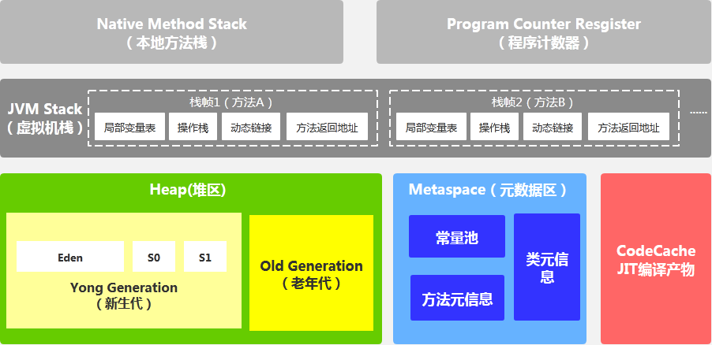
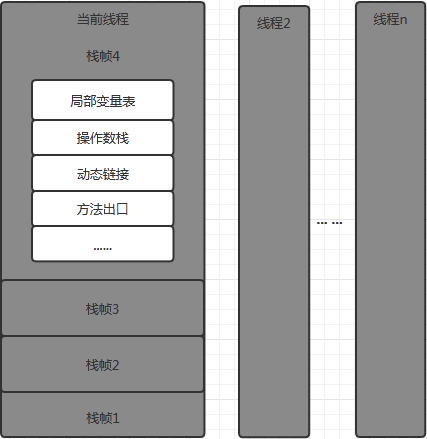
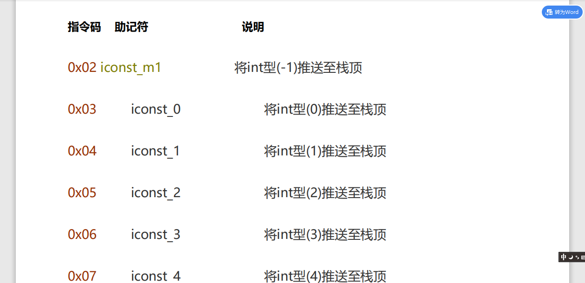

# 1. 前言
我之前的一篇文章[JVM虚拟机详解](https://yzstu.blog.csdn.net/article/details/105462458)大致讲了一下JVM，经过一段时间的工作学习，对JVM有了更加深入和详细的见解，JVM的内容实在是太多，所以打算通过几篇文章分享给大家。现在这篇文章主要讲的是JVM的栈内存。
# 2. 概述

我们在数据结构中经常提到的栈并不是虚拟机栈，只能说虚拟机栈是栈的一种。

虚拟机栈内存是虚拟运行时内存中的一小块，将其称为线程栈或许更为恰当，因为一个栈往往对应着一个线程的运行时的内存模型，所以请大家先在脑海中将栈与线程联系起来，这样有助于大家理解下面的内容。每一个栈中还会有许多个栈帧，每一个栈帧又对应着当前线程所执行的方法。

# 3. 栈与其他内存区域联动
## 3.1. 栈与程序计数器
没新开一个线程，就会创建一个栈，并且在程序计数器中也会为新开的栈分配一块区域来为当前栈记录程序的执行位置，程序计数器对于多线程和GC有很大意义，具体内容我们会在下文中详细讲解。
## 3.2. 栈与堆
在每一个栈帧中都会有许多的临时变量，这些变量中有可能是对象，而大家应该知道（如果不知道就去看[JVM虚拟机详解](https://yzstu.blog.csdn.net/article/details/105462458)），对象都是储存在堆内存中，所以说，栈可能会引用堆中的对象。
## 3.3. 栈与元数据区
元数据区中存储虚拟机加载的类信息、常量、静态变量、即时编译器编译后的代码等数据，是各个线程共享的内存区域，其与栈的关系，参考堆与栈的关系。
## 3.4. 栈与本地方法栈
栈中的方法有可能也会引用本地方法栈中方法。
# 4. jvm栈内存

# 5. 准备工作
## 5.1. 工具
### 5.1.1. JVM指令手册
JVM指令手册是java官方提供的用于更好的理解.class文件指令或.class反编译文件的指导文档，可以去官网查看下载或百度搜索，不过为了更好的理解本文，建议大家扫描本文最下方我的公众号二维码，回复“jvm指令手册”获取。

### 5.1.2. javap
javap是JDK提供的一个命令行工具,javap能对给定的class文件提供的字节代码进行反编译。

通过它，可以对照源代码和字节码，从而了解很多编译器内部的工作,对更深入地理解如何提高程序执行的效率等问题有极大的帮助。

使用格式
```shell
javap <options> <classes>
```
## 5.2. 反编译
创建Math、Main类，内容如下：
```java
package cn.yzstu.jvm;

/**
 * @author Baldwin
 */
public class Math {
    public int compute(){
        System.out.println("compute come in");
        int a = 5;
        int b = 10;
        int c = (a + b) * 10;
        return c;
    }

    public static void main(String[] args) {
        Math math = new Math();
        int compute = math.compute();
        System.out.println(compute);
    }
}
```
```java
package cn.yzstu.jvm;

/**
 * @author Baldwin
 */
public class Main {
    public static void main(String[] args) {
        Math math = new Math();
        int compute = math.compute();
        System.out.println(compute);
    }
}
```
先编译一下，查看Math.class文件，内容应当如下：
```hex
  Offset: 00 01 02 03 04 05 06 07 08 09 0A 0B 0C 0D 0E 0F 	
00000000: CA FE BA BE 00 00 00 34 00 2F 0A 00 09 00 1E 09    J~:>...4./......
00000010: 00 1F 00 20 08 00 21 0A 00 22 00 23 07 00 24 0A    ......!..".#..$.
00000020: 00 05 00 1E 0A 00 05 00 25 0A 00 22 00 26 07 00    ........%..".&..
00000030: 27 01 00 06 3C 69 6E 69 74 3E 01 00 03 28 29 56    '...<init>...()V
00000040: 01 00 04 43 6F 64 65 01 00 0F 4C 69 6E 65 4E 75    ...Code...LineNu
00000050: 6D 62 65 72 54 61 62 6C 65 01 00 12 4C 6F 63 61    mberTable...Loca
00000060: 6C 56 61 72 69 61 62 6C 65 54 61 62 6C 65 01 00    lVariableTable..
00000070: 04 74 68 69 73 01 00 13 4C 63 6E 2F 79 7A 73 74    .this...Lcn/yzst
00000080: 75 2F 6A 76 6D 2F 4D 61 74 68 3B 01 00 07 63 6F    u/jvm/Math;...co
00000090: 6D 70 75 74 65 01 00 03 28 29 49 01 00 01 61 01    mpute...()I...a.
000000a0: 00 01 49 01 00 01 62 01 00 01 63 01 00 04 6D 61    ..I...b...c...ma
000000b0: 69 6E 01 00 16 28 5B 4C 6A 61 76 61 2F 6C 61 6E    in...([Ljava/lan
000000c0: 67 2F 53 74 72 69 6E 67 3B 29 56 01 00 04 61 72    g/String;)V...ar
000000d0: 67 73 01 00 13 5B 4C 6A 61 76 61 2F 6C 61 6E 67    gs...[Ljava/lang
000000e0: 2F 53 74 72 69 6E 67 3B 01 00 04 6D 61 74 68 01    /String;...math.
000000f0: 00 0A 53 6F 75 72 63 65 46 69 6C 65 01 00 09 4D    ..SourceFile...M
00000100: 61 74 68 2E 6A 61 76 61 0C 00 0A 00 0B 07 00 28    ath.java.......(
00000110: 0C 00 29 00 2A 01 00 0F 63 6F 6D 70 75 74 65 20    ..).*...compute.
00000120: 63 6F 6D 65 20 69 6E 07 00 2B 0C 00 2C 00 2D 01    come.in..+..,.-.
00000130: 00 11 63 6E 2F 79 7A 73 74 75 2F 6A 76 6D 2F 4D    ..cn/yzstu/jvm/M
00000140: 61 74 68 0C 00 11 00 12 0C 00 2C 00 2E 01 00 10    ath.......,.....
00000150: 6A 61 76 61 2F 6C 61 6E 67 2F 4F 62 6A 65 63 74    java/lang/Object
00000160: 01 00 10 6A 61 76 61 2F 6C 61 6E 67 2F 53 79 73    ...java/lang/Sys
00000170: 74 65 6D 01 00 03 6F 75 74 01 00 15 4C 6A 61 76    tem...out...Ljav
00000180: 61 2F 69 6F 2F 50 72 69 6E 74 53 74 72 65 61 6D    a/io/PrintStream
00000190: 3B 01 00 13 6A 61 76 61 2F 69 6F 2F 50 72 69 6E    ;...java/io/Prin
000001a0: 74 53 74 72 65 61 6D 01 00 07 70 72 69 6E 74 6C    tStream...printl
000001b0: 6E 01 00 15 28 4C 6A 61 76 61 2F 6C 61 6E 67 2F    n...(Ljava/lang/
000001c0: 53 74 72 69 6E 67 3B 29 56 01 00 04 28 49 29 56    String;)V...(I)V
000001d0: 00 21 00 05 00 09 00 00 00 00 00 03 00 01 00 0A    .!..............
000001e0: 00 0B 00 01 00 0C 00 00 00 2F 00 01 00 01 00 00    ........./......
000001f0: 00 05 2A B7 00 01 B1 00 00 00 02 00 0D 00 00 00    ..*7..1.........
00000200: 06 00 01 00 00 00 06 00 0E 00 00 00 0C 00 01 00    ................
00000210: 00 00 05 00 0F 00 10 00 00 00 01 00 11 00 12 00    ................
00000220: 01 00 0C 00 00 00 6E 00 02 00 04 00 00 00 16 B2    ......n........2
00000230: 00 02 12 03 B6 00 04 08 3C 10 0A 3D 1B 1C 60 10    ....6...<..=..`.
00000240: 0A 68 3E 1D AC 00 00 00 02 00 0D 00 00 00 16 00    .h>.,...........
00000250: 05 00 00 00 08 00 08 00 09 00 0A 00 0A 00 0D 00    ................
00000260: 0B 00 14 00 0C 00 0E 00 00 00 2A 00 04 00 00 00    ..........*.....
00000270: 16 00 0F 00 10 00 00 00 0A 00 0C 00 13 00 14 00    ................
00000280: 01 00 0D 00 09 00 15 00 14 00 02 00 14 00 02 00    ................
00000290: 16 00 14 00 03 00 09 00 17 00 18 00 01 00 0C 00    ................
000002a0: 00 00 5F 00 02 00 03 00 00 00 15 BB 00 05 59 B7    .._........;..Y7
000002b0: 00 06 4C 2B B6 00 07 3D B2 00 02 1C B6 00 08 B1    ..L+6..=2...6..1
000002c0: 00 00 00 02 00 0D 00 00 00 12 00 04 00 00 00 10    ................
000002d0: 00 08 00 11 00 0D 00 12 00 14 00 13 00 0E 00 00    ................
000002e0: 00 20 00 03 00 00 00 15 00 19 00 1A 00 00 00 08    ................
000002f0: 00 0D 00 1B 00 10 00 01 00 0D 00 08 00 11 00 14    ................
00000300: 00 02 00 01 00 1C 00 00 00 02 00 1D                ............
```

作为机器码，人类确实难以阅读，这里除了CA FE我能看懂外，其他的我就看不懂了。机器码还是交给机器来读吧，我们下面来换一种便于阅读的代码。
## 5.3. 指令反编译
cmd进入我们的Math.class文件所在的文件夹，执行以下命令：
```bash
javap -c Math.class > Math.txt
javap -c Main.class > Main.txt
```
然后在我们当前文件夹下就出现了一个Math.txt文件，打开文件就可以看到如下内容：
```text
Compiled from "Math.java"
public class cn.yzstu.jvm.Math {
  public cn.yzstu.jvm.Math();
    Code:
       0: aload_0
       1: invokespecial #1                  // Method java/lang/Object."<init>":()V
       4: return

  public int compute();
    Code:
       0: iconst_5
       1: istore_1
       2: bipush        10
       4: istore_2
       5: iload_1
       6: iload_2
       7: iadd
       8: bipush        10
      10: imul
      11: istore_3
      12: iload_3
      13: ireturn
}
```
```text
Compiled from "Main.java"
public class cn.yzstu.jvm.Main {
  public cn.yzstu.jvm.Main();
    Code:
       0: aload_0
       1: invokespecial #1                  // Method java/lang/Object."<init>":()V
       4: return

  public static void main(java.lang.String[]);
    Code:
       0: new           #2                  // class cn/yzstu/jvm/Math
       3: dup
       4: invokespecial #3                  // Method cn/yzstu/jvm/Math."<init>":()V
       7: astore_1
       8: aload_1
       9: invokevirtual #4                  // Method cn/yzstu/jvm/Math.compute:()I
      12: istore_2
      13: getstatic     #5                  // Field java/lang/System.out:Ljava/io/PrintStream;
      16: iload_2
      17: invokevirtual #6                  // Method java/io/PrintStream.println:(I)V
      20: return
}
```
这就是我们得到的java指令了，我们接下来将围绕这两个文件进行分析jvm栈内存的工作原理
# 5. jvm栈内存工作原理
众所周知，我们的代码是从Main方法开始的，我们的指令文件中的Main方法就是对应着我们代码中的Main方法，指令也是从这里开始的
## 5.1. Math math = new Math();
```text
       0: new           #2                  // class cn/yzstu/jvm/Math
       3: dup
       4: invokespecial #3                  // Method cn/yzstu/jvm/Math."<init>":()V
       7: astore_1
       8: aload_1
```

第一行指令:new指令将在java堆上为math对象分配内存空间，并将地址压入操作数操作数栈顶，此时这个地址里是null，因为暂未调用构造方法，参数#2是cn.yzstu.jvm.Math的编号（每执行一条指令，程序计数器将指向下一条指令，下文不再提示）

第二行指令:复制操作数栈顶数据，并将其压入操作数栈顶，也就是说此时操作数栈上有连续相同的两个对象地址

第三行指令:调用超类也就是Math的构造方法，实例初始化方法，私有方法。注意这个方法是一个实例方法，所以需要从操作数操作数栈顶弹出一个this引用，也就是说这一步会弹出一个之前入栈的对象地址

第四行指令:这里将我们操作数栈顶的数据放到了main栈帧的本地变量表的第二个位置，也就是本地变量math 的赋值

第五行指令:将第二个引用类型本地变量推送至操作数栈顶，也就是将我们创建的math的地址保存至操作数栈顶进行储存，此时完成了math的创建
## 5.2. int compute = math.compute();
```text
       9: invokevirtual #4                  // Method cn/yzstu/jvm/Math.compute:()I
      12: istore_2
```
第一行指令:调用实例方法，参数是#4，这是math.compute的编号，下一步将进入实例的compute方法，具体内容
第二行指令:将操作数栈顶int类型的数据存入本地变量表第三个值（main方法中的变量compute），实际上这个值是compute方法所存入栈的，我们下面来分析compute方法
## 5.3. compute
### 5.3.1. int a = 5
```text
       0: iconst_5
       1: istore_1
```
第一行指令:将int类型的数字5推送至操作数栈顶，iconst指令是可以直接将简单数字（-1，0,1,2,3,4,5）推送至操作数操作数栈顶的，其他int类型的数字需要使用bipush指令，下面会有体现
第二行指令:将操作数栈顶的值存入本地变量，也就是将我们刚才推送的5存入本地变量a
### 5.3.2. int b = 10
```text
       2: bipush        10
       4: istore_2
```
第一行指令:将单字节的常量（-128-127）退送至操作数栈顶后面有个参数10，我们本次要推送的值是10
第二行指令:将操作数栈顶的值存入本地变量，也就是我们刚才推送的10存入b
### 5.3.3. int c = (a + b) * 10
```text
       5: iload_1
       6: iload_2
       7: iadd
       8: bipush        10
      10: imul
      11: istore_3
```
在执行指令前，会有一块区域存放本方法的方法出口
第一行指令:将本地变量的第二个值加载到操作数栈顶，也就是a=5
第一行指令:将本地变量的第三个值加载到操作数栈顶，也就是b=10
第三行指令:将操作数栈栈顶的两个int值执行相加操作，并将结果压到操作数栈栈顶，完成a+b操作
第四行指令:将10压值操作数栈栈顶
第五行指令:将操作数栈栈顶两数字执行相乘操作，并将结果压至栈顶
第五行指令:将操作数栈栈顶值存入本地变量第四个值，也就是c，此时c=150
### 5.3.4. return c
```text
      12: iload_3
      13: ireturn
```
第一行指令:将本地变量第三个值加载到操作数栈栈顶，也就是c
第二行指令:从当前方法，将操作数栈中的int值返回，根据方法出口将值返回到某个调用本方法的栈顶
## 5.4. System.out.println(compute)
经过前面的一系列操作，我们math.compute()计算的已经储存到main方法本地变量的compute中了

```text
      13: getstatic     #5                  // Field java/lang/System.out:Ljava/io/PrintStream;
      16: iload_2
      17: invokevirtual #6                  // Method java/io/PrintStream.println:(I)V
```
第一行指令:获取指定类的静态域，并将其压入操作数栈顶，参数#5就代表java.lang.System.out:Ljava/io/PrintStream

第二行指令:获取本地变量的第三个值也就是compute=150，压入操作数栈顶

第三行指令:进行方法调用，指定方法PrintStream.println。需要注意的是，如果此时调用的方法需要参数，参数需要传入操作数栈栈顶，我们刚才已经将compute=150压入栈顶了，现在方法执行，输出150

## 5.5. 指令return
从当前方法返回void，代表着main方法结束
# 6. 总结
1.所有的临时变量是保存在栈帧的本地变量表中的

2.所有的数据计算都是在操作数栈中进行的

3.一些简单的值操作不需要参数，比如iconst_1，可以直接将int值1推送至栈顶

4.指令参数可能是代表着某些值的编号，也有可能是一些简单的值

总体来说不算晦涩难懂，主要是对指令的理解要到位