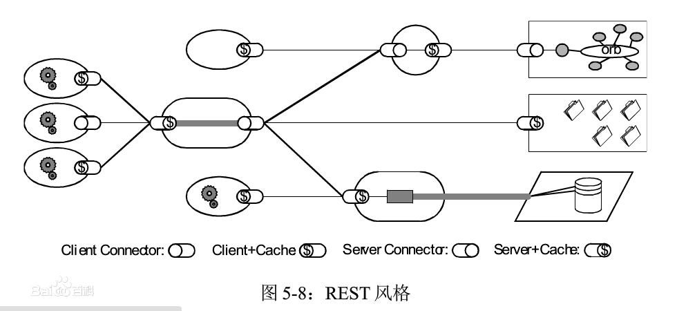

[REST](https://baike.baidu.com/item/RESTful/4406165?fr=aladdin)（英文：Representational State Transfer，简称REST）描述了一个架构样式的网络系统，比如 web 应用程序。它首次出现在 2000 年 Roy Fielding 的博士论文中，Roy Fielding是HTTP协议（1.0版和1.1版）的主要设计者、Apache服务器软件的作者之一、Apache基金会的第一任主席。在目前主流的三种Web服务交互方案中，REST相比于[SOAP](https://baike.baidu.com/item/%E7%AE%80%E5%8D%95%E5%AF%B9%E8%B1%A1%E8%AE%BF%E9%97%AE%E5%8D%8F%E8%AE%AE/3841505?fromtitle=SOAP&fromid=4684413&fr=aladdin)（Simple Object Access protocol，简单对象访问协议）以及[XML-RPC](https://baike.baidu.com/item/XML-RPC/10888726?fr=aladdin)更加简单明了，无论是对URL的处理还是对Payload的编码，REST都倾向于用更加简单轻量的方法设计和实现。值得注意的是REST并没有一个明确的标准，而更像是一种设计的风格,如果一个架构符合REST原则，就称它为RESTful架构。

它的大原则容易把握，但是细节不容易做对。本文主要是总结 RESTful 的设计细节，介绍如何设计出易于理解和使用的API。
# 1. 原则条件
Web 应用程序最重要的 REST 原则是，客户端和服务器之间的交互在请求之间是无状态的。从客户端到服务器的每个请求都必须包含理解请求所必需的信息。如果服务器在请求之间的任何时间点重启，客户端不会得到通知。此外，无状态请求可以由任何可用服务器回答，这十分适合云计算之类的环境。客户端可以缓存数据以改进性能。

在服务器端，应用程序状态和功能可以分为各种资源。资源是一个有趣的概念实体，它向客户端公开。资源的例子有：应用程序对象、数据库记录、算法等等。每个资源都使用 URI (Universal Resource Identifier) 得到一个唯一的地址。所有资源都共享统一的接口，以便在客户端和服务器之间传输状态。使用的是标准的 HTTP 方法，比如 GET、PUT、POST 和 DELETE。Hypermedia 是应用程序状态的引擎，资源表示通过超链接互联。

# 2. REST名称解析
REST，即Representational State Transfer的缩写，百度翻译中将其翻译为“表征状态转移”，其实我觉得更合适的应该将其称之为“表现层的状态转化”。
## 2.1. 资源
REST省略了其主语，阮一峰的一篇文章中提到，REST的主语应当是Resource，即我们上文中说的“表现层”应当指的是资源的表现层。

所谓**资源**，就是网络中一个具体的存在，他可以是一首歌、数据库里的一行数据、dfs中的一个文件等等。你可以用一个URI（统一资源定位符）指向它，每种资源对应一个特定的URI。要获取这个资源，访问它的URI就可以，因此URI就成了每一个资源的地址或独一无二的识别符。

这样理解的话，我们所说的**上网**，无非就是通过URI来访问网络中的各种资源。

# 2.2. 表现层
资源是一种实体，他可以有各种不同的表现形式，我们把资源通过不同的方式表现出来，就叫作**表现层**。

比如我们现在看到的这篇文章，我在写的时候他是markdown格式，但他可以是txt格式的，也可以是html格式的。

我们上文提到了一个URL指向了网络中的唯一一个资源实体，但是URL并不能代表资源的表现形式。我们有些网址最后后缀.html，实际上这是不必要的，因为html应当是表现层的范畴，没有在URI中体现的必要。而表现形式的真正体现，则是在HTTP请求头用Accept和Content-Type字段指定。

# 2.3. 状态转化
访问一个网站，就代表了客户端和服务器的一个互动过程。在这个过程中，势必涉及到数据和状态的变化。

互联网通信协议HTTP协议，是一个无状态协议。这意味着，所有的状态都保存在服务器端。因此，如果客户端想要操作服务器，必须通过某种手段，让服务器端发生"状态转化"（State Transfer）。而这种转化是建立在表现层之上的，所以就是"表现层状态转化"。

# 3. URL 设计
## 3.1. 动词 + 宾语
**RESTful核心思想：客户端发出的数据操作指令都是"动词 + 宾语"的结构**

我们在RESTful架构接口设计中，必须满足上面的结构，比如：
```text
GET /users
```
GET是一个动词，代表获取资源

users是一个名词，是宾语，代表所有用户

动词通常就是五中HTTP(根据 HTTP 规范，动词一律大写)方法，对应了我们的CURD操作：
```text
GET：读取（Read）
POST：新建（Create）
PUT：更新（Update）
PATCH：更新（Update），通常是部分更新
DELETE：删除（Delete）
```

## 3.2. 动词的覆盖

有些客户端只能使用GET和POST这两种方法。服务器必须接受POST模拟其他三个方法（PUT、PATCH、DELETE）。

这时，客户端发出的 HTTP 请求，要加上X-HTTP-Method-Override属性，告诉服务器应该使用哪一个动词，覆盖POST方法。

```text
POST /api/Person/4 HTTP/1.1  
X-HTTP-Method-Override: PUT
```
上面代码中，X-HTTP-Method-Override指定本次请求的方法是PUT，而不是POST。

## 3.3. 宾语必须是名词

宾语就是API的URL，是HTTP动词作用的对象。作为资源的体现，他必须是名词。像我们经常出现的以下的URL，都是错误的：
```text
/getAllUser
/createUser
/deleteById
```

## 3.4. 复数宾语
对于使用复数还是单数，实际上并没有明文的规定，但是一般地，获取所有资源，应当使用复数。如果项目要求统一风格的话，建议都使用复数。

## 3.5. 避免多级URL
在实际项目中，资源往往都是多级分类的，比如获取某一角色的所有用户信息可能是下面的情况
```text
GET /users/15/roles/45
```
这种URL很不利于我们接口设计的拓展，也不是很好理解，这里我们更推荐的做法是，除了第一级，其他级别都用查询字符串来标识，如：
```text
GET /user/15?roles=45
```
# 4. 状态码
[状态码大全](https://baike.baidu.com/item/HTTP%E7%8A%B6%E6%80%81%E7%A0%81/5053660?fr=aladdin)

客户端的每一次请求，服务器都必须给出回应。回应包括 HTTP 状态码和数据两部分。

HTTP 状态码就是一个三位数，分成五个类别。
- 1xx：相关信息
- 2xx：操作成功
- 3xx：重定向
- 4xx：客户端错误
- 5xx：服务器错误

这五大类总共包含100多种状态码，覆盖了绝大部分可能遇到的情况。每一种状态码都有标准的（或者约定的）解释，客户端只需查看状态码，就可以判断出发生了什么情况，所以服务器应该返回尽可能精确的状态码。

API 不需要1xx状态码，下面介绍其他四类状态码的在API设计中的使用举例。
## 4.1. 2xx
200状态码表示操作成功，但是不同的方法可以返回更精确的状态码。

- GET: 200 OK
- POST: 201 Created
- PUT: 200 OK
- PATCH: 200 OK
- DELETE: 204 No Content

上面代码中，POST返回201状态码，表示生成了新的资源；DELETE返回204状态码，表示资源已经不存在。

此外，202 Accepted状态码表示服务器已经收到请求，但还未进行处理，会在未来再处理，通常用于异步操作。下面是一个例子。

```text
HTTP/1.1 202 Accepted

{
  "task": {
    "href": "/api/yzstu/job-management/jobs/2130040",
    "id": "2130040"
  }
}
```
## 4.2. 3xx
API 用不到301状态码（永久重定向）和302状态码（暂时重定向，307也是这个含义），因为它们可以由应用级别返回，浏览器会直接跳转，API 级别可以不考虑这两种情况。

API 用到的3xx状态码，主要是303 See Other，表示参考另一个 URL。它与302和307的含义一样，也是"暂时重定向"，区别在于302和307用于GET请求，而303用于POST、PUT和DELETE请求。收到303以后，浏览器不会自动跳转，而会让用户自己决定下一步怎么办。下面是一个例子。

```text
HTTP/1.1 303 See Other
Location: /api/users/15
```

## 4.3. 4xx 
4xx状态码表示客户端错误，主要有下面几种。

- 400 Bad Request：服务器不理解客户端的请求，未做任何处理。
- 401 Unauthorized：用户未提供身份验证凭据，或者没有通过身份验证。
- 403 Forbidden：用户通过了身份验证，但是不具有访问资源所需的权限。
- 404 Not Found：所请求的资源不存在，或不可用。
- 405 Method Not Allowed：用户已经通过身份验证，但是所用的 HTTP 方法不在他的权限之内。
- 410 Gone：所请求的资源已从这个地址转移，不再可用。
- 415 Unsupported Media Type：客户端要求的返回格式不支持。比如，API 只能返回 JSON 格式，但是客户端要求返回 XML 格式。
- 422 Unprocessable Entity ：客户端上传的附件无法处理，导致请求失败。

- 429 Too Many Requests：客户端的请求次数超过限额。

## 4.4 5xx
5xx状态码表示服务端错误。一般来说，API 不会向用户透露服务器的详细信息，所以只要两个状态码就够了。

- 500 Internal Server Error：客户端请求有效，服务器处理时发生了意外。

- 503 Service Unavailable：服务器无法处理请求，一般用于网站维护状态。

# 5. 服务器响应
## 5.1. 数据格式
API 返回的数据格式，不应该是纯文本，而应该是一个 JSON 对象，因为这样才能返回标准的结构化数据。所以，服务器回应的 HTTP 头的Content-Type属性要设为application/json。

客户端请求时，也要明确告诉服务器，可以接受 JSON 格式，即请求的 HTTP 头的ACCEPT属性也要设成application/json。下面是一个例子。

```text
GET /users/2 HTTP/1.1 
Accept: application/json
```
## 5.2. 状态码
有很多公司都会将将API的结果使用自定义result封装起来，即使发生错误，返回的状态码也是200，比如：
```text
HTTP/1.1 200 OK
Content-Type: application/json

{
  "status": "failure",
  "data": {
    "error": "Expected at least two items in list."
  }
}
```
客户端在收到回复之后只有解析数据才能得知操作失败，这种做法是不符合RESTful架构要求的，正确的做法应该是使用状态码反映错误，再将错误信息封装在result里，如下：
```text
HTTP/1.1 400 Bad Request
Content-Type: application/json

{
  "error": "Invalid payoad.",
  "detail": {
     "surname": "This field is required."
  }
}
```
## 5.3. 提供下一步链接
API 的使用者未必知道，URL 是怎么设计的。一个解决方法就是，在回应中，给出相关链接，便于下一步操作。这样的话，用户只要记住一个 URL，就可以发现其他的 URL。这种方法叫做 HATEOAS。

举例来说，GitHub的API都在 [api.github.com](api.github.com) 这个域名。访问它，就可以得到其他 URL。

```text
{
  "current_user_url": "https://api.github.com/user",
  "current_user_authorizations_html_url": "https://github.com/settings/connections/applications{/client_id}",
  "authorizations_url": "https://api.github.com/authorizations",
  "code_search_url": "https://api.github.com/search/code?q={query}{&page,per_page,sort,order}",
  "commit_search_url": "https://api.github.com/search/commits?q={query}{&page,per_page,sort,order}",
  "emails_url": "https://api.github.com/user/emails",
  "emojis_url": "https://api.github.com/emojis",
  "events_url": "https://api.github.com/events",
  "feeds_url": "https://api.github.com/feeds",
  "followers_url": "https://api.github.com/user/followers",
  "following_url": "https://api.github.com/user/following{/target}",
  "gists_url": "https://api.github.com/gists{/gist_id}",
  "hub_url": "https://api.github.com/hub",
  "issue_search_url": "https://api.github.com/search/issues?q={query}{&page,per_page,sort,order}",
  "issues_url": "https://api.github.com/issues",
  "keys_url": "https://api.github.com/user/keys",
  "label_search_url": "https://api.github.com/search/labels?q={query}&repository_id={repository_id}{&page,per_page}",
  "notifications_url": "https://api.github.com/notifications",
  "organization_url": "https://api.github.com/orgs/{org}",
  "organization_repositories_url": "https://api.github.com/orgs/{org}/repos{?type,page,per_page,sort}",
  "organization_teams_url": "https://api.github.com/orgs/{org}/teams",
  "public_gists_url": "https://api.github.com/gists/public",
  "rate_limit_url": "https://api.github.com/rate_limit",
  "repository_url": "https://api.github.com/repos/{owner}/{repo}",
  "repository_search_url": "https://api.github.com/search/repositories?q={query}{&page,per_page,sort,order}",
  "current_user_repositories_url": "https://api.github.com/user/repos{?type,page,per_page,sort}",
  "starred_url": "https://api.github.com/user/starred{/owner}{/repo}",
  "starred_gists_url": "https://api.github.com/gists/starred",
  "user_url": "https://api.github.com/users/{user}",
  "user_organizations_url": "https://api.github.com/user/orgs",
  "user_repositories_url": "https://api.github.com/users/{user}/repos{?type,page,per_page,sort}",
  "user_search_url": "https://api.github.com/search/users?q={query}{&page,per_page,sort,order}"
}
```
上面的回应中，挑一个 URL 访问，又可以得到别的 URL。对于用户来说，不需要记住 URL 设计，只要从[api.github.com](api.github.com)一步步查找就可以了。

HATEOAS 的格式没有统一规定，上面例子中，GitHub 将它们与其他属性放在一起。更好的做法应该是，将相关链接与其他属性分开。

```text
HTTP/1.1 200 OK
Content-Type: application/json

{
  "status": "In progress",
   "links": {[
    { "rel":"cancel", "method": "delete", "href":"/api/status/12345" } ,
    { "rel":"edit", "method": "put", "href":"/api/status/12345" }
  ]}
}
```
## 5.4. API版本信息
**（此处存在争议， Google APIs 和 Twitter APIs 都在URL中加入了版本），且阮一峰在《RESTful API 设计指南》一书中提到api版本存在于URL中并不违反RESTful架构要求**

不同的版本，可以理解成同一种资源的不同表现形式，所以应该采用同一个URI。版本号可以在HTTP请求头信息的Accept字段中进行区分
```text
　　Accept: vnd.example-com.foo+json; version=1.0

　　Accept: vnd.example-com.foo+json; version=1.1

　　Accept: vnd.example-com.foo+json; version=2.0
```
# 6. GET、DELETE、PUT、POST的典型用法
## 6.1. GET
- 安全且幂等
- 获取表示
- 变更时获取表示（缓存）
- 200（OK） - 表示已在响应中发出
- 204（无内容） - 资源有空表示
- 301（Moved Permanently） - 资源的URI已被更新
- 303（See Other） - 其他（如，负载均衡）
- 304（not modified）- 资源未更改（缓存）
- 400 （bad request）- 指代坏请求（如，参数错误）
- 404 （not found）- 资源不存在
- 406 （not acceptable）- 服务端不支持所需表示
- 500 （internal server error）- 通用错误响应
- 503 （Service Unavailable）- 服务端当前无法处理请求
## 6.2. POST
- 不安全且不幂等
- 使用服务端管理的（自动产生）的实例号创建资源
- 创建子资源
- 部分更新资源
- 如果没有被修改，则不过更新资源（乐观锁）
- 200（OK）- 如果现有资源已被更改
- 201（created）- 如果新资源被创建
- 202（accepted）- 已接受处理请求但尚未完成（异步处理）
- 301（Moved Permanently）- 资源的URI被更新
- 303（See Other）- 其他（如，负载均衡）
- 400（bad request）- 指代坏请求
- 404 （not found）- 资源不存在
- 406 （not acceptable）- 服务端不支持所需表示
- 409 （conflict）- 通用冲突
- 412 （Precondition Failed）- 前置条件失败（如执行条件更新时的冲突）
- 415 （unsupported media type）- 接受到的表示不受支持
- 500 （internal server error）- 通用错误响应
- 503 （Service Unavailable）- 服务当前无法处理请求
## 6.3. PUT
- 不安全但幂等
- 用客户端管理的实例号创建一个资源
- 通过替换的方式更新资源
- 如果未被修改，则更新资源（乐观锁）
- 200 （OK）- 如果已存在资源被更改
- 201 （created）- 如果新资源被创建
- 301（Moved Permanently）- 资源的URI已更改
- 303 （See Other）- 其他（如，负载均衡）
- 400 （bad request）- 指代坏请求
- 404 （not found）- 资源不存在
- 406 （not acceptable）- 服务端不支持所需表示
- 409 （conflict）- 通用冲突
- 412 （Precondition Failed）- 前置条件失败（如执行条件更新时的冲突）
- 415 （unsupported media type）- 接受到的表示不受支持
- 500 （internal server error）- 通用错误响应
- 503 （Service Unavailable）- 服务当前无法处理请求
## 6.4. DELETE
- 不安全但幂等
- 删除资源
- 200 （OK）- 资源已被删除
- 301 （Moved Permanently）- 资源的URI已更改
- 303 （See Other）- 其他，如负载均衡
- 400 （bad request）- 指代坏请求
- 404 （not found）- 资源不存在
- 409 （conflict）- 通用冲突
- 500 （internal server error）- 通用错误响应
- 503 （Service Unavailable）- 服务端当前无法处理请求
  
# 7. 总结
## 7.1. REST四个基本原则：
- 使用HTTP动词：GET POST PUT DELETE；
- 无状态连接，服务器端不应保存过多上下文状态，即每个请求都是独立的；
- 为每个资源设置URI；
- 通过XML JSON进行数据传递；
实现上述原则的架构即可称为RESTFul架构。
## 7.2. 软件设计原则
- 互联网环境下，任何应用的架构和API可以被快速理解；
- 分布式环境下，任何请求都可以被发送到任意服务器；
- 异构环境下，任何资源的访问和使用方式都统一；
- 
# 参考链接
- [RESTful API Design: 13 Best Practices to Make Your Users Happy](https://blog.florimondmanca.com/restful-api-design-13-best-practices-to-make-your-users-happy). by Florimond Manca
- [API design](https://docs.microsoft.com/en-us/azure/architecture/best-practices/api-design). by MicroSoft Azure
- [RESTful API 最佳实践](http://www.ruanyifeng.com/blog/2018/10/restful-api-best-practices.html).by 阮一峰
- [理解RESTful架构](http://www.ruanyifeng.com/blog/2011/09/restful.html). by 阮一峰
- [RESTful](https://baike.baidu.com/item/RESTful/4406165?fr=aladdin). by 百度百科
- [HTTP状态码](https://baike.baidu.com/item/HTTP%E7%8A%B6%E6%80%81%E7%A0%81/5053660?fr=aladdin). by 百度百科
- [RESTful 架构详解](https://www.runoob.com/w3cnote/restful-architecture.html). by runoob