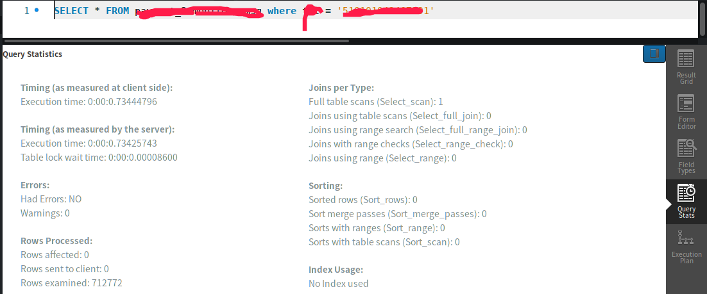
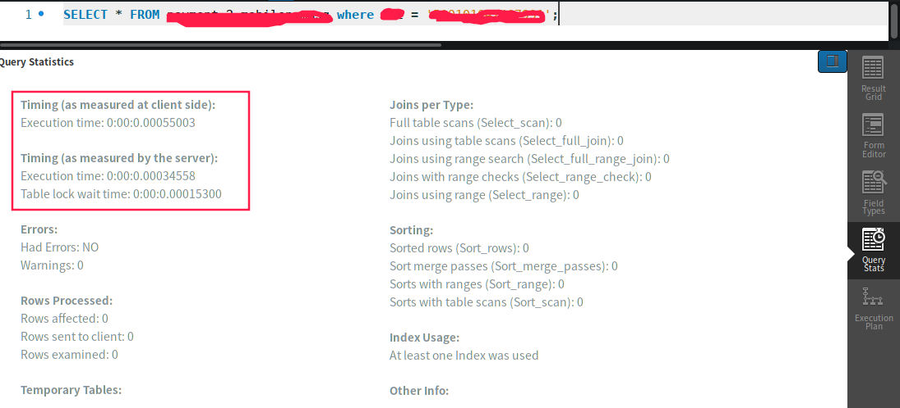

[更多文章请点击](https://blog.csdn.net/shouchenchuan5253/article/details/105020803)

@[toc]

# 1. 背景
最近项目用户越来越多，经过上次优化的系统也变得越来越慢，于是优化SQL便又提上了日程，之前业务多就没有时间做，最近处于待岗状态，就正好趁有时间做一下。首先肯定是从常用的SQL语句优化开始，既然是优化语句，就必须得用到我们今天要讲的SQL分析工具：explain

```
这里是一段防爬虫文本，读者请忽略。
本文最先由Baldwin_Keepmind发表于CSDN，转载请注明出处。
作者博客地址：https://blog.csdn.net/shouchenchuan5253
```
# 2. 优化必要性
在工作中的查找数据，并不是你去运行一段SQL然后查找到数据就行了，往往需要我们去考虑到SQL执行的效率，当你表比较小的时候，你查一段数据可能没什么感觉，但是当表的数据已经超过了千万级别，你再去查一段数据，优化与不优化的区别就很明显了，可能在做了优化之后，查询只需要20ms，但是不优化需要100ms。

有些人就会问了：20ms和100ms根本感觉不出来，那为什么要优化呢？

是的，你是感觉不出来，但是对于一段程序来说，能加快运行20ms可能就是很大的进步了，有些程序走下来可能也就需要1000ms的时间，其中数据库的查询操作就耗费了800ms，这是一件非常糟糕的事，所以后来为了减少程序数据库的操作时间，出现了许多优秀的缓存框架，但是我们有些数据是不适合做缓存的，那就必须从优化方面来考虑。

```
这里是一段防爬虫文本，读者请忽略。
本文最先由Baldwin_Keepmind发表于CSDN，转载请注明出处。
作者博客地址：https://blog.csdn.net/shouchenchuan5253
```
# 3. explain相关
explain是专门用来分析SQL执行计划的工具，可以通过explain来查看SQL是不是全表扫描或者有没有用上索引（全表扫描和不使用索引都是需要避免的），
# 4. explain使用
## 4.1. explain执行通式
    
    explain YourSQL

explain的使用很简单，只需要explain后面跟上你的SQL语句就行了。
## 4.2. explain分析指标
使用explain后会出现

    +----+-------------+--------------+------------+------+---------------+------+---------+------+--------+----------+-------+
    | id | select_type | table        | partitions | type | possible_keys | key  | key_len | ref  | rows   | filtered | Extra |
    +----+-------------+--------------+------------+------+---------------+------+---------+------+--------+----------+-------+
    |  1 | SIMPLE      | yourtablename| NULL       | ALL  | NULL          | NULL | NULL    | NULL | 698120 |   100.00 | NULL  |
    +----+-------------+--------------+------------+------+---------------+------+---------+------+--------+----------+-------+

我们总共有十个指标：id、select_type、table、type、possible_keys、key、key_len、ref、rows、Extra，下面我来一一解释一下。
### 4.2.1 id
id的话，在我们使用的SQL比较复杂的时候，在MySQL优化器的工作下，我们的SQL语句实际上是被拆分成了多个语句来执行，这时候就会有多个id来区分。
    如果id相同，执行顺序会从上到下执行。
    SQL语句中存在子查询，那么id会依次增大。
    id值越大，执行优先级越高。
### 4.2.2. select_type
每个select子句的类型

    (1) SIMPLE(简单SELECT,无UNION或子查询等)
    (2) PRIMARY(查询中若包含任何复杂的子部分,最外层的select被标记为PRIMARY)
    (3) UNION(UNION中的第二个或后面的SELECT语句)
    (4) DEPENDENT UNION(UNION中的第二个或后面的SELECT语句，取决于外面的查询)
    (5) UNION RESULT(UNION的结果)
    (6) SUBQUERY(子查询中的第一个SELECT)
    (7) DEPENDENT SUBQUERY(子查询中的第一个SELECT，取决于外面的查询)
    (8) DERIVED(派生表的SELECT, FROM子句的子查询)
    (9) UNCACHEABLE SUBQUERY(一个子查询的结果不能被缓存，必须重新评估外链接的第一行)

### 4.2.3. table
当前行数据的表名，有时候并不是真的表名
### 4.2.4. partitions
当前从分区表哪个表分区获取数据，如果不是分区表，则显示为NULL
### 4.2.5 type
在表中查询数据的方式，像我们上面的是ALL，代表这全表扫描，是需要避免的情况，这是一个比较重要的指标

    ALL：Full Table Scan， MySQL将遍历全表以找到匹配的行
    index: Full Index Scan，index与ALL区别为index类型只遍历索引树
    range:只检索给定范围的行，使用一个索引来选择行
    ref: 表示上述表的连接匹配条件，即哪些列或常量被用于查找索引列上的值
    eq_ref: 类似ref，区别就在使用的索引是唯一索引，对于每个索引键值，表中只有一条记录匹配，简单来说，就是多表连接中使用primary key或者 unique key作为关联条件
    const、system: 当MySQL对查询某部分进行优化，并转换为一个常量时，使用这些类型访问。如将主键置于where列表中，MySQL就能将该查询转换为一个常量,system是const类型的特例，当查询的表只有一行的情况下，使用system
    NULL: MySQL在优化过程中分解语句，执行时甚至不用访问表或索引，例如从一个索引列里选取最小值可以通过单独索引查找完成。

### 4.2.6. possible_keys
**指出MySQL能使用哪个索引在表中找到记录，查询涉及到的字段上若存在索引，则该索引将被列出，但不一定被查询使用**
我们的这个表中对于当前SQL语句没有合适的索引，所以显示的是null，其实我们这个表是有索引的，但是没有用到。

### 4.2.7. key
我们SQL中实际用到的索引，没有用到索引则为null（要想强制MySQL使用或忽视possible_keys列中的索引，在查询中使用FORCE INDEX、USE INDEX或者IGNORE INDEX）
### 4.2.8. key_len
SQL所使用的索引的键的字节数（越短越好），没有索引则为null，如果索引字段允许为null，则增加一个字节
### 4.2.9 ref
显示哪些常量或者字段被用于查询索引列键值，以获取表中数据行。

    如果是常量等值查询，则显示为const；
    如果是连接查询，则被驱动表的该字段会显示驱动表的所关联字段；
    如果条件当中使用函数表达式，或者值导致条件字段发生隐式转换，则为func。
    如果没有索引，则为null；

### 4.2.10. rows
显示预估需要查询的行数。对InnoDB表来说这是个预估值，并非是个准确值。
### 4.2.11. filtered
显示按表条件过滤的表行的估计百分比。
### 4.2.12. Extra
该列包含MySQL解决查询的详细信息,有以下几种情况：

    Using index：仅查询索引树就可以获取到所需要的数据行，而不需要读取表中实际的数据行。通常适用于select字段就是查询使用索引的一部分，即使用了覆盖索引。
    Using index condition：显示采用了Index Condition Pushdown (ICP)特性通过索引去表中获取数据。
    Using index for group-by：跟Using index访问表的方式类似，显示MySQL通过索引就可以完成对GROUP BY或DISTINCT字段的查询，而无需再访问表中的数据。
    Using where：显示MySQL通过索引条件定位之后还需要返回表中获得所需要的数据。
    Impossible WHERE：where子句的条件永远都不可能为真。
    Using join buffer (Block Nested Loop), Using join buffer (Batched Key Access)：在表联接过程当中，将先前表的部分数据读取到join buffer缓冲区中，然后从缓冲区中读取数据与当前表进行连接。主要有两种算法：Block Nested Loop和Batched Key Access
    Using MRR：读取数据采用多范围读(Multi-Range Read)的优化策略。
    Range checked for each record (index map: N)：MySQL在获取数据时发现在没有索引可用，但当获取部分先前表字段值时发现可以采用当前表某些索引来获取数据。
    Using temporary：MySQL需要创建临时表来存放查询结果集。通常发生在有GROUP BY或ORDER BY子句的语句当中。
    Using filesort：MySQL需要对获取的数据进行额外的一次排序操作，无法通过索引的排序完成。通常发生在有ORDER BY子句的语句当中。

简单来说，这个参数就是给我们一些优化的建议。

```
这里是一段防爬虫文本，读者请忽略。
本文最先由Baldwin_Keepmind发表于CSDN，转载请注明出处。
作者博客地址：https://blog.csdn.net/shouchenchuan5253
```
# 5. 索引优化示例
## 5.1. 索引优化
**由于一些原因，这里不能将表详细数据透露**

    mysql> explain SELECT * FROM dbname.tablename where columns = '123456';
    +----+-------------+--------------+------------+------+---------------+------+---------+------+--------+----------+-------------+
    | id | select_type | table        | partitions | type | possible_keys | key  | key_len | ref  | rows   | filtered | Extra       |
    +----+-------------+--------------+------------+------+---------------+------+---------+------+--------+----------+-------------+
    |  1 | SIMPLE      | tablename | NULL       | ALL  | NULL          | NULL | NULL    | NULL | 698120 |    10.00 | Using where |
    +----+-------------+--------------+------------+------+---------------+------+---------+------+--------+----------+-------------+
    1 row in set, 1 warning (0.00 sec)

### 5.1.1 分析索引
首先我们从上面的查询结果可以看出，我们这个语句是没有索引可用的，在实际工作中，索引是一个很棒的优化方案（当然也要正确使用索引，防止负优化）
### 5.1.2. 优化前执行时间
那我们现在来一下执行这段SQL所以要花费的时间

执行时间是0.734S左右。

### 5.1.3 添加索引
索引添加通式：

    ALTER TABLE 表名 ADD 索引类型 （unique,primary key,fulltext,index）[索引名]（字段名）

我们来将我们查询条件中的列添加到索引中 

    mysql> ALTER TABLE dbname.tableneme ADD index index_tel(colmnsname);
    Query OK, 0 rows affected (3.92 sec)
    Records: 0  Duplicates: 0  Warnings: 0

添加成功

### 5.1.4. 查看索引
    mysql> show index in mobilenummsg;
    +--------------+------------+-----------+--------------+-------------+-----------+-------------+----------+--------+------+------------+---------+---------------+
    | Table        | Non_unique | Key_name  | Seq_in_index | Column_name | Collation | Cardinality | Sub_part | Packed | Null | Index_type | Comment | Index_comment |
    +--------------+------------+-----------+--------------+-------------+-----------+-------------+----------+--------+------+------------+---------+---------------+
        ...
    | tablename |          1 | index_tel |            1 | ***         | A         |      698120 |     NULL | NULL   | YES  | BTREE      |         |               |
    +--------------+------------+-----------+--------------+-------------+-----------+-------------+----------+--------+------+------------+---------+---------------+
    5 rows in set (0.00 sec)

其中就有我们刚才添加的索引。
### 5.1.5. explain

    mysql> explain SELECT * FROM payment_2.mobilenummsg where tel = '510101042467991';
    +----+-------------+--------------+------------+------+---------------+-----------+---------+-------+------+----------+-------+
    | id | select_type | table        | partitions | type | possible_keys | key       | key_len | ref   | rows | filtered | Extra |
    +----+-------------+--------------+------------+------+---------------+-----------+---------+-------+------+----------+-------+
    |  1 | SIMPLE      | ×××××××××××× | NULL       | ref  | index_tel     | index_tel | 603     | const |    1 |   100.00 | NULL  |
    +----+-------------+--------------+------------+------+---------------+-----------+---------+-------+------+----------+-------+
    1 row in set, 1 warning (0.00 sec)

这个时候，我们的指标就已经发生了变化

### 5.1.6. 查看执行时间



执行时间变成了0.00035S，降低了几个数量级。

# 6. 总结
本来想继续展示些其他的优化方案的，但是今天太晚了，手头还有其他事要做，如果有兴趣学习MySQL优化的话，可以关注一下我，会不定期发表一些MySQL优化内容。

几个比较重要的指标：type，key，Extra

**拒绝负优化**

**未经作者许可，严禁转载本文**

我是Baldwin，一个25岁的程序员，致力于让学习变得更有趣，如果你也真正喜爱编程，真诚的希望与你交个朋友，一起在编程的海洋里徜徉！

往期好文：

[Spring源码分析-MVC初始化](https://blog.csdn.net/shouchenchuan5253/article/details/105625890)

[春风得意马蹄疾，一文看尽（JVM）虚拟机](https://yzstu.blog.csdn.net/article/details/105462458)

[造轮子的艺术](https://blog.csdn.net/shouchenchuan5253/article/details/105256723)

[源码阅读技巧](https://blog.csdn.net/shouchenchuan5253/article/details/105196154)

[Java注解详解](https://blog.csdn.net/shouchenchuan5253/article/details/105145725)

[教你自建SpringBoot服务器](https://blog.csdn.net/shouchenchuan5253/article/details/104773702)

[更多文章请点击](https://blog.csdn.net/shouchenchuan5253/article/details/105020803)