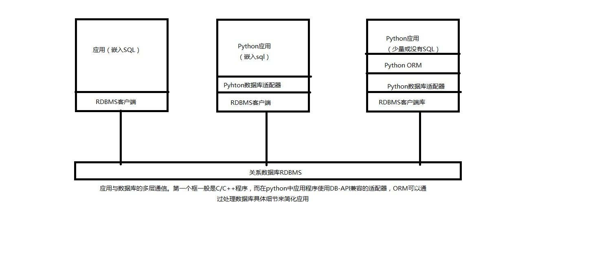
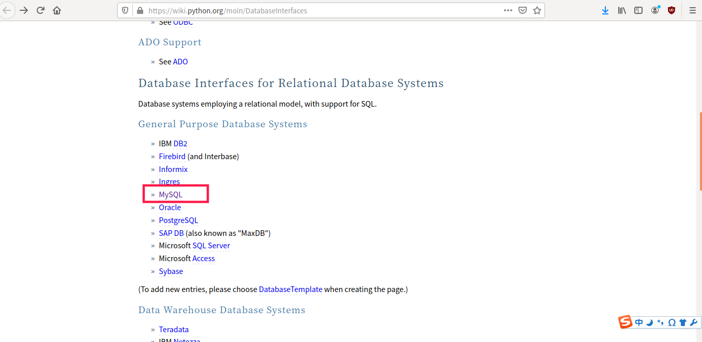
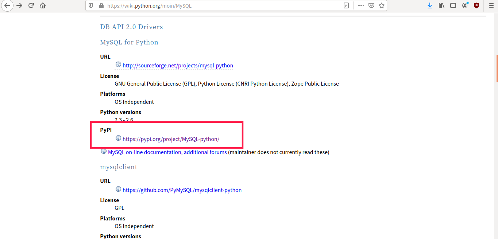
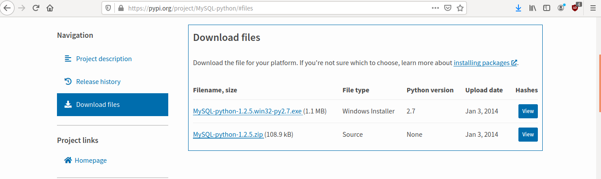
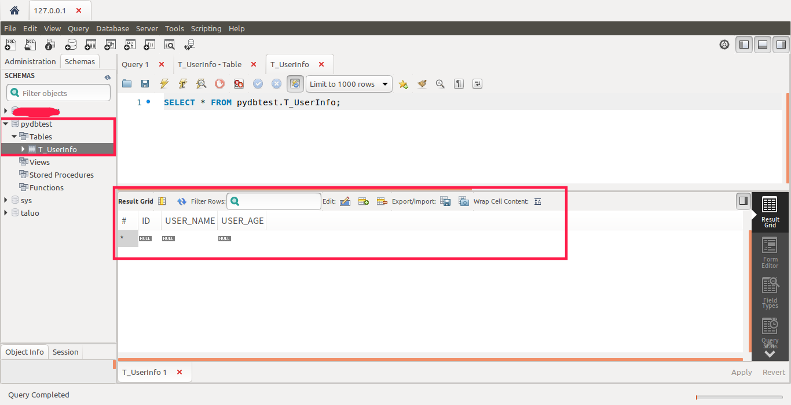
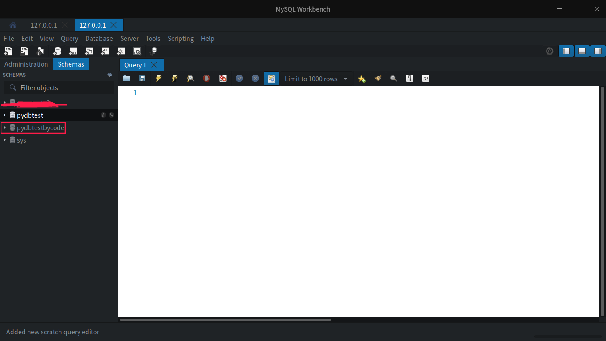
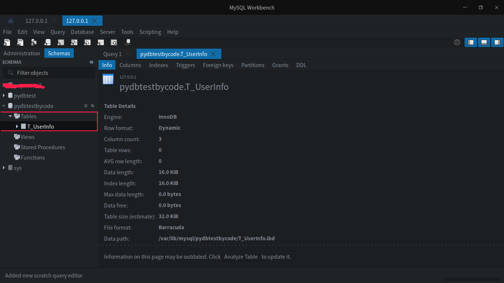
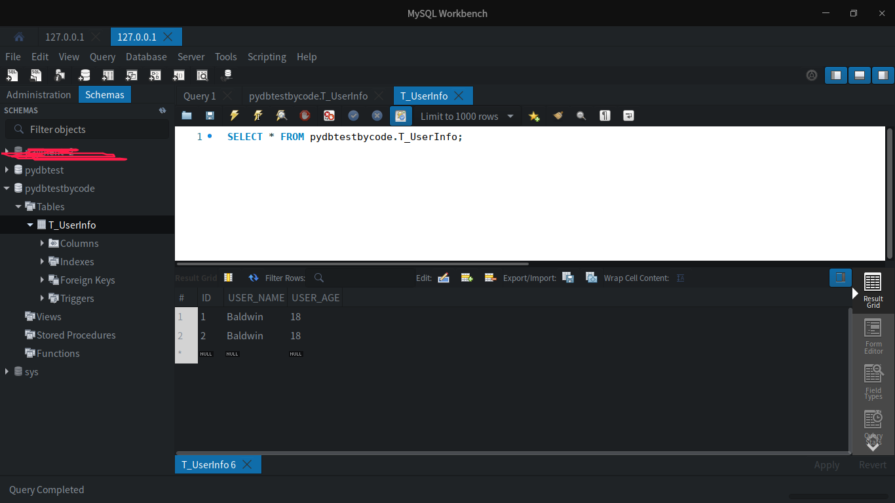

# 1.相关
# 1.1. 持久化储存
数据持久化就是将内存中的数据模型转换为存储模型,以及将存储模型转换为内存中的数据模型的统称. 数据模型可以是任何数据结构或对象模型,存储模型可以是关系模型、XML、二进制流等。

我们99.99%的程序都需要进行数据持久化来让程序下一次运行的时候能够访问上一次运行的数据。

一般采用的可持久和方法概括起来有三种：文件储存、数据库储存、混合储存。

    ×文件储存：将数据写入到文件（磁盘）中，程序释放内存不影响磁盘中的数据。
    ×数据库储存：使用现有的数据库系统来储存数据，本质也是写入到磁盘。

## 1.1.1 好处

    1、程序代码重用性强，即使更换数据库，只需要更改配置文件，不必重写程序代码。
    2、业务逻辑代码可读性强，在代码中不会有大量的SQL语言，提高程序的可读性。
    3、持久化技术可以自动优化，以减少对数据库的访问量，提高程序运行效率。

## 1.1.2 数据库
数据库通常使用文件系统作为基本的持久化存储，他可以是普通的操作系统文件，专用的操作系统文件，甚至是原始的磁盘分区。

数据库存储可以抽象为一张表，每行数据都有一些字段对应数据库的列，每一列的表定义的集合以及每个表的数据类型放到一起定义了数据库的模式。

数据库可以创建和删除，表也一样。当查询一个数据库的时候，可以一次性取回一次性结果，也可以逐条遍历每个结果行，一些数据库使用游标的概念来提交SQL命令，查询以及获取结果，不管是一次性获取还是逐行获取都可以使用这个概念。
## 1.2. Python操作数据库
在python中数据库是通过适配器的方式进行访问的，适配器是一个python模块，使用他可以与关系数据库的客户端库（通常是使用C语言编写的）接口相连。一般情况下会推荐所有的python适配器应当符合python数据库特殊兴趣小组的API标准。

python数据库应用的结构，包括使用和没有使用ORM的情况，DB-API是连接到数据库客户端的C语言库接口。

# 2. Python-数据库

**Python 标准数据库接口为 Python DB-API，Python DB-API为开发人员提供了数据库应用编程接口。**

## 2.1. Python支持的数据库
Python支持多种数据库，这使我们在开发的过程中能够根据项目需求灵活地选择最适合项目的数据库。

(Python数据库接口官网文档)[https://wiki.python.org/moin/DatabaseInterfaces]

下面是Python所支持的数据库详情：
    关系型数据库：IBM DB2、Firebird (and Interbase) 、Informix、Ingres、MySQL、Oracle、PostgreSQL、SAP DB (also known as "MaxDB"、Microsoft SQL Server、Microsoft Access、Sybase、Teradata、IBM Netezza、asql、GadFly、SQLite、ThinkSQL
    NoSql：MetaKit、ZODB、BerkeleyDB、KirbyBase、Durus、atop、buzhug、4Suite server、Oracle/Sleepycat DB XML 
    Python本地数据库：buzhug、SnakeSQL

## 2.2. Python DB-API
不同的数据库需要我们引入对应的模块来作为驱动，我们可以到(Python数据库接口官网文档)[https://wiki.python.org/moin/DatabaseInterfaces]中去选择我们的使用的数据库，查看驱动的详细信息，我比较熟悉MySQL，等下也会以MySQL为例。

到了我们选中的数据库的详情页时，我们要找到**MySQL for Python**的相关信息。

上图中的**PyPI**下的地址就是我们所需要的驱动的下载地址，点进去之后根据你的电脑系统选择安装包。

## 2.3. 安装Python-MySQL连接器

**令人难过的是：本文写到一半，我的系统崩溃了，含泪换了Deepin系统，所以安装连接器的部分与上文已经无关了，嘿嘿。**

命令：

    sudo pip3 install mysql-connector

结果：

    Collecting mysql-connector
    Downloading https://files.pythonhosted.org/packages/28/04/e40098f3730e75bbe36a338926f566ea803550a34fb50535499f4fc4787a/mysql-connector-2.2.9.tar.gz (11.9MB)
        100% |████████████████████████████████| 11.9MB 93kB/s 
    Building wheels for collected packages: mysql-connector
    Running setup.py bdist_wheel for mysql-connector ... done
    Stored in directory: /root/.cache/pip/wheels/8c/83/a1/f8b6d4bb1bd6208bbde1608bbfa7557504bed9eaf2ecf8c175
    Successfully built mysql-connector
    Installing collected packages: mysql-connector
    Successfully installed mysql-connector-2.2.9

显示安装完成。

# 3. 数据库连接
**以下内容均以MySQL数据库为例，可视化工具为MySQL Workbench。**
## 3.1 准备工作
在连接数据库之前，请你先准备好以下几点：

### 确定数据库账号密码
我的本地数据库账号：root，密码：root
### 创建数据库
创建数据库，可以自己命名，我创建的数据库名为：pydbtest

    CREATE SCHEMA `pydbtest` DEFAULT CHARACTER SET utf8 ;

### 创建表
创建一个我们等下要访问的表，表名：T_UserInfo，包含列：ID、USER_NAME、USER_AGE

    CREATE TABLE `pydbtest`.`T_UserInfo` (
    `ID` INT NOT NULL AUTO_INCREMENT,
    `USER_NAME` VARCHAR(45) NULL,
    `USER_AGE` INT NULL,
    PRIMARY KEY (`ID`),
    UNIQUE INDEX `ID_UNIQUE` (`ID` ASC));

### 总览

准备好数据库环境之后就可以开始进行数据库的连接了。

## 3.2. 代码连接数据库
### 3.2.1 检测驱动安装情况
创建Python文件，输入以下代码
    
    import mysql.connector

代码没有报错的话，就说明驱动安装成功了。
### 3.2.2. 配置数据库详情
代码：

    mydb = mysql.connector.connect(
    host="localhost",       # 数据库主机地址
    user="yourusername",    # 数据库用户名
    passwd="yourpassword"   # 数据库密码
    )
    
    print(mydb)

输出：

    /usr/bin/python3.7 /home/baldwin/PycharmProjects/PyDemo/dbconnect/Connect.py
    <mysql.connector.connection.MySQLConnection object at 0x7ff310d200b8>

    Process finished with exit code 0

连接成功！！！

### 3.2.3. 执行SQL
#### 创建执行器

代码：

    mycursor = mydb.cursor()

#### 创建数据库
代码：

    mycursor.execute("CREATE SCHEMA `pydbtestbycode` DEFAULT CHARACTER SET utf8")

数据库：

#### 创建表

代码：

    createTable = "CREATE TABLE `T_UserInfo` (`ID` int(11) NOT NULL AUTO_INCREMENT,`USER_NAME` varchar(45) DEFAULT NULL,`USER_AGE` int(11) DEFAULT NULL,PRIMARY KEY (`ID`),UNIQUE KEY `ID_UNIQUE` (`ID`)) ENGINE=InnoDB DEFAULT CHARSET=utf8"
    mycursor.execute("use pydbtestbycode")
    mycursor.execute(createTable)

数据库：

#### 增

代码形式一：

    insertTable = "INSERT INTO `pydbtestbycode`.`T_UserInfo` (`ID`, `USER_NAME`, `USER_AGE`) VALUES ('1', 'Baldwin', '18');"
    mycursor.execute(insertTable)
    mydb.commit()

代码形式二：

    insert = "INSERT INTO `pydbtestbycode`.`T_UserInfo` (ID,USER_NAME, USER_AGE) VALUES (%s,%s, %s);"
    insertVal = (2,'Baldwin',18)
    mycursor.execute(insert,insertVal)
    mydb.commit()

数据库：

#### 小总结
删改查旧比较简单了，自己尝试一下。

需要注意的是：**数据表内容有更新，必须使用到commit**

# 4. 总结

相比于java，Python的数据库连接要方便许多