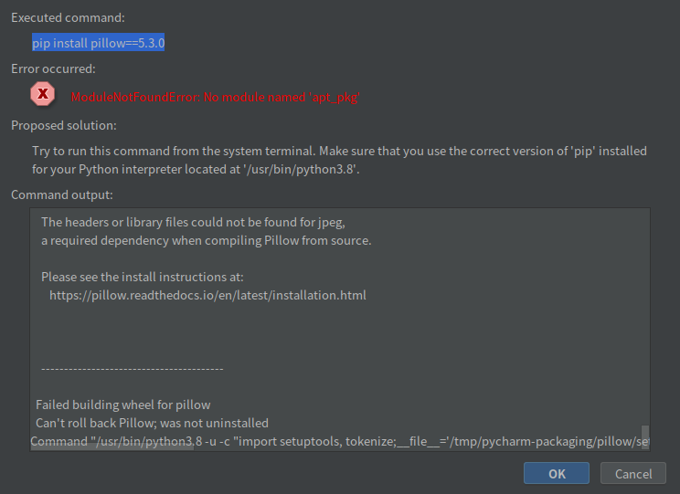

# 1. 背景
最近有一个项目需要用Python来完成，在工作过程中需要下载一个包，执行命令**pip install pillow==5.3.0**后pycharm报错

# 2.原因
去网上搜索了下，主要原因是我电脑Ubuntu系统自带的是Python2.7，后来我自己升级到了3.8，出现Python apt的一个混乱，所以我们需要重新为系统设置一个我们Python3.6的专属模块。 
# 3.解决办法

# 3.1 删除原有Python apt模块
