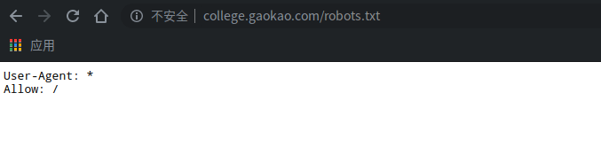

# 1. 背景
有一个朋友的女儿在高三，最近向我询问关于高考志愿的问题，我也不知道该怎么建议，就把历年的高考分数详情爬下来给她了。回想起当时高中毕业时报考时的无助与迷茫，想了下决定把这个过程写下来分享给大家，也希望能够帮助到其他正准备报考的朋友和身边有高三学子的朋友，希望能帮到你们。
# 2. 资源选择
这里选择的是[gaokao高考网](http://college.gaokao.com/)关于历年分数线的资源。

## robots.txt

该网站对爬虫未作限制。

**请各位爬虫程序开发者遵守网站robots协议**

# 3. 需求分析
这里的需求是针对朋友女儿的，在程序里会提供可供选择的参数，你可以根据自己的需求修改参数来满足你的需求。

主要做的有以下几点：
    
    1. 朋友是河南的，应该爬取的应该是高校面向河南的招生分数线
    2. 爬取歌各省各个高校的2010-2019的录取分数线
    3. 