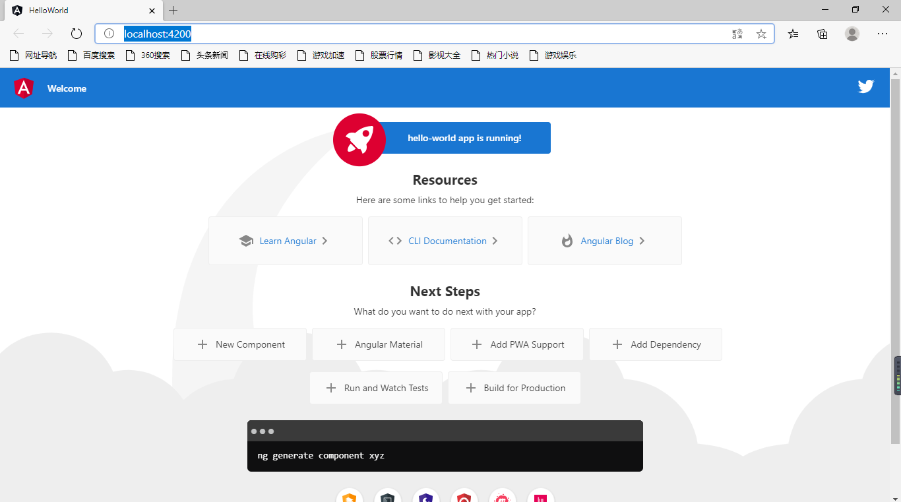

**本文及系列所有文章均基于Win10系统**

# 前言

Angular 是一个应用设计框架与开发平台，用于创建高效、复杂、精致的单页面应用。 最近项目中的某个模块要使用Angular来做前端界面，所以现在开始要学习一下。

# node、npm安装

实际上只需要安装node，因为在安装node的过程中，会一起安装npm组件，我电脑上已经安装了node和npm，所以这里就不在展示安装过程了，大家可以直接进入node官网安装即可。

[node官网](https://nodejs.org/en/)

安装完成之后查看node和npm的版本

```shell
C:\Users\Administrator>node -v
v14.15.2
C:\Users\Administrator>npm -v
6.14.9
```

# 安装cnpm

npm和cnpm都是自动从网络上获取一些开发资源的工具，但是npm访问的是国外的资源，cnpm是访问的淘宝维护的国内的资源，所以在获取一些资源的时候，使用cnpm要快的多 。

执行命令

```shell
npm install -g cnpm --registry=https://registry.npm.taobao.org
```

执行结果

```shell
npm WARN deprecated request@2.88.2: request has been deprecated, see https://github.com/request/request/issues/3142
npm WARN deprecated har-validator@5.1.5: this library is no longer supported
C:\Users\Administrator\AppData\Roaming\npm\cnpm -> C:\Users\Administrator\AppData\Roaming\npm\node_modules\cnpm\bin\cnpm
+ cnpm@6.1.1
added 689 packages from 972 contributors in 60.995s
```

# 安装angular/cli

执行命令

```shell
cnpm install -g @angular/cli
```

等待安装完成

# 创建一个angular项目

我的angular项目路径是D:\project\angular

进入项目路径并new一个angular项目

```shell
C:\Users\Administrator>d:
D:\>cd project
D:\project>cd angular
D:\project\angular>ng new hello-world
```

构建选项

```she
? Do you want to enforce stricter type checking and stricter bundle budgets in the workspace?
  This setting helps improve maintainability and catch bugs ahead of time.
  For more information, see https://angular.io/strict Yes
? Would you like to add Angular routing? Yes
? Which stylesheet format would you like to use? Less   [ http://lesscss.org]
```

等待构建完成

```shell
The file will have its original line endings in your working directory
    Successfully initialized git.
```

# 运行项目

进入项目文件夹并启动项目

```shell
D:\project\angular>cd hello-world
D:\project\angular\hello-world>ng serve --open
```

等待项目编译完成

```shell
Compiling @angular/core : es2015 as esm2015
Compiling @angular/common : es2015 as esm2015
Compiling @angular/platform-browser : es2015 as esm2015
Compiling @angular/router : es2015 as esm2015
Compiling @angular/platform-browser-dynamic : es2015 as esm2015
√ Browser application bundle generation complete.

Initial Chunk Files   | Names         |      Size
vendor.js             | vendor        |   2.66 MB
polyfills.js          | polyfills     | 484.59 kB
styles.css, styles.js | styles        | 344.16 kB
main.js               | main          |  59.53 kB
runtime.js            | runtime       |   6.15 kB
                      | Initial Total |   3.53 MB
Build at: 2020-12-29T16:14:52.985Z - Hash: 01d7b61d91b9fb3c0772 - Time: 12210ms
** Angular Live Development Server is listening on localhost:4200, open your browser on http://localhost:4200/ **
√ Compiled successfully.
√ Browser application bundle generation complete.
Initial Chunk Files   | Names  |      Size
styles.css, styles.js | styles | 344.16 kB
4 unchanged chunks
Build at: 2020-12-29T16:14:59.660Z - Hash: 14a5cf3d9e5aae347e75 - Time: 2215ms
√ Compiled successfully.
```

# 访问项目

访问网址 [http://localhost:4200/](http://localhost:4200/)



# 总结

搭建过程其实是非常简单的，没遇到啥问题，主要注意的就是如果你在国内开发的话，需要设置cnpm，我用了代理，所以这方面的需求也不高，如果你在搭建过程中下载文件非常慢，请注意设置cnpm