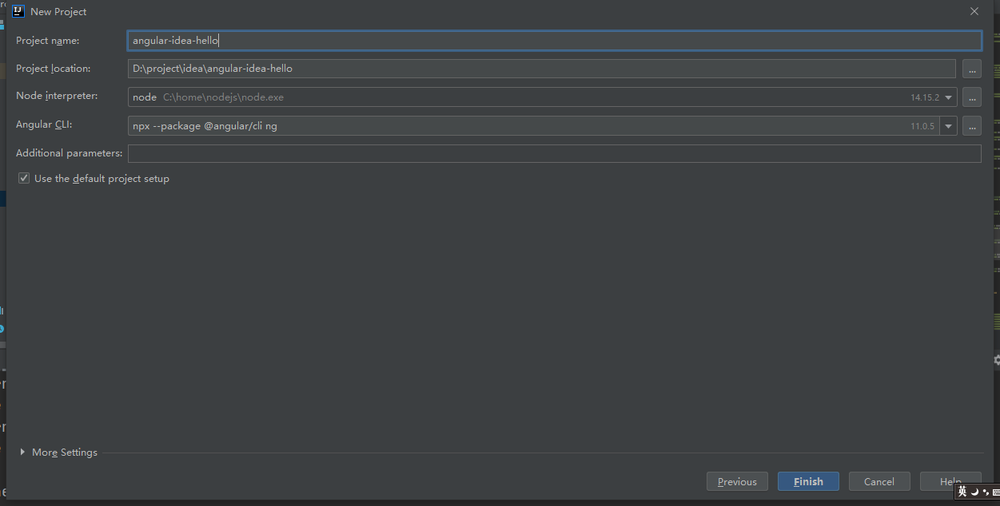
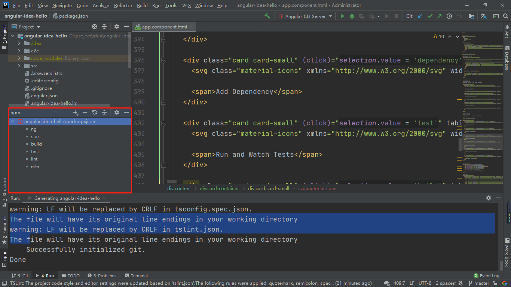
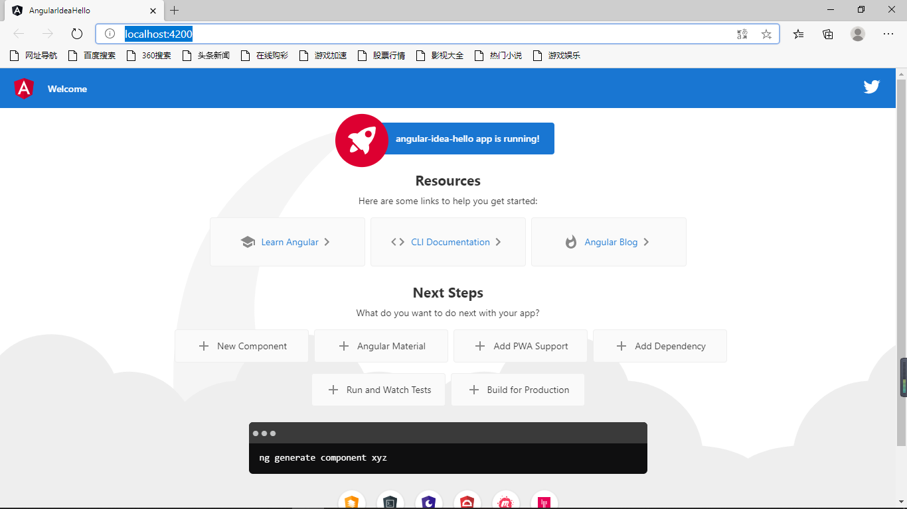
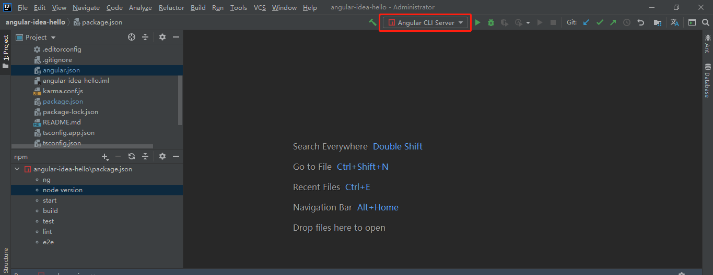

**本文章所有内容基于[win10搭建Angular环境并运行hello-world](https://yzstu.blog.csdn.net/article/details/111939972)**

# 1. 相关

上一篇文章中我们了解Angular开发所需要准备的环境，我们搭建好环境之后不可能直接使用文本工具进行编程，必须选择一款IDE，而一款好的IDE能让我们开发起来事半功倍。我选择的是JetBrains IDEA，主要原因是在我工作内容中的几款编辑器，IDEA是支持Angular开发的做的比较好的一款IDE。

# 2. 新建项目

```text
File => New => Project => JavaScript => Angular CLI 
```
选择下一步之后，就可以在里面配置我们的项目了。如果你从一开始跟着我进行到这一步，你就会发现IDEA已经将Node interpreter和Angular CLI都自动配置了，我们只需要设置我们的项目名即可。



点击Finish之后就是等待构建完成了，当控制台输出以下内容，就代表着已成功构建
```shell
The file will have its original line endings in your working directory
    Successfully initialized git.
Done
```
# 3. 在IDEA中运行项目
## 3.1. Show npm Script
在项目根目录下找到**pachage.json**文件，右键选择Show npm Script就会出现一个新的窗口

在这个窗口中就有一些我们常用的命令，其中start命令就相当于ng serve命令，双击start，项目就开始编译并启动，启动完成控制台输出以下信息
```shell
** Angular Live Development Server is listening on localhost:4200, open your browser on http://localhost:4200/ **


√ Compiled successfully.
``` 
此时访问[http://localhost:4200/](http://localhost:4200/)

npm中的命令其实都定义在package.json中，我们也可以自定义命令。
我们在package.json的scripts节点下新增
```shell 
"node version": "node -v"
```
然后刷新npm界面就可以看到新增了一条**node version**命令，双击效果如执行**node -v**命令。
## 3.2. IDEA-RUN
在IDEA的最上方控制栏有可以直接运行项目的选项

我们可以选择直接RUN或者是DEBUG的方式来运行项目，这里其实也是相当于执行
```shell
ng server
```
# 4. 从VCS中拉取项目
```text
VCS => Get From Version Controll => 输入地址 
```
# 5. 总结
对于熟悉IDEA使用的同学来说，这里都不算很难，也可以自己去尝试其他的用法。如果你是一个新手，可以关注我，后续文章会慢慢带大家熟悉Angular语法和IDEA的用法
