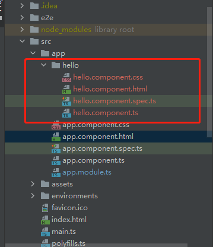

本文所有内容基于[BaldwinKeepMind的Angular专栏](https://blog.csdn.net/shouchenchuan5253/category_10700467.html)
# 1. 概述
组件是 Angular 应用的主要构造块。每个组件应当包含以下部分：
- 一个 HTML 模板，用于声明页面要渲染的内容
- 一个用于定义行为的 Typescript 类
- 一个 CSS 选择器，用于定义组件在模板中的使用方式
- （可选）要应用在模板上的 CSS 样式

## 2. 创建组件
## 2.1. IDEA创建组件
```tet
鼠标光标置于你想要创建组件的文件夹上=>右键=>New=>Angular Schematic=>component=>输入组件名=>ok
```
这样我们就创建了一个新的组件，并且自动生成了组件的基本组成部分，如下图：

## 2.2. Angular CLI创建组件

在终端窗口中，导航到要放置你应用的目录。

运行 ng generate component <component-name> 命令，其中 <component-name> 是新组件的名字。

这条命令的效果与在IDEA中创建组件的效果相同

# 3. 生命周期
当 Angular 实例化组件类并渲染组件视图及其子视图时，组件实例的生命周期就开始了。生命周期一直伴随着变更检测，Angular 会检查数据绑定属性何时发生变化，并按需更新视图和组件实例。当 Angular 销毁组件实例并从 DOM 中移除它渲染的模板时，生命周期就结束了。当 Angular 在执行过程中创建、更新和销毁实例时，指令就有了类似的生命周期。

你的应用可以使用生命周期钩子方法来触发组件或指令生命周期中的关键事件，以初始化新实例，需要时启动变更检测，在变更检测过程中响应更新，并在删除实例之前进行清理。

## 3.1. 响应生命周期事件

你可以通过实现一个或多个 Angular core 库中定义的生命周期钩子接口来响应组件或指令生命周期中的事件。这些钩子让你有机会在适当的时候对组件或指令实例进行操作，比如 Angular 创建、更新或销毁这个实例时。

每个接口都有唯一的一个钩子方法，它们的名字是由接口名再加上 ng 前缀构成的。比如，OnInit 接口的钩子方法叫做 ngOnInit()。如果你在组件或指令类中实现了这个方法，Angular 就会在首次检查完组件或指令的输入属性后，紧接着调用它。

你不必实现所有生命周期钩子，只要实现你需要的那些就可以了。

## 3.2. 生命周期顺序
当你的应用通过调用构造函数来实例化一个组件或指令时，Angular 就会调用那个在该实例生命周期的适当位置实现了的那些钩子方法。

Angular 会按以下顺序执行钩子方法。你可以用它来执行以下类型的操作。 

| 钩子方法                  | 用途                                                         | 时机                                                         |
| :------------------------ | :----------------------------------------------------------- | :----------------------------------------------------------- |
| `ngOnChanges()`           | 当 Angular 设置或重新设置数据绑定的输入属性时响应。 该方法接受当前和上一属性值的 `SimpleChanges` 对象注意，这发生的非常频繁，所以你在这里执行的任何操作都会显著影响性能。 | 在 `ngOnInit()` 之前以及所绑定的一个或多个输入属性的值发生变化时都会调用。注意，如果你的组件没有输入，或者你使用它时没有提供任何输入，那么框架就不会调用 `ngOnChanges()`。 |
| `ngOnInit()`              | 在 Angular 第一次显示数据绑定和设置指令/组件的输入属性之后，初始化指令/组件。 | 在第一轮 `ngOnChanges()` 完成之后调用，只调用**一次**。      |
| `ngDoCheck()`             | 检测，并在发生 Angular 无法或不愿意自己检测的变化时作出反应。 | 紧跟在每次执行变更检测时的 `ngOnChanges()` 和 首次执行变更检测时的 `ngOnInit()` 后调用。 |
| `ngAfterContentInit()`    | 当 Angular 把外部内容投影进组件视图或指令所在的视图之后调用。。 | 第一次 `ngDoCheck()` 之后调用，只调用一次。                  |
| `ngAfterContentChecked()` | 每当 Angular 检查完被投影到组件或指令中的内容之后调用。      | `ngAfterContentInit()` 和每次 `ngDoCheck()` 之后调用         |
| `ngAfterViewInit()`       | 当 Angular 初始化完组件视图及其子视图或包含该指令的视图之后调用。 | 第一次 `ngAfterContentChecked()` 之后调用，只调用一次。      |
| `ngAfterViewChecked()`    | 每当 Angular 做完组件视图和子视图或包含该指令的视图的变更检测之后调用。 | `ngAfterViewInit()` 和每次 `ngAfterContentChecked()` 之后调用。 |
| `ngOnDestroy()`           | 每当 Angular 每次销毁指令/组件之前调用并清扫。 在这儿反订阅可观察对象和分离事件处理器，以防内存泄漏。 。 | 在 Angular 销毁指令或组件之前立即调用。                      |

# 4. 视图封装
在 Angular 中，组件的 CSS 样式被封装进了自己的视图中，而不会影响到应用程序的其它部分。
## 4.1. 封装模式
通过在组件的元数据上设置视图封装模式，你可以分别控制每个组件的封装模式。 可选的封装模式一共有如下三种
- ShadowDom 模式：使用浏览器原生的 Shadow DOM 实现来为组件的宿主元素附加一个 Shadow DOM。组件的样式被包裹在这个 Shadow DOM 中。(译注：不进不出，没有样式能进来，组件样式出不去。)
- Emulated 模式（默认值）：通过预处理（并改名）CSS 代码来模拟 Shadow DOM 的行为，以达到把 CSS 样式局限在组件视图中的目的。 (译注：只进不出，全局样式能进来，组件样式出不去)
- None模式： 意味着 Angular 不使用视图封装。 Angular 会把 CSS 添加到全局样式中。而不会应用上前面讨论过的那些作用域规则、隔离和保护等。 从本质上来说，这跟把组件的样式直接放进 HTML 是一样的。(译注：能进能出。)

ShadowDom 模式只适用于提供了原生 Shadow DOM 支持的浏览器（参阅 Can I use 上的 Shadow DOM v1 部分）。 它仍然受到很多限制，这就是为什么仿真 (Emulated) 模式是默认选项，并建议将其用于大多数情况。

## 4.2. 封装模式控制

可以通过在组件元数据中通过**encapsulation**属性来修改组件封装模式，如：

```erlang
@Component({
  selector: 'app-hello',
  templateUrl: './hello.component.html',
  styleUrls: ['./hello.component.css'],
    encapsulation: ViewEncapsulation.ShadowDom
})
```

# 5. 组件交互
组件通讯，也就是让两个或多个组件之间共享信息的方法。
## 5.1. 父组件数据发送到子组件
考虑以下层次结构
```text
<parent-component>
  <child-component></child-component>
</parent-component>
```
@Input() 和 @Output() 为子组件提供了一种与其父组件通信的方法。 @Input() 允许父组件更新子组件中的数据。相反，@Output() 允许子组件向父组件发送数据。

代码参考[angular-idea-hello](https://github.com/yzstu/angular-idea-hello)中的的blog组件部分。
## 5.2. 子组件数据发送到父组件
@Output() 在子组件中标记了一个属性，作为数据从子组件传递到父组件的途径。

子组件使用 @Output() 属性来引发事件，以通知父组件这一变化。为了引发事件， @Output() 必须是 EventEmitter 类型，它是 @angular/core 中用来发出自定义事件的类。

下面的例子给出了如何在组件中设置 @Output()，来把数据从 HTML 的 < input> 推送到父组件的数组中。

要使用 @Output() ，就必须配置父组件和子组件。

代码参考[angular-idea-hello](https://github.com/yzstu/angular-idea-hello)中的的blog组件部分。
# 6. 总结
太多了，一篇文章写完感觉不太合适，而且在这里抱怨一下Angular的官方文档，实在是晦涩难懂，而且对于新手十分不友好，正在考虑重写这系列的文章。
