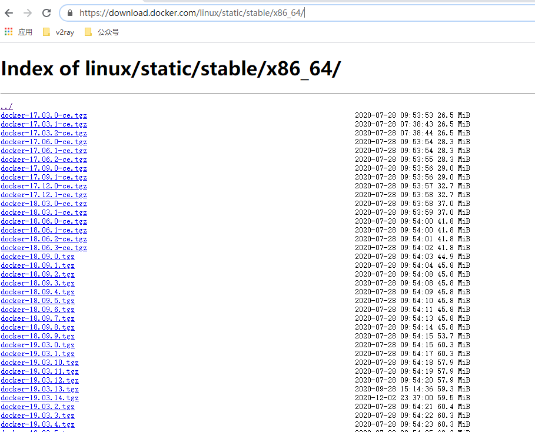

**本来是已经准备开始K8S的内容，但是K8S与Docker关联比较大，于是决定先写一些关于Docker的文章**

**本文所有内容基于CentOS8系统**

# 概述

Docker社区版本中提供了MacOS、Windows和Linux等系统的安装包，同时也支持在云服务器上的安装，如AWSCloud。网上在各种系统下安装Docker的教程也比较多，本文中仅介绍在Linux下Docker二进制文件的安装方式。

# 下载二进制文件

下载地址：[Docker二进制文件官方下载地址](https://download.docker.com/linux/static/stable/x86_64) 



选择我们需要的版本下载，这里我选择的是**docker-18.06.2-ce.tgz**。

进入你存放下载文件的文件件，执行以下命令

```bash
wget https://download.docker.com/linux/static/stable/x86_64/docker-18.06.2-ce.tgz
```

等待下载完成

```bash
--2020-12-03 21:26:22--  https://download.docker.com/linux/static/stable/x86_64/docker-18.06.2-ce.tgz
正在解析主机 download.docker.com (download.docker.com)... 13.225.2.81, 13.225.2.92, 13.225.2.103, ...
正在连接 download.docker.com (download.docker.com)|13.225.2.81|:443... 已连接。
已发出 HTTP 请求，正在等待回应... 200 OK
长度：43834194 (42M) [application/x-tar]
正在保存至: “docker-18.06.2-ce.tgz”

docker-18.06.2-ce.tgz                  100%[============================================================================>]  41.80M  9.29MB/s  用时 6.8s    

2020-12-03 21:26:29 (6.17 MB/s) - 已保存 “docker-18.06.2-ce.tgz” [43834194/43834194])
```


# 下载二进制安装脚本

地址：[Docker二进制安装脚本地址](https://github.com/liumiaocn/easypack/tree/master/docker )

在刚才的文件夹下创建一个名为**install-docker.sh**的文件

```bash
vim install-docker.sh
```

将install-docker.sh中的内容复制到我们创建的文件中

```bash
#!/bin/sh

usage(){
  echo "Usage: $0 FILE_NAME_DOCKER_CE_TAR_GZ"
  echo "       $0 docker-17.09.0-ce.tgz"
  echo "Get docker-ce binary from: https://download.docker.com/linux/static/stable/x86_64/"
  echo "eg: wget https://download.docker.com/linux/static/stable/x86_64/docker-17.09.0-ce.tgz"
  echo ""
}
SYSTEMDDIR=/usr/lib/systemd/system
SERVICEFILE=docker.service
DOCKERDIR=/usr/bin
DOCKERBIN=docker
SERVICENAME=docker

if [ $# -ne 1 ]; then
  usage
  exit 1
else
  FILETARGZ="$1"
fi

if [ ! -f ${FILETARGZ} ]; then
  echo "Docker binary tgz files does not exist, please check it"
  echo "Get docker-ce binary from: https://download.docker.com/linux/static/stable/x86_64/"
  echo "eg: wget https://download.docker.com/linux/static/stable/x86_64/docker-17.09.0-ce.tgz"
  exit 1
fi

echo "##unzip : tar xvpf ${FILETARGZ}"
tar xvpf ${FILETARGZ}
echo

echo "##binary : ${DOCKERBIN} copy to ${DOCKERDIR}"
cp -p ${DOCKERBIN}/* ${DOCKERDIR} >/dev/null 2>&1
which ${DOCKERBIN}

echo "##systemd service: ${SERVICEFILE}"
echo "##docker.service: create docker systemd file"
cat >${SYSTEMDDIR}/${SERVICEFILE} <<EOF
[Unit]
Description=Docker Application Container Engine
Documentation=http://docs.docker.com
After=network.target docker.socket
[Service]
Type=notify
EnvironmentFile=-/run/flannel/docker
WorkingDirectory=/usr/local/bin
ExecStart=/usr/bin/dockerd \
                -H tcp://0.0.0.0:4243 \
                -H unix:///var/run/docker.sock \
                --selinux-enabled=false \
                --log-opt max-size=1g
ExecReload=/bin/kill -s HUP $MAINPID
# Having non-zero Limit*s causes performance problems due to accounting overhead
# in the kernel. We recommend using cgroups to do container-local accounting.
LimitNOFILE=infinity
LimitNPROC=infinity
LimitCORE=infinity
# Uncomment TasksMax if your systemd version supports it.
# Only systemd 226 and above support this version.
#TasksMax=infinity
TimeoutStartSec=0
# set delegate yes so that systemd does not reset the cgroups of docker containers
Delegate=yes
# kill only the docker process, not all processes in the cgroup
KillMode=process
Restart=on-failure
[Install]
WantedBy=multi-user.target
EOF

echo ""

systemctl daemon-reload
echo "##Service status: ${SERVICENAME}"
systemctl status ${SERVICENAME}
echo "##Service restart: ${SERVICENAME}"
systemctl restart ${SERVICENAME}
echo "##Service status: ${SERVICENAME}"
systemctl status ${SERVICENAME}

echo "##Service enabled: ${SERVICENAME}"
systemctl enable ${SERVICENAME}

echo "## docker version"
docker version
```

# 修改脚本权限

执行命令

```bash
chmod -x ./install-docker.sh 
```

# 执行安装脚本

执行命令

```bash
bash ./install-docker.sh docker-18.06.2-ce.tgz
```

脚本会自动安装我们下载的Docker安装包并且重启Docker

查看Docker信息

```bash
[root@VM-0-4-centos download]# docker info
Containers: 0
 Running: 0
 Paused: 0
 Stopped: 0
Images: 0
Server Version: 18.06.2-ce
Storage Driver: overlay2
 Backing Filesystem: extfs
 Supports d_type: true
 Native Overlay Diff: true
Logging Driver: json-file
Cgroup Driver: cgroupfs
Plugins:
 Volume: local
 Network: bridge host macvlan null overlay
 Log: awslogs fluentd gcplogs gelf journald json-file logentries splunk syslog
Swarm: inactive
Runtimes: runc
Default Runtime: runc
Init Binary: docker-init
containerd version: 468a545b9edcd5932818eb9de8e72413e616e86e
runc version: 69663f0bd4b60df09991c08812a60108003fa340
init version: fec3683
Security Options:
 seccomp
  Profile: default
Kernel Version: 4.18.0-80.el8.x86_64
Operating System: CentOS Linux 8 (Core)
OSType: linux
Architecture: x86_64
CPUs: 1
Total Memory: 1.787GiB
Name: VM-0-4-centos
ID: BUHQ:DMTC:UM3Z:FJTX:FYWQ:U55P:MM2H:WT7X:YQFA:LUNL:MBDC:7DXS
Docker Root Dir: /var/lib/docker
Debug Mode (client): false
Debug Mode (server): false
Registry: https://index.docker.io/v1/
Labels:
Experimental: false
Insecure Registries:
 127.0.0.0/8
Live Restore Enabled: false
```

# 修改Docker安装目录

从上文中Docker信息中我们可以看到，Docker的安装目录是

```bash
Docker Root Dir: /var/lib/docker
```

一般情况下，这个目录的的空间较小，所以不建议将其安装在var中。我们现在来修改一下Docker的安装目录

## 新建Docker目录

```bash
mkdir -p /opt/docker/root
```

## 修改Docker配置文件

查询Docker配置文件位置

```bash
[root@VM-0-4-centos download]# systemctl enable docker
Created symlink /etc/systemd/system/multi-user.target.wants/docker.service → /usr/lib/systemd/system/docker.service.
```

修改docker.service文件，在ExecStart属性的最后面添加参数

```bash
--graph /opt/docker/root
```

## 重启Docker

 重新enable 一下docker 服务 重新进行软连接 以及进行一次 daemon-reload 

```bash
systemctl disable docker
systemctl enable docker
systemctl daemon-reload
systemctl start docker
```

## 查看DockerInfo

```bash
[root@VM-0-4-centos ~]# systemctl restart docker
您在 /var/spool/mail/root 中有邮件
[root@VM-0-4-centos ~]# docker info
Containers: 0
 Running: 0
 Paused: 0
 Stopped: 0
Images: 0
Server Version: 18.06.2-ce
Storage Driver: overlay2
 Backing Filesystem: extfs
 Supports d_type: true
 Native Overlay Diff: true
Logging Driver: json-file
Cgroup Driver: cgroupfs
Plugins:
 Volume: local
 Network: bridge host macvlan null overlay
 Log: awslogs fluentd gcplogs gelf journald json-file logentries splunk syslog
Swarm: inactive
Runtimes: runc
Default Runtime: runc
Init Binary: docker-init
containerd version: 468a545b9edcd5932818eb9de8e72413e616e86e
runc version: 69663f0bd4b60df09991c08812a60108003fa340
init version: fec3683
Security Options:
 seccomp
  Profile: default
Kernel Version: 4.18.0-80.el8.x86_64
Operating System: CentOS Linux 8 (Core)
OSType: linux
Architecture: x86_64
CPUs: 1
Total Memory: 1.787GiB
Name: VM-0-4-centos
ID: BUHQ:DMTC:UM3Z:FJTX:FYWQ:U55P:MM2H:WT7X:YQFA:LUNL:MBDC:7DXS
Docker Root Dir: /opt/docker/root
Debug Mode (client): false
Debug Mode (server): false
Registry: https://index.docker.io/v1/
Labels:
Experimental: false
Insecure Registries:
 127.0.0.0/8
Live Restore Enabled: false
```

注：若启动后Docker Root Dir未发生变化，请执行以下命令再重新查看info

```bash
systemctl restart docker
```

## 验证

docker安装MySQL：[详细教程链接]( https://yzstu.blog.csdn.net/article/details/105671928 )，建议大家看一看详细教程，里面也有安装docker国内源的内容，可以大大加快你下载镜像的速度

执行拉取MySQL5.7的命令

```bash
[root@VM-0-4-centos ~]# docker pull mysql:5.7.29
5.7.29: Pulling from library/mysql
54fec2fa59d0: Pull complete 
bcc6c6145912: Pull complete 
951c3d959c9d: Pull complete 
05de4d0e206e: Pull complete 
319f0394ef42: Pull complete 
d9185034607b: Pull complete 
013a9c64dadc: Pull complete 
58b7b840ebff: Pull complete 
9b85c0abc43d: Pull complete 
bdf022f63e85: Pull complete 
35f7f707ce83: Pull complete 
Digest: sha256:95b4bc7c1b111906fdb7a39cd990dd99f21c594722735d059769b80312eb57a7
Status: Downloaded newer image for mysql:5.7.29
```


执行命令

```bash
du /var/lib/docker/
```

与命令

```bash
du /opt/docker/root/
```

可以看到，所有的镜像都存在于文件夹/opt/docker/root/下