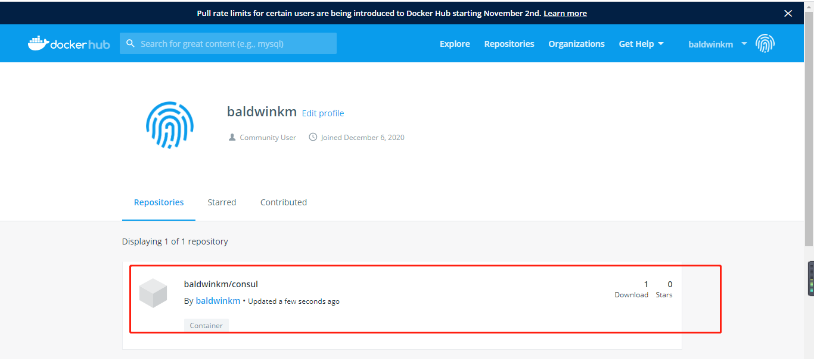

# 前言
上一篇文章[Dockerfile常用命令解析与实战](https://yzstu.blog.csdn.net/article/details/112131129)我们自己打包了一个consul镜像，他只是在我们本地仓库中，在这一篇文章中我们将把我们打包的镜像上传到Dockerhub，这样我们就可以在线下载该镜像了。
# 注册Dockerhub
首先我们需要在[Dockerhub](https://registry.hub.docker.com/)中注册一个账号，这里大家自行去注册，不再演示。
# 登录Dockerhub
在我们的服务器上执行命令
```shell
docker login
```
然后根据提示输入我们刚才注册的账户和密码
```shell
Username: baldwinkm
Password: 
WARNING! Your password will be stored unencrypted in /root/.docker/config.json.
Configure a credential helper to remove this warning. See
https://docs.docker.com/engine/reference/commandline/login/#credentials-store

Login Succeeded
```
看到Login Succeeded就代表我们登录成功了
# push镜像
执行命令
```shell
docker push baldwinkm/consul:consul-1.0
```
等待上传完成
```shell
[root@vultrguest dockerbuilder]# docker push baldwinkm/consul:0.0.1
The push refers to repository [docker.io/baldwinkm/consul]
72e72ac314e5: Pushed 
9795bbe2572e: Pushed 
2a0b0dc039a4: Pushed 
69c702c75667: Pushed 
44978799c986: Pushed 
777b2c648970: Mounted from library/consul 
0.0.1: digest: sha256:ae056306b8217922794d7ceba9ebf680db5259c5774bffc63f1dcbbbfbf99127 size: 1570
```
# 检查
访问我们的Repositories查看

我们的镜像就上传上去了
# 下载镜像
我们可以使用
```shell
docker pull baldwinkm/consul:0.0.1
```
在其他服务器上下载我们上传的镜像。
# 总结
上传镜像计较简单，主要就是不要忘记登录