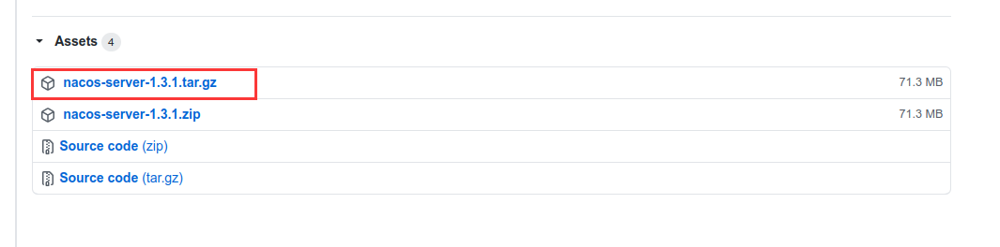
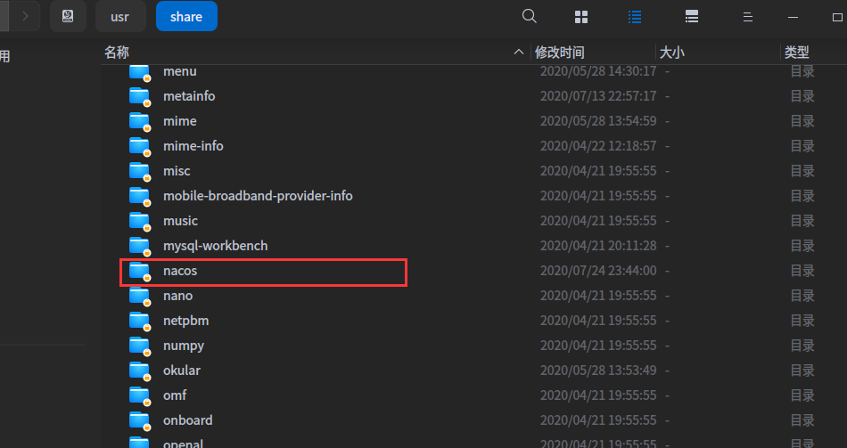
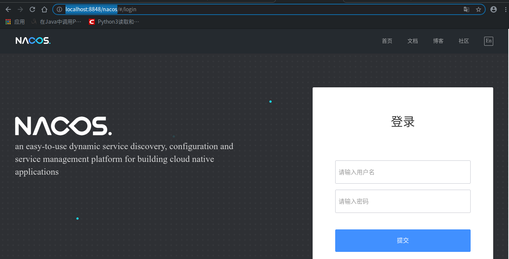

# 1.环境准备

nacos需要在java环境下运行，所以在安装nacos之前请确保已经安装了java

```bash
baldwin@baldwin:/usr/share/nacos/bin$ java -version
openjdk version "1.8.0_212"
OpenJDK Runtime Environment (build 1.8.0_212-8u212-b01-1~deb9u1-b01)
OpenJDK 64-Bit Server VM (build 25.212-b01, mixed mode)
```

# 2.Nacos下载

Nacos下载地址：[https://github.com/alibaba/nacos/releases](https://github.com/alibaba/nacos/releases)

选择自己需要的版本，这里我选择的是当前的最新版本1.3.1。

我电脑的系统是Deepin，所以下载的是第一个，windows用户下载第二个，windows和linux下的安装流程大致相同。



Github这几天下载速度比较慢，如果需要nacos文件，可以关注我的公众号，回复“nacos”获取文件。


# 3.安装

直接将文件解压到你安装软件的文件夹下，我习惯将软件安装到/usr/share文件夹下



nacos文件夹结构如下

```
.
├── bin
│   ├── shutdown.cmd
│   ├── shutdown.sh
│   ├── startup.cmd
│   └── startup.sh
├── conf
│   ├── application.properties
│   ├── application.properties.example
│   ├── cluster.conf.example
│   ├── nacos-logback.xml
│   ├── nacos-mysql.sql
│   └── schema.sql
├── LICENSE
├── logs
│   └── start.out
├── NOTICE
└── target
    └── nacos-server.jar
```

# 4.启动

进入bin目录下，Linux系统执行bash startup.sh -m standalone命令sh startup.sh -m standalone，windows用户双击startup.cmd，单机模式启动

控制台：

```
baldwin@baldwin:/usr/share/nacos/bin$ sudo bash startup.sh -m standalone
/usr/lib/jvm/java-8-openjdk-amd64/bin/java  -Xms512m -Xmx512m -Xmn256m -Dnacos.standalone=true -Dnacos.member.list= -Djava.ext.dirs=/usr/lib/jvm/java-8-openjdk-amd64/jre/lib/ext:/usr/lib/jvm/java-8-openjdk-amd64/lib/ext -Xloggc:/usr/share/nacos/logs/nacos_gc.log -verbose:gc -XX:+PrintGCDetails -XX:+PrintGCDateStamps -XX:+PrintGCTimeStamps -XX:+UseGCLogFileRotation -XX:NumberOfGCLogFiles=10 -XX:GCLogFileSize=100M -Dloader.path=/usr/share/nacos/plugins/health,/usr/share/nacos/plugins/cmdb -Dnacos.home=/usr/share/nacos -jar /usr/share/nacos/target/nacos-server.jar  --spring.config.location=classpath:/,classpath:/config/,file:./,file:./config/,file:/usr/share/nacos/conf/ --logging.config=/usr/share/nacos/conf/nacos-logback.xml --server.max-http-header-size=524288
nacos is starting with standalone
nacos is starting，you can check the /usr/share/nacos/logs/start.out
```

start.out日志

```
/usr/lib/jvm/java-8-openjdk-amd64/bin/java  -Xms512m -Xmx512m -Xmn256m -Dnacos.standalone=true -Dnacos.member.list= -Djava.ext.dirs=/usr/lib/jvm/java-8-openjdk-amd64/jre/lib/ext:/usr/lib/jvm/java-8-openjdk-amd64/lib/ext -Xloggc:/usr/share/nacos/logs/nacos_gc.log -verbose:gc -XX:+PrintGCDetails -XX:+PrintGCDateStamps -XX:+PrintGCTimeStamps -XX:+UseGCLogFileRotation -XX:NumberOfGCLogFiles=10 -XX:GCLogFileSize=100M -Dloader.path=/usr/share/nacos/plugins/health,/usr/share/nacos/plugins/cmdb -Dnacos.home=/usr/share/nacos -jar /usr/share/nacos/target/nacos-server.jar  --spring.config.location=classpath:/,classpath:/config/,file:./,file:./config/,file:/usr/share/nacos/conf/ --logging.config=/usr/share/nacos/conf/nacos-logback.xml --server.max-http-header-size=524288

         ,--.
       ,--.'|

   ,--,:  : |                                           Nacos 1.3.1
,`--.'`|  ' :                       ,---.               Running in stand alone mode, All function modules
|   :  :  | |                      '   ,'\   .--.--.    Port: 8848
:   |   \ | :  ,--.--.     ,---.  /   /   | /  /    '   Pid: 13167
|   : '  '; | /       \   /     \.   ; ,. :|  :  /`./   Console: http://192.168.31.15:8848/nacos/index.html
'   ' ;.    ;.--.  .-. | /    / ''   | |: :|  :  ;_
|   | | \   | \__\/: . ..    ' / '   | .; : \  \    `.      https://nacos.io
'   : |  ; .' ," .--.; |'   ; :__|   :    |  `----.   \
|   | '`--'  /  /  ,.  |'   | '.'|\   \  /  /  /`--'  /
'   : |     ;  :   .'   \   :    : `----'  '--'.     /
;   |.'     |  ,     .-./\   \  /            `--'---'
'---'        `--`---'     `----'
。。。。。。

2020-07-26 00:11:06,681 INFO Tomcat started on port(s): 8848 (http) with context path '/nacos'

2020-07-26 00:11:06,686 INFO Nacos Log files: /usr/share/nacos/logs

2020-07-26 00:11:06,689 INFO Nacos Log files: /usr/share/nacos/conf

2020-07-26 00:11:06,690 INFO Nacos Log files: /usr/share/nacos/data

2020-07-26 00:11:06,690 INFO Nacos started successfully in stand alone mode. use external storage
```

启动成功！

nacos可视化管理界面，访问地址：http://localhost:8848/nacos



输入nacos/nacos成功登录

# 5.启动异常

启动命令

```
sh startup.sh -m standalone
```

启动报错

```bash
baldwin@baldwin:/usr/share/nacos/bin$ sudo ./startup.sh 
./startup.sh: 87: ./startup.sh: [[: not found
./startup.sh: 91: ./startup.sh: [[: not found
./startup.sh: 100: ./startup.sh: [[: not found
./startup.sh: 102: ./startup.sh: [[: not found
./startup.sh: 109: ./startup.sh: [[: not found
/usr/lib/jvm/java-11-openjdk-amd64/bin/java  -server -Xms2g -Xmx2g -Xmn1g -XX:MetaspaceSize=128m -XX:MaxMetaspaceSize=320m -XX:-OmitStackTraceInFastThrow -XX:+HeapDumpOnOutOfMemoryError -XX:HeapDumpPath=/usr/share/nacos/logs/java_heapdump.hprof -XX:-UseLargePages -Dnacos.member.list= -Djava.ext.dirs=/usr/lib/jvm/java-11-openjdk-amd64/jre/lib/ext:/usr/lib/jvm/java-11-openjdk-amd64/lib/ext -Xloggc:/usr/share/nacos/logs/nacos_gc.log -verbose:gc -XX:+PrintGCDetails -XX:+PrintGCDateStamps -XX:+PrintGCTimeStamps -XX:+UseGCLogFileRotation -XX:NumberOfGCLogFiles=10 -XX:GCLogFileSize=100M -Dloader.path=/usr/share/nacos/plugins/health,/usr/share/nacos/plugins/cmdb -Dnacos.home=/usr/share/nacos -jar /usr/share/nacos/target/nacos-server.jar  --spring.config.location=classpath:/,classpath:/config/,file:./,file:./config/,file:/usr/share/nacos/conf/ --logging.config=/usr/share/nacos/conf/nacos-logback.xml --server.max-http-header-size=524288
./startup.sh: 130: ./startup.sh: [[: not found
nacos is starting with cluster
nacos is starting，you can check the /usr/share/nacos/logs/start.out
```

查看/usr/share/nacos/logs/start.out文件

```
/usr/lib/jvm/java-11-openjdk-amd64/bin/java  -server -Xms2g -Xmx2g -Xmn1g -XX:MetaspaceSize=128m -XX:MaxMetaspaceSize=320m -XX:-OmitStackTraceInFastThrow -XX:+HeapDumpOnOutOfMemoryError -XX:HeapDumpPath=/usr/share/nacos/logs/java_heapdump.hprof -XX:-UseLargePages -Dnacos.member.list= -Djava.ext.dirs=/usr/lib/jvm/java-11-openjdk-amd64/jre/lib/ext:/usr/lib/jvm/java-11-openjdk-amd64/lib/ext -Xloggc:/usr/share/nacos/logs/nacos_gc.log -verbose:gc -XX:+PrintGCDetails -XX:+PrintGCDateStamps -XX:+PrintGCTimeStamps -XX:+UseGCLogFileRotation -XX:NumberOfGCLogFiles=10 -XX:GCLogFileSize=100M -Dloader.path=/usr/share/nacos/plugins/health,/usr/share/nacos/plugins/cmdb -Dnacos.home=/usr/share/nacos -jar /usr/share/nacos/target/nacos-server.jar  --spring.config.location=classpath:/,classpath:/config/,file:./,file:./config/,file:/usr/share/nacos/conf/ --logging.config=/usr/share/nacos/conf/nacos-logback.xml --server.max-http-header-size=524288
-Djava.ext.dirs=/usr/lib/jvm/java-11-openjdk-amd64/jre/lib/ext:/usr/lib/jvm/java-11-openjdk-amd64/lib/ext is not supported.  Use -classpath instead.
Error: Could not create the Java Virtual Machine.
Error: A fatal exception has occurred. Program will exit.
```

意思是我调用的是jdk11,不支持这个操作啥的，我的默认jdk是8,我不知道这里为什么调用的是11。

查一下系统jdk

```
baldwin@baldwin:/usr/share/nacos$ dpkg -l | grep openjdk
ii  openjdk-11-jdk:amd64                          11.0.4+11-1~deb10u1                 amd64        OpenJDK Development Kit (JDK)
ii  openjdk-11-jdk-headless:amd64                 11.0.4+11-1~deb10u1                 amd64        OpenJDK Development Kit (JDK) (headless)
ii  openjdk-11-jre:amd64                          11.0.4+11-1~deb10u1                 amd64        OpenJDK Java runtime, using Hotspot JIT
ii  openjdk-11-jre-headless:amd64                 11.0.4+11-1~deb10u1                 amd64        OpenJDK Java runtime, using Hotspot JIT (headless)
ii  openjdk-8-jdk:amd64                           8u212-b01-1~deb9u1                  amd64        OpenJDK Development Kit (JDK)
ii  openjdk-8-jdk-headless:amd64                  8u212-b01-1~deb9u1                  amd64        OpenJDK Development Kit (JDK) (headless)
ii  openjdk-8-jre:amd64                           8u212-b01-1~deb9u1                  amd64        OpenJDK Java runtime, using Hotspot JIT
ii  openjdk-8-jre-headless:amd64                  8u212-b01-1~deb9u1                  amd64        OpenJDK Java runtime, using Hotspot JIT (headless)
```

```
果然是有个jdk11,先把它卸载掉

sudo apt-get remove openjdk-11*
正在读取软件包列表... 完成
正在分析软件包的依赖关系树       
正在读取状态信息... 完成       
注意，根据Glob 'openjdk-11*' 选中了 'openjdk-11-demo'
。。。。。。
下列软件包将被【卸载】：
  com.hostbuf.finalshell default-jdk default-jdk-headless default-jre default-jre-headless openjdk-11-jdk openjdk-11-jdk-headless openjdk-11-jre
  openjdk-11-jre-headless
升级了 0 个软件包，新安装了 0 个软件包，要卸载 9 个软件包，有 203 个软件包未被升级。
解压缩后将会空出 624 MB 的空间。
您希望继续执行吗？ [Y/n] y
(正在读取数据库 ... 系统当前共安装有 252880 个文件和目录。)
。。。
update-alternatives: 使用 /usr/lib/jvm/java-8-openjdk-amd64/bin/jconsole 来在自动模式中提供 /usr/bin/jconsole (jconsole)
dpkg: 警告: 卸载 openjdk-11-jdk:amd64 时，目录 /usr/lib/jvm/openjdk-11 非空，因而不会删除该目录
正在卸载 openjdk-11-jdk-headless:amd64 (11.0.4+11-1~deb10u1) ...
update-alternatives: 使用 /usr/lib/jvm/java-8-openjdk-amd64/bin/jar 来在自动模式中提供 /usr/bin/jar (jar)
。。。
正在处理用于 libc-bin (2.28.7-1+deepin) 的触发器 ...
正在处理用于 bamfdaemon (0.5.4-1) 的触发器 ...
Rebuilding /usr/share/applications/bamf-2.index...
```

卸载完成，重新启动nacos

启动未成功，查询日志

```
/usr/lib/jvm/java-8-openjdk-amd64/bin/java  -server -Xms2g -Xmx2g -Xmn1g -XX:MetaspaceSize=128m -XX:MaxMetaspaceSize=320m -XX:-OmitStackTraceInFastThrow -XX:+HeapDumpOnOutOfMemoryError -XX:HeapDumpPath=/usr/share/nacos/logs/java_heapdump.hprof -XX:-UseLargePages -Dnacos.member.list= -Djava.ext.dirs=/usr/lib/jvm/java-8-openjdk-amd64/jre/lib/ext:/usr/lib/jvm/java-8-openjdk-amd64/lib/ext -Xloggc:/usr/share/nacos/logs/nacos_gc.log -verbose:gc -XX:+PrintGCDetails -XX:+PrintGCDateStamps -XX:+PrintGCTimeStamps -XX:+UseGCLogFileRotation -XX:NumberOfGCLogFiles=10 -XX:GCLogFileSize=100M -Dloader.path=/usr/share/nacos/plugins/health,/usr/share/nacos/plugins/cmdb -Dnacos.home=/usr/share/nacos -jar /usr/share/nacos/target/nacos-server.jar  --spring.config.location=classpath:/,classpath:/config/,file:./,file:./config/,file:/usr/share/nacos/conf/ --logging.config=/usr/share/nacos/conf/nacos-logback.xml --server.max-http-header-size=524288

         ,--.
       ,--.'|

   ,--,:  : |                                           Nacos 1.3.1
,`--.'`|  ' :                       ,---.               Running in cluster mode, All function modules
|   :  :  | |                      '   ,'\   .--.--.    Port: 8848
:   |   \ | :  ,--.--.     ,---.  /   /   | /  /    '   Pid: 12947
|   : '  '; | /       \   /     \.   ; ,. :|  :  /`./   Console: http://192.168.31.15:8848/nacos/index.html
'   ' ;.    ;.--.  .-. | /    / ''   | |: :|  :  ;_
|   | | \   | \__\/: . ..    ' / '   | .; : \  \    `.      https://nacos.io
'   : |  ; .' ," .--.; |'   ; :__|   :    |  `----.   \
|   | '`--'  /  /  ,.  |'   | '.'|\   \  /  /  /`--'  /
'   : |     ;  :   .'   \   :    : `----'  '--'.     /
;   |.'     |  ,     .-./\   \  /            `--'---'
'---'        `--`---'     `----'

2020-07-26 00:07:22,876 INFO The server IP list of Nacos is []
。。。。。。
```

分析：剩下还有报错信息，暂时不用理会。我们这里发现，虽然我们设置的是单机模式，启动的却是集群模式，那么就说明sh startup.sh -m standalone命令是有问题的，我换作bash startup.sh -m standalone命令后，启动正常，这里的原因暂且不表，遇到这个问题可以尝试更换命令解决。


