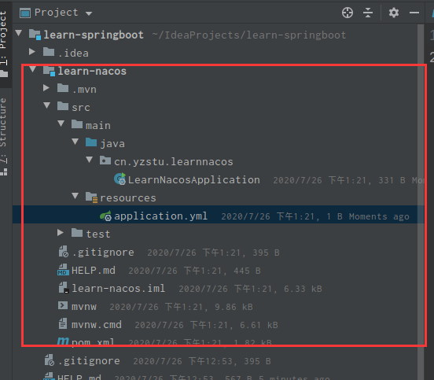
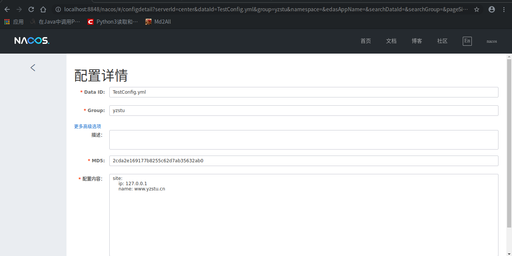
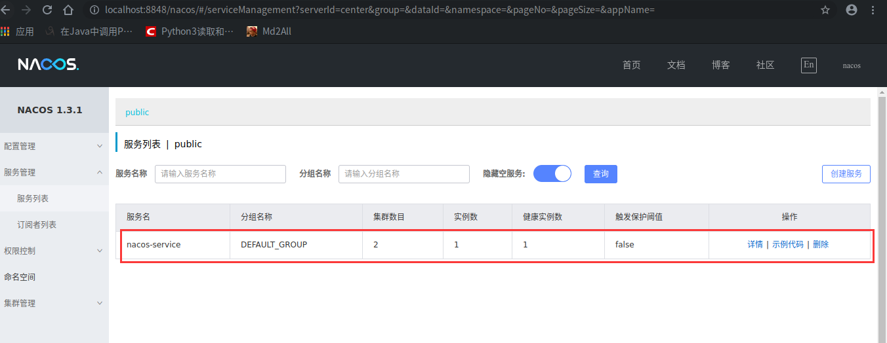
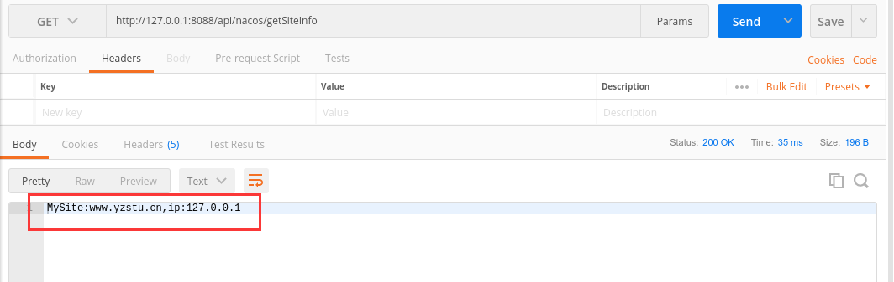
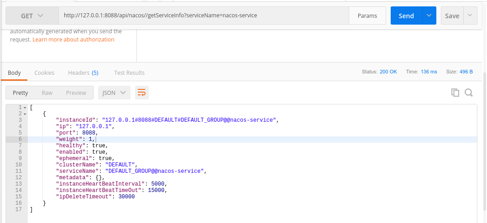

# 1. 环境准备

部署Nacos环境：[https://blog.csdn.net/shouchenchuan5253/article/details/107587983](https://blog.csdn.net/shouchenchuan5253/article/details/107587983)

# 2. 创建项目

创建一个springboot项目。

我的项目地址：[SpringBoot学习-Nacos](https://gitee.com/dikeywork/learn-springboot/tree/master/learn-nacos)



# 3. 添加依赖

```xml
<!-- 版本 0.2.x.RELEASE 对应的是 Spring Boot 2.x 版本，版本 0.1.x.RELEASE 对应的是 Spring Boot 1.x 版本 -->
<!-- 截至至20200725 版本0.2.3为较新版本 -->
<dependency>
    <groupId>com.alibaba.boot</groupId>
    <artifactId>nacos-config-spring-boot-starter</artifactId>
    <version>0.2.3</version>
</dependency>
```

# 4. 项目配置

在application.yml文件中配置nacos服务地址及端口

```
server:
  port: 8088
  ip: 127.0.0.1

spring:
  application:
    name: nacos-service

# nacos配置内容
nacos:
  config:
    server-addr: 127.0.0.1:8848 # 配置 Nacos 配置 的地址
  discovery:
    server-addr: 127.0.0.1:8848 # 配置 Nacos 服务 的地址
```

# 5. 创建配置源

在这之前可以提前在nacos服务里新增一个配置，这里我们新增的配置内容如下



# 6. 创建配置类NacosConfig

```java
import com.alibaba.nacos.api.annotation.NacosInjected;
import com.alibaba.nacos.api.exception.NacosException;
import com.alibaba.nacos.api.naming.NamingService;
import com.alibaba.nacos.spring.context.annotation.config.NacosPropertySource;
import org.springframework.beans.factory.annotation.Value;
import org.springframework.context.annotation.Configuration;

import javax.annotation.PostConstruct;

/**
 * @author baldwin
 */
@Configuration
@NacosPropertySource(dataId = "TestConfig.yml",groupId = "yzstu", autoRefreshed = true) //加载 dataId 为 example 的配置源，并开启自动更新
public class NacosConfig {

    @Value("${server.port}")
    private int serverPort;

    @Value("${server.ip}")
    private String ip;

    @Value("${spring.application.name}")
    private String applicationName;

    @NacosInjected
    private NamingService namingService;

    /**
     * 开机自动注册服务
     * @throws NacosException
     */
    @PostConstruct
    public void registerInstance() throws NacosException {
        namingService.registerInstance(applicationName, ip, serverPort);
    }
}

```

# 7. Nacos测试接口NacosApi

```java
import com.alibaba.nacos.api.annotation.NacosInjected;
import com.alibaba.nacos.api.config.annotation.NacosValue;
import com.alibaba.nacos.api.naming.NamingService;
import com.alibaba.nacos.api.naming.pojo.Instance;
import io.swagger.annotations.Api;
import io.swagger.annotations.ApiImplicitParam;
import io.swagger.annotations.ApiOperation;
import lombok.Data;
import org.springframework.web.bind.annotation.GetMapping;
import org.springframework.web.bind.annotation.RequestMapping;
import org.springframework.web.bind.annotation.RequestParam;
import org.springframework.web.bind.annotation.RestController;

import java.util.List;

@RestController
@RequestMapping(("/api/nacos"))
@Api(value = "Nacos服务相关接口")
public class NacosApi {

    @NacosInjected
    private NamingService namingService;

    @NacosValue(value = "${site.ip:0.0.0.0}",autoRefreshed = true)
    private String siteIp;

    @NacosValue(value = "${site.name:null}",autoRefreshed = true)
    private String siteName;

    @ApiOperation(value = "获取网站信息")
    @GetMapping(value = "/getSiteInfo")
    public String getSiteInfo(){
        return "MySite:"+siteName + ",ip:"+siteIp;
    }

    @ApiOperation(value = "获取所有实例信息")
    @ApiImplicitParam(value = "serviceName",example = "nacos-service",required = true)
    @GetMapping(value = "/getServiceInfo")
    public List<Instance> getInstanceInfo(@RequestParam(value = "serviceName") String serviceName){
        try {
            return namingService.getAllInstances(serviceName) ;
        } catch (Exception e){
            e.printStackTrace();
        }
        return null ;
    }
}

```


# 8. 测试

启动项目，在nacos-UI中进入服务列表，查看是否成功注册。



访问接口获取远程配置数据



访问接口获取实例信息



到这里基本上就完成了服务注册了

# 9. 异常解决

## 无法获取远程配置参数

1.检查NacosPropertySource注解中的dataId和groupId是否与远程配置文件中一直

2.远程配置文件需要设置后缀

# 10. 总结

作为一个简单的服务注册流程，只要过程中细心一点，应该就没有什么大问题，主要注意的就是导包和注解的使用

项目地址：[https://gitee.com/dikeywork/learn-springboot/tree/master/learn-nacos](https://gitee.com/dikeywork/learn-springboot/tree/master/learn-nacos)

系列文章地址：[https://blog.csdn.net/shouchenchuan5253/category_10223260.html](https://blog.csdn.net/shouchenchuan5253/category_10223260.html)

我是Baldwin，一个25岁的程序员，致力于让学习变得更有趣，如果你也真正喜爱编程，真诚的希望与你交个朋友，一起在编程的海洋里徜徉！

往期好文：

[用Python每天给女神发一句手机短信情话](https://blog.csdn.net/shouchenchuan5253/article/details/105753596)

[MySQL优化之explain](https://blog.csdn.net/shouchenchuan5253/article/details/105722148)

[Spring源码分析-MVC初始化](https://blog.csdn.net/shouchenchuan5253/article/details/105625890)

[春风得意马蹄疾，一文看尽（JVM）虚拟机](https://yzstu.blog.csdn.net/article/details/105462458)

[造轮子的艺术](https://blog.csdn.net/shouchenchuan5253/article/details/105256723)

[源码阅读技巧](https://blog.csdn.net/shouchenchuan5253/article/details/105196154)

[Java注解详解](https://blog.csdn.net/shouchenchuan5253/article/details/105145725)

[教你自建SpringBoot服务器](https://blog.csdn.net/shouchenchuan5253/article/details/104773702)

[更多文章请点击](https://blog.csdn.net/shouchenchuan5253/article/details/105020803)


