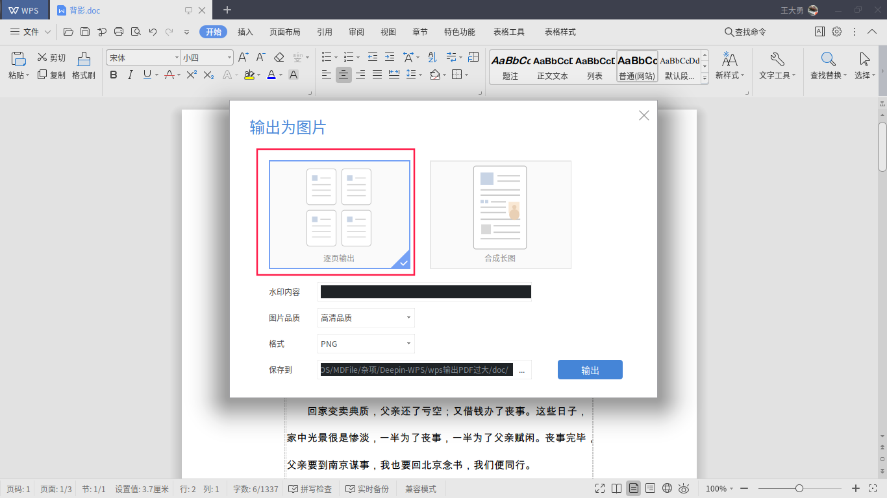
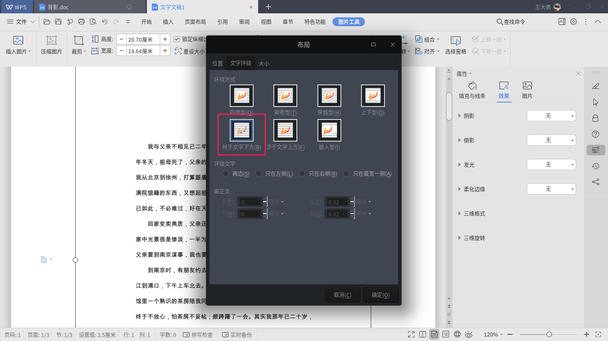
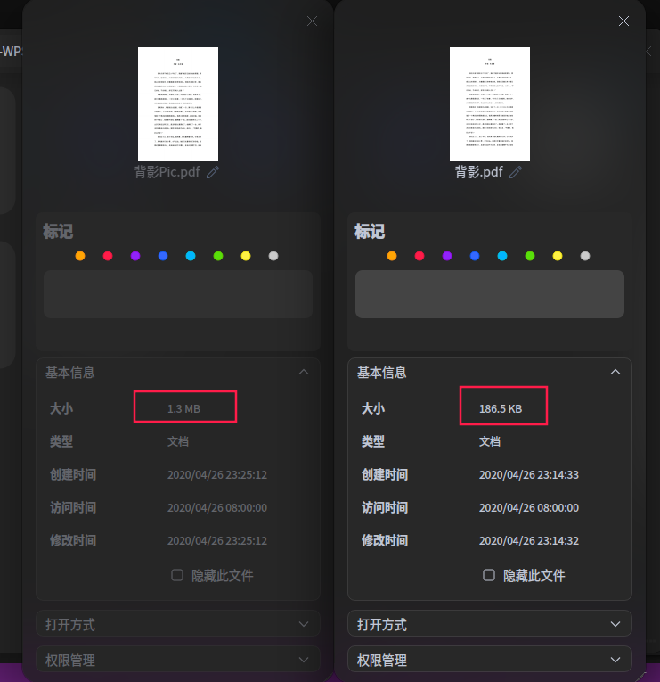

# 1.背景
最近换了Deepin系统，总得来说还是很清爽很好用的，在处理文档方面，虽然用不了Office全家桶，但是Deepin应用商城提供的WPS凑合着用也没有问题。

但是今天在写文档输出成pdf格式时出了问题，输出倒是能够正常输出，但是在我把文档传到服务器上时我才发现平时几秒就能完成的事儿，这次却用了半分钟，本来我还说是最近网速慢，仔细一看文档大小有29M，沃特么当时就懵比了，不知道传了个啥玩意儿上去，赶紧回头看我本地的文档还真是29M。

# 2. 原因

去网上搜了一圈才明白Deepin-WPS在输出PDF时会把字体也一起打包，而Deepin自带的思源字体又很大，最后就导致PDF文件也很大。

# 3. 解决办法
网上给的解决办法大多都是下载微软字体，然后把文档字体都设置成微软字体（[对应解决办法请点击我](https://bbs.deepin.org/forum.php?mod=viewthread&action=printable&tid=173281)），但是下载微软字体的过程中我遇到了许多麻烦，而且最后也没有成功，我不知道是不是我哪一步做错了，反正最后是没有成功，我想你在使用这种办法的时候也会遇到与我一样的问题，所以在此提供一种更简单又有效的方法----**直接贴入图片**。

以下以《背影》文档举例
# 3.1. 将文档输出为图片
新建一个文档并输出为图片：文件-》输出为图片

记得选择为**逐页输出**

然后我们在文档的同级目录下就可以看到一个与文档同名的文件夹，里面有我们文档的每一页对应的图片。

## 3.2. 插入图片
新建一个文档，你的图片有多少页就要插入几个空白页，然后将图片依次插入到空白页里。
## 3.3. 调整图片
现在你会发现，直接调整图片是调整不了的，还需要对图片的各式进行一些设置。

在文档中右键图片-》其他布局选项-》文字环绕-》衬于文字下方-》确定

回到文档，你就可以随心所欲的调整图片了，调整到合适的位置和大小再保存输出为PDF。

## 3.4. 效果对比

怎么回事？用了这种方法后反而变大了。

这其实是因为我的《背影》文档中的字体种类比较单一，所以对比显得我们图片PDF大一些，实际上我们图片DOC的大小有1.6M转换成PDF之后变成了1.3M，而文本DOC是16K，转换成PDF后后是186K，膨胀了十几倍。

这也暴露了一个问题，当文档字体比较单一或者DOC页数（对应图片数）非常多的时候是不推荐这种方法的，这只是在你走投无路的时候一种参考方法。

# 4. 总结

**当文档字体比较单一或者DOC页数（对应图片数）非常多的时候是不推荐这种方法的，这只是在你走投无路的时候一种参考方法。**

反正Deepin系统还有很长的路要走，期待在以后能够解决这个问题。