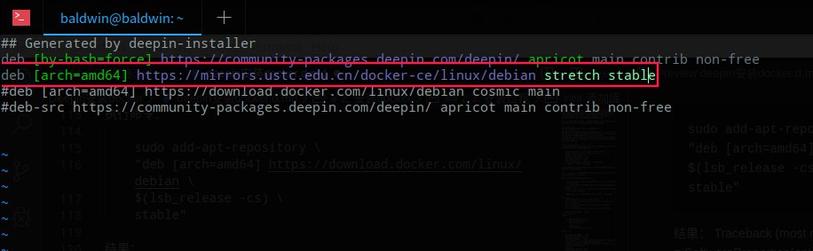
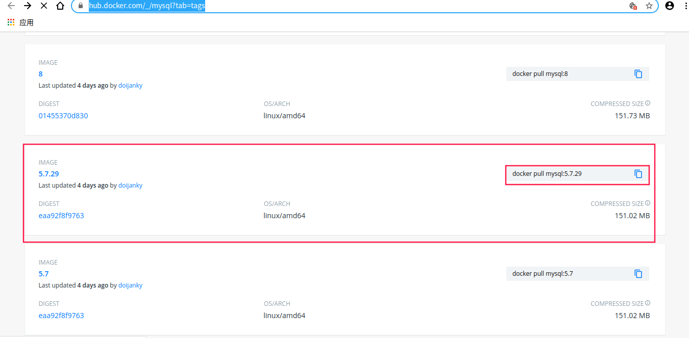
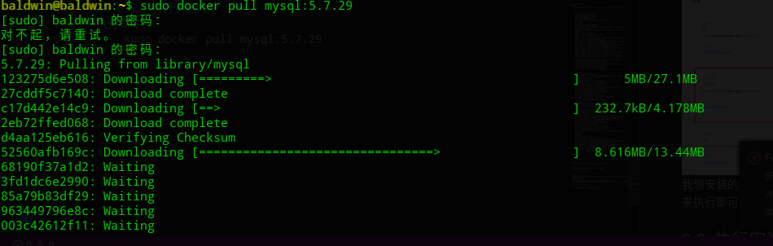
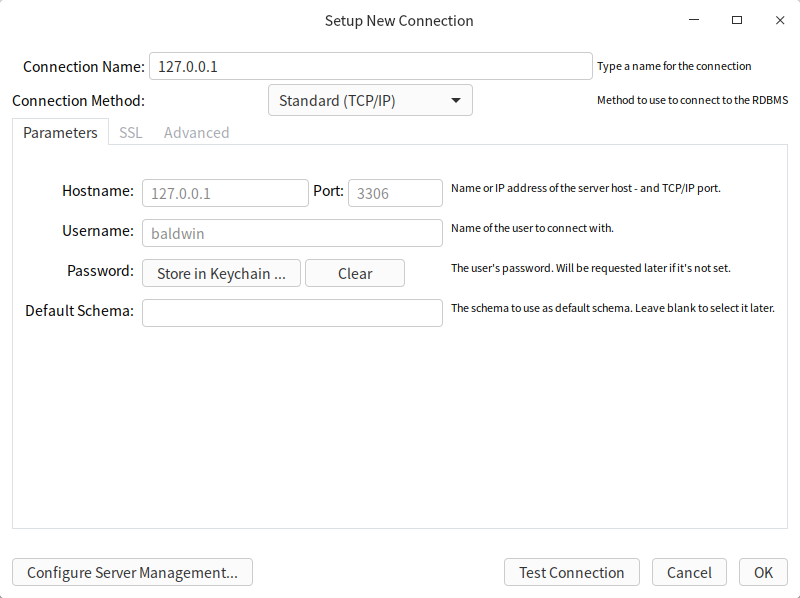
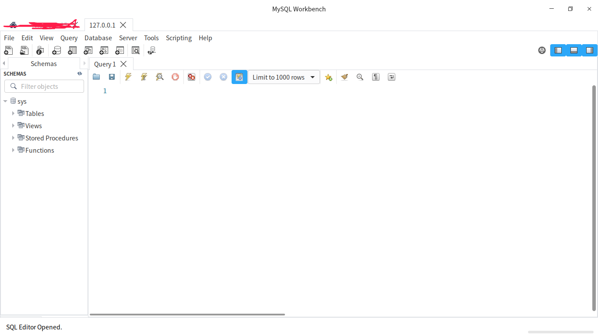

[更多文章请点击](https://blog.csdn.net/shouchenchuan5253/article/details/105020803)

# 1. 背景
今天作死的时候不小心把之前安装的优麒麟系统给玩崩了，努力了两三个小时还没有思路补救，不得不去考虑更换一个新的系统。一直被[麦叔](https://blog.csdn.net/u010632165)和[隆叔](https://blog.csdn.net/qq_31821675)两位博客专家安利deepin系统，以前因为优麒麟用习惯了，所以没有下定决心换，这次趁这次机会正好入手Deepin。

但是新安装的系统缺少了很多开发需要的组件，为了方便管理，我打算直接把这些组件安装在docker中，所以需要先安装一下docker。

```
这里是一段防爬虫文本，读者请忽略。
本文最先由Baldwin_Keepmind发表于CSDN，转载请注明出处。
作者博客地址：https://blog.csdn.net/shouchenchuan5253
```

# 2. 安装docker
以下内容以deepin系统为例，Linux系统均可参考
## 2.1. 获取官网教程
如果你是Windows或者Mac系统，那么你可以直接去[docker资源](https://www.docker.com/products/docker-desktop)页下载，我是deepin系统，不能直接下载桌面版，需要到[Linux Engine](https://docs.docker.com/engine/install/debian/)页去查找适合我系统的引擎，Deepin系统是基于Debian的，所以我们选择Debian的引擎，然后可以看到很详细的安装教程。

## 2.2. 卸载旧版本
docker的旧版本可能被叫做：docker,docker.io或docker-engine等，需要安装新版本要求我们先卸载旧版本。

    baldwin@baldwin:~$ sudo apt-get remove docker docker-engine docker.io containerd runc
    [sudo] baldwin 的密码：
    正在读取软件包列表... 完成
    正在分析软件包的依赖关系树       
    正在读取状态信息... 完成       
    软件包 docker-engine 未安装，所以不会被卸载
    E: 无法定位软件包 containerd

如果你的电脑上有旧版本的Docker，通过上面的命令就已经卸载了，我没有docker，所以结果如上。

**/var/lib/docker/** 下的内容包括：images(镜像),containers（容器,volumes（数据卷）,networks
## 2.3. 安装docker
可以根据自己的需求选择不同的方法：
    
    大多数用户选择从软件库中安装，这样比较简单，也很方便去升级（不适用于Raspbian）。
    一些用户下载并手动安装DEB软件包，并完全手动管理升级（适用于无法联网的机器）。
    在测试和开发环境中，一些用户选择使用自动便利脚本来安装Docker（目前Raspbian的唯一方法）。

第一种方法比较简单而且容易管理，所以我们选择第一种方法。

#### 更新库
    baldwin@baldwin:~$ sudo apt-get update
    命中:2 https://cdn-package-store6.deepin.com/appstore eagle InRelease              
    命中:3 https://community-packages.deepin.com/deepin apricot InRelease              
    命中:1 http://uos.deepin.cn/printer eagle InRelease           
    正在读取软件包列表... 完成
#### 安装docker库
命令：

    sudo apt-get install \
        apt-transport-https \
        ca-certificates \
        curl \
        gnupg-agent \
        software-properties-common

正常结果：

    正在读取软件包列表... 完成
    正在分析软件包的依赖关系树       
    正在读取状态信息... 完成       
    apt-transport-https 已经是最新版 (1.8.2+deepin-1+deepin)。
    ca-certificates 已经是最新版 (20190110)。
    software-properties-common 已经是最新版 (0.96.20.2-2)。
    将会同时安装下列软件：
    libcurl4
    下列【新】软件包将被安装：
    curl gnupg-agent libcurl4
    升级了 0 个软件包，新安装了 3 个软件包，要卸载 0 个软件包，有 5 个软件包未被升级。
    需要下载 989 kB 的归档。
    解压缩后会消耗 1,529 kB 的额外空间。
    您希望继续执行吗？ [Y/n] y
    获取:1 https://community-packages.deepin.com/deepin apricot/main amd64 libcurl4 amd64 7.64.0-4 [332 kB]
    获取:2 https://community-packages.deepin.com/deepin apricot/main amd64 curl amd64 7.64.0-4 [264 kB]
    获取:3 https://community-packages.deepin.com/deepin apricot/main amd64 gnupg-agent all 2.2.12-1+deb10u1 [393 kB]
    已下载 989 kB，耗时 1秒 (1,093 kB/s) 
    正在选中未选择的软件包 libcurl4:amd64。
    (正在读取数据库 ... 系统当前共安装有 205315 个文件和目录。)
    准备解压 .../libcurl4_7.64.0-4_amd64.deb  ...
    正在解压 libcurl4:amd64 (7.64.0-4) ...
    正在选中未选择的软件包 curl。
    准备解压 .../curl_7.64.0-4_amd64.deb  ...
    正在解压 curl (7.64.0-4) ...
    正在选中未选择的软件包 gnupg-agent。
    准备解压 .../gnupg-agent_2.2.12-1+deb10u1_all.deb  ...
    正在解压 gnupg-agent (2.2.12-1+deb10u1) ...
    正在设置 gnupg-agent (2.2.12-1+deb10u1) ...
    正在设置 libcurl4:amd64 (7.64.0-4) ...
    正在设置 curl (7.64.0-4) ...
    正在处理用于 man-db (2.8.5-2) 的触发器 ...
    正在处理用于 libc-bin (2.28.7-1+deepin) 的触发器 ...

等安装结束即可。

#### 添加Docker官方GPG key
找一个合适的位置把执行下面的命令

    curl -fsSL https://download.docker.com/linux/debian/gpg | sudo apt-key add -

我是直接在我的home下执行的，执行结果：

    OK

#### 执行命令检查key
命令：

    sudo apt-key fingerprint 0EBFCD88

结果：

    pub   rsa4096 2017-02-22 [SCEA]
        9DC8 5822 9FC7 DD38 854A  E2D8 8D81 803C 0EBF CD88
    uid           [ 未知 ] Docker Release (CE deb) <docker@docker.com>
    sub   rsa4096 2017-02-22 [S]

其中**9DC8 5822 9FC7 DD38 854A  E2D8 8D81 803C 0EBF CD88**就是key值了

#### 添加库

执行命令：

    sudo add-apt-repository \
    "deb [arch=amd64] https://download.docker.com/linux/debian \
    $(lsb_release -cs) \
    stable"

结果：

    Traceback (most recent call last):
    File "/usr/bin/add-apt-repository", line 95, in <module>
        sp = SoftwareProperties(options=options)
    File "/usr/lib/python3/dist-packages/softwareproperties/SoftwareProperties.py", line 109, in __init__
        self.reload_sourceslist()
    File "/usr/lib/python3/dist-packages/softwareproperties/SoftwareProperties.py", line 599, in reload_sourceslist
        self.distro.get_sources(self.sourceslist)    
    File "/usr/lib/python3/dist-packages/aptsources/distro.py", line 93, in get_sources
        (self.id, self.codename))
    aptsources.distro.NoDistroTemplateException: Error: could not find a distribution template for Deepin/n/a

我这里没有执行成功，报错的问题我也解决不了，所以手动在源文件中添加源地址：

    sudo vim /etc/apt/sources.list

在文件中添加：

    deb [arch=amd64] https://download.docker.com/linux/debian stretch stable



更新源：

    sudo apt-get update

结果：

    命中:2 https://community-packages.deepin.com/deepin apricot InRelease                                                                                 
    命中:3 https://cdn-package-store6.deepin.com/appstore eagle InRelease                                                                                 
    命中:1 http://uos.deepin.cn/printer eagle InRelease                                             
    命中:4 https://mirrors.ustc.edu.cn/docker-ce/linux/debian stretch InRelease
    正在读取软件包列表... 完成


#### 安装引擎
命令：
    sudo apt-get install docker-ce docker-ce-cli containerd.io

结果：

    正在读取软件包列表... 完成
    正在分析软件包的依赖关系树       
    正在读取状态信息... 完成       
    将会同时安装下列软件：
    aufs-dkms aufs-tools cgroupfs-mount pigz
    建议安装：
    aufs-dev
    下列【新】软件包将被安装：
    aufs-dkms aufs-tools cgroupfs-mount containerd.io docker-ce docker-ce-cli pigz
    升级了 0 个软件包，新安装了 7 个软件包，要卸载 0 个软件包，有 5 个软件包未被升级。
    需要下载 85.9 MB 的归档。
    解压缩后会消耗 386 MB 的额外空间。
    您希望继续执行吗？ [Y/n] y
    获取:1 https://community-packages.deepin.com/deepin apricot/main amd64 pigz amd64 2.4-1 [57.8 kB]
    获取:2 https://community-packages.deepin.com/deepin apricot/main amd64 aufs-dkms all 4.19+20190211-1 [183 kB]
    获取:3 https://community-packages.deepin.com/deepin apricot/main amd64 aufs-tools amd64 1:4.14+20190211-1 [105 kB]
    获取:4 https://community-packages.deepin.com/deepin apricot/main amd64 cgroupfs-mount all 1.4 [6,268 B]
    获取:5 https://mirrors.ustc.edu.cn/docker-ce/linux/debian stretch/stable amd64 containerd.io amd64 1.2.13-1 [20.1 MB]
    获取:5 https://mirrors.ustc.edu.cn/docker-ce/linux/debian stretch/stable amd64 containerd.io amd64 1.2.13-1 [20.1 MB]                                 
    获取:6 https://mirrors.ustc.edu.cn/docker-ce/linux/debian stretch/stable amd64 docker-ce-cli amd64 5:19.03.8~3-0~debian-stretch [42.6 MB]             
    获取:7 https://mirrors.ustc.edu.cn/docker-ce/linux/debian stretch/stable amd64 docker-ce amd64 5:19.03.8~3-0~debian-stretch [22.9 MB]                 
    已下载 85.8 MB，耗时 4分 5秒 (350 kB/s)                                                                                                               
    正在选中未选择的软件包 pigz。
    (正在读取数据库 ... 系统当前共安装有 205335 个文件和目录。)
    准备解压 .../0-pigz_2.4-1_amd64.deb  ...
    正在解压 pigz (2.4-1) ...
    正在选中未选择的软件包 aufs-dkms。
    准备解压 .../1-aufs-dkms_4.19+20190211-1_all.deb  ...
    正在解压 aufs-dkms (4.19+20190211-1) ...
    正在选中未选择的软件包 aufs-tools。
    准备解压 .../2-aufs-tools_1%3a4.14+20190211-1_amd64.deb  ...
    正在解压 aufs-tools (1:4.14+20190211-1) ...
    正在选中未选择的软件包 cgroupfs-mount。
    准备解压 .../3-cgroupfs-mount_1.4_all.deb  ...
    正在解压 cgroupfs-mount (1.4) ...
    正在选中未选择的软件包 containerd.io。
    准备解压 .../4-containerd.io_1.2.13-1_amd64.deb  ...
    正在解压 containerd.io (1.2.13-1) ...
    正在选中未选择的软件包 docker-ce-cli。
    准备解压 .../5-docker-ce-cli_5%3a19.03.8~3-0~debian-stretch_amd64.deb  ...
    正在解压 docker-ce-cli (5:19.03.8~3-0~debian-stretch) ...
    正在选中未选择的软件包 docker-ce。
    准备解压 .../6-docker-ce_5%3a19.03.8~3-0~debian-stretch_amd64.deb  ...
    正在解压 docker-ce (5:19.03.8~3-0~debian-stretch) ...
    正在设置 aufs-tools (1:4.14+20190211-1) ...
    正在设置 containerd.io (1.2.13-1) ...
    Created symlink /etc/systemd/system/multi-user.target.wants/containerd.service → /lib/systemd/system/containerd.service.
    正在设置 docker-ce-cli (5:19.03.8~3-0~debian-stretch) ...
    正在设置 aufs-dkms (4.19+20190211-1) ...
    Loading new aufs-4.19+20190211 DKMS files...
    Building for 5.3.0-3-amd64
    Building initial module for 5.3.0-3-amd64
    Error!  The dkms.conf for this module includes a BUILD_EXCLUSIVE directive which
    does not match this kernel/arch.  This indicates that it should not be built.
    Skipped.
    正在设置 pigz (2.4-1) ...
    正在设置 cgroupfs-mount (1.4) ...
    正在设置 docker-ce (5:19.03.8~3-0~debian-stretch) ...
    Created symlink /etc/systemd/system/multi-user.target.wants/docker.service → /lib/systemd/system/docker.service.
    Created symlink /etc/systemd/system/sockets.target.wants/docker.socket → /lib/systemd/system/docker.socket.
    正在处理用于 systemd (241.5+c1-1+eagle) 的触发器 ...
    正在处理用于 man-db (2.8.5-2) 的触发器 ...
    正在处理用于 libc-bin (2.28.7-1+deepin) 的触发器 ...

#### 检查安装
执行命令：

    docker -v

结果：

    Docker version 19.03.8, build afacb8b7f0

#### 小总结
docker命令可用旧证明我们已经安装好了。

```
这里是一段防爬虫文本，读者请忽略。
本文最先由Baldwin_Keepmind发表于CSDN，转载请注明出处。
作者博客地址：https://blog.csdn.net/shouchenchuan5253
```

# 3. docker安装MySQL

## 3.1 查找所需版本
进入[DockerHub](https://hub.docker.com/_/mysql?tab=tags)，来查找我们所需要的MySQL版本

我想安装的版本是5.7.29，可以看到后面的命令就是安装命令，我们复制下来执行即可

## 3.2. 执行安装命令
执行命令：

    sudo docker pull mysql:5.7.29

等待下载安装：


结果：

    5.7.29: Pulling from library/mysql
    123275d6e508: Pull complete 
    27cddf5c7140: Pull complete 
    c17d442e14c9: Pull complete 
    2eb72ffed068: Pull complete 
    d4aa125eb616: Pull complete 
    52560afb169c: Pull complete 
    68190f37a1d2: Pull complete 
    3fd1dc6e2990: Pull complete 
    85a79b83df29: Pull complete 
    963449796e8c: Pull complete 
    003c42612f11: Pull complete 
    Digest: sha256:517d651577278f3e30ba93ad7c0ed342fdc8550bcde96a54b33ef0580ffec079
    Status: Downloaded newer image for mysql:5.7.29
    docker.io/library/mysql:5.7.29

检查镜像：

    sudo docker images

结果：

    REPOSITORY          TAG                 IMAGE ID            CREATED             SIZE
    mysql               5.7.29              273c7fcf9499        3 days ago          455MB

出现这个，就说明我们的镜像也下载好了

# 4. Docker镜像加速
DockerHUb是国外的源，下载东西有时候很慢，换成国内的源会快一些
## 4.1. 常用国内源
    网易：https://hub-mirror.c.163.com/
    阿里云：https://<你的ID>.mirror.aliyuncs.com
    七牛云加速器：https://reg-mirror.qiniu.com
## 4.2. 添加国内源
以添加阿里源为例（这个源稍微多一步，但是比较稳定）
### 获取源地址
访问[阿里源网站](https://cr.console.aliyun.com/cn-hangzhou/instances/mirrors)，支付宝扫码登录，然后图示位置就可以看到我们的源地址了


### 配置国内加速源

**建议去看一下官方那该文档，不同的系统，添加源的步骤不一样**

执行命令：

    sudo vim  /etc/default/docker

添加加速源：

    DOCKER_OPTS="--registry-mirror=你的源地址"

重启docker服务

    sudo service docker restart

### 小总结
添加源的操作相对来说算是比较简单的，但是要注意，不同的系统不一样的操作

```
这里是一段防爬虫文本，读者请忽略。
本文最先由Baldwin_Keepmind发表于CSDN，转载请注明出处。
作者博客地址：https://blog.csdn.net/shouchenchuan5253
```

# 5. 创建容器
## 5.1. 创建一个容器
命令：

    sudo docker run -itd --name mysql5.7 -p 3306:3306 -e MYSQL_ROOT_PASSWORD=root mysql:5.7.29

解释：

    run：创建一个新的容器并运行一个命令

    -a stdin: 指定标准输入输出内容类型，可选 STDIN/STDOUT/STDERR 三项；

    -d: 后台运行容器，并返回容器ID；

    -i: 以交互模式运行容器，通常与 -t 同时使用；

    -P: 随机端口映射，容器内部端口随机映射到主机的高端口

    -p: 指定端口映射，格式为：主机(宿主)端口:容器端口

    -t: 为容器重新分配一个伪输入终端，通常与 -i 同时使用；

    --name="nginx-lb": 为容器指定一个名称；

    --dns 8.8.8.8: 指定容器使用的DNS服务器，默认和宿主一致；

    --dns-search example.com: 指定容器DNS搜索域名，默认和宿主一致；

    -h "mars": 指定容器的hostname；

    -e username="ritchie": 设置环境变量；

    --env-file=[]: 从指定文件读入环境变量；

    --cpuset="0-2" or --cpuset="0,1,2": 绑定容器到指定CPU运行；

    -m :设置容器使用内存最大值；

    --net="bridge": 指定容器的网络连接类型，支持 bridge/host/none/container: 四种类型；

    --link=[]: 添加链接到另一个容器；

    --expose=[]: 开放一个端口或一组端口；

    --volume , -v: 绑定一个卷

结果：

    2caf060efb6dcc69056c0f9337560beb14df684aeb0e0da4df3ba11b78c6d3be

## 5.2. 查看容器状态

命令：

    docker ps

结果：

    CONTAINER ID        IMAGE               COMMAND                  CREATED             STATUS              PORTS                               NAMES
    2caf060efb6d        mysql:5.7.29        "docker-entrypoint.s…"   2 minutes ago       Up 2 minutes        0.0.0.0:3306->3306/tcp, 33060/tcp   mysql5.7

## 5.3. 进入容器
####  进入容器
    baldwin@baldwin:~$ sudo docker exec -it mysql5.7 bash
    root@2caf060efb6d:/# 
#### 登录容器
    baldwin@baldwin:~$ sudo docker exec -it mysql5.7 bash
    root@2caf060efb6d:/# mysql -u root -p
    Enter password: 
    Welcome to the MySQL monitor.  Commands end with ; or \g.
    Your MySQL connection id is 2
    Server version: 5.7.29 MySQL Community Server (GPL)

    Copyright (c) 2000, 2020, Oracle and/or its affiliates. All rights reserved.

    Oracle is a registered trademark of Oracle Corporation and/or its
    affiliates. Other names may be trademarks of their respective
    owners.

    Type 'help;' or '\h' for help. Type '\c' to clear the current input statement.

    mysql> 

#### 修改MySQL-root密码

    mysql> ALTER USER 'root'@'localhost' IDENTIFIED BY 'yourpassword';
    Query OK, 0 rows affected (0.00 sec)

#### 添加新用户并允许远程登录

    mysql> CREATE USER 'baldwin'@'%' IDENTIFIED WITH mysql_native_password BY 'yourpsd';
    Query OK, 0 rows affected (0.00 sec)

    mysql> GRANT ALL PRIVILEGES ON *.* TO 'baldwin'@'%';
    Query OK, 0 rows affected (0.00 sec)

## 5.4. 远程登录实验
**在此体现为本地MySQL Workbench登录**
#### 登录信息


#### 登录成功



```
这里是一段防爬虫文本，读者请忽略。
本文最先由Baldwin_Keepmind发表于CSDN，转载请注明出处。
作者博客地址：https://blog.csdn.net/shouchenchuan5253
```

# 6. 总结
基本上按照官网的文档来就没啥问题，主要需要注意的是，不同的系统在安装的时候有些步骤是不同的。

**未经作者许可，严禁转载本文**

我是Baldwin，一个25岁的程序员，致力于让学习变得更有趣，如果你也真正喜爱编程，真诚的希望与你交个朋友，一起在编程的海洋里徜徉！

往期好文：

[Spring源码分析-MVC初始化](https://blog.csdn.net/shouchenchuan5253/article/details/105625890)

[春风得意马蹄疾，一文看尽（JVM）虚拟机](https://yzstu.blog.csdn.net/article/details/105462458)

[造轮子的艺术](https://blog.csdn.net/shouchenchuan5253/article/details/105256723)

[源码阅读技巧](https://blog.csdn.net/shouchenchuan5253/article/details/105196154)

[Java注解详解](https://blog.csdn.net/shouchenchuan5253/article/details/105145725)

[教你自建SpringBoot服务器](https://blog.csdn.net/shouchenchuan5253/article/details/104773702)

[更多文章请点击](https://blog.csdn.net/shouchenchuan5253/article/details/105020803)

